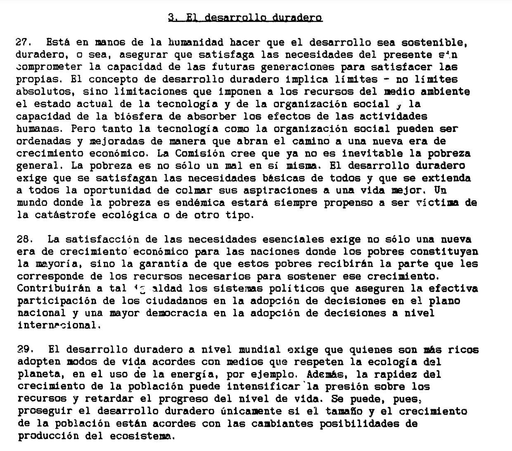
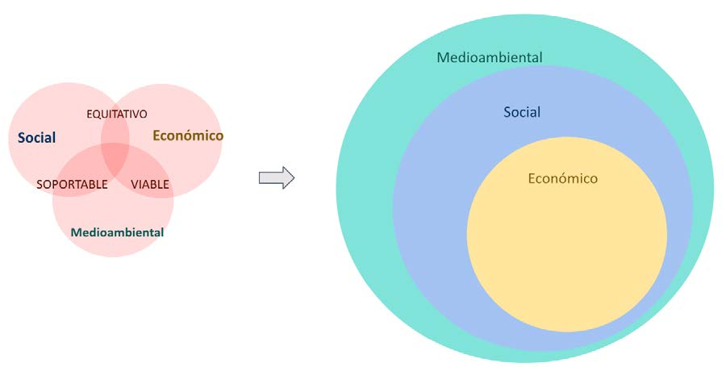
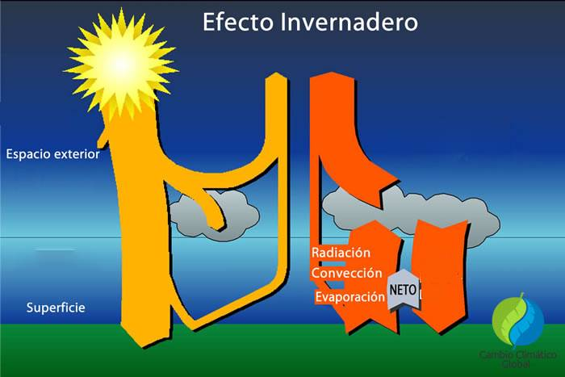
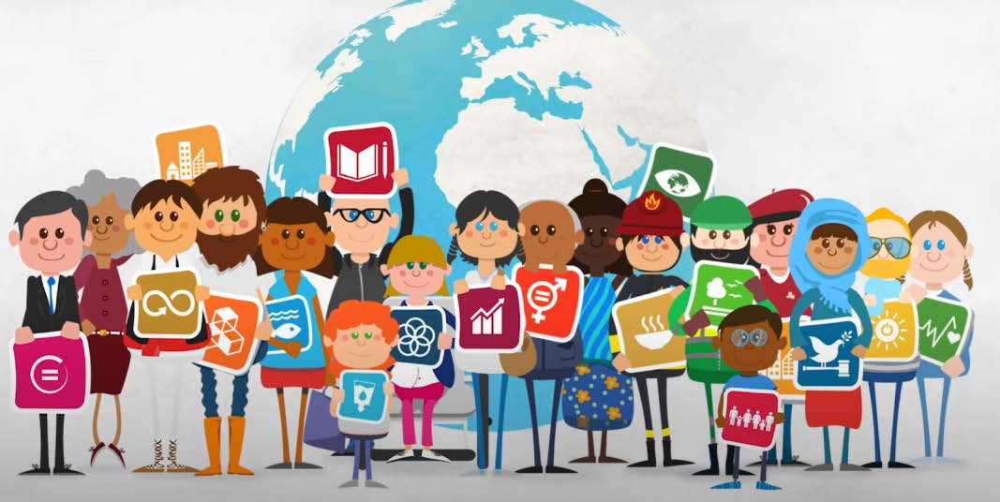
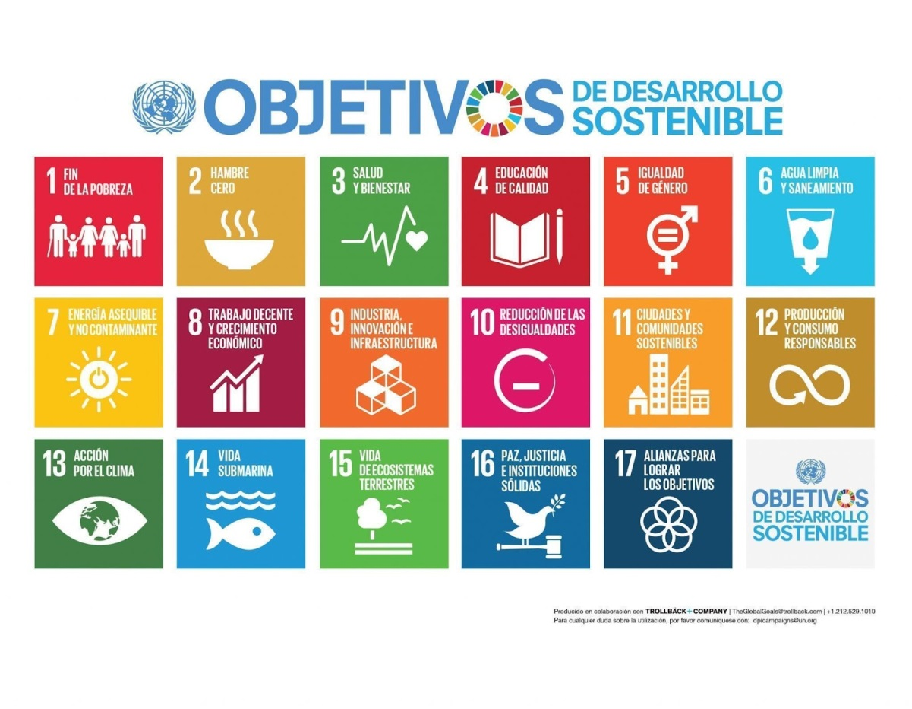
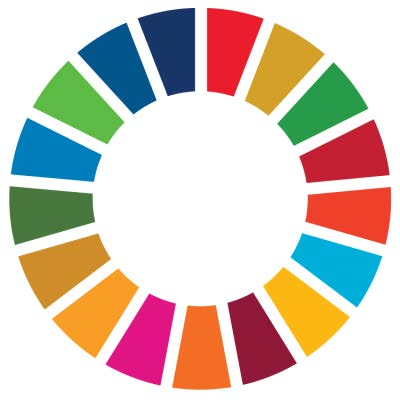
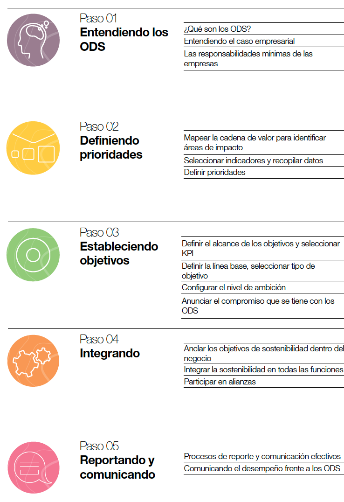
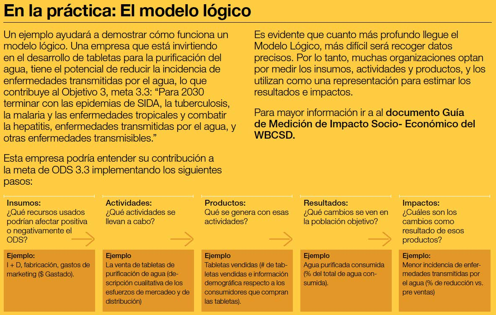
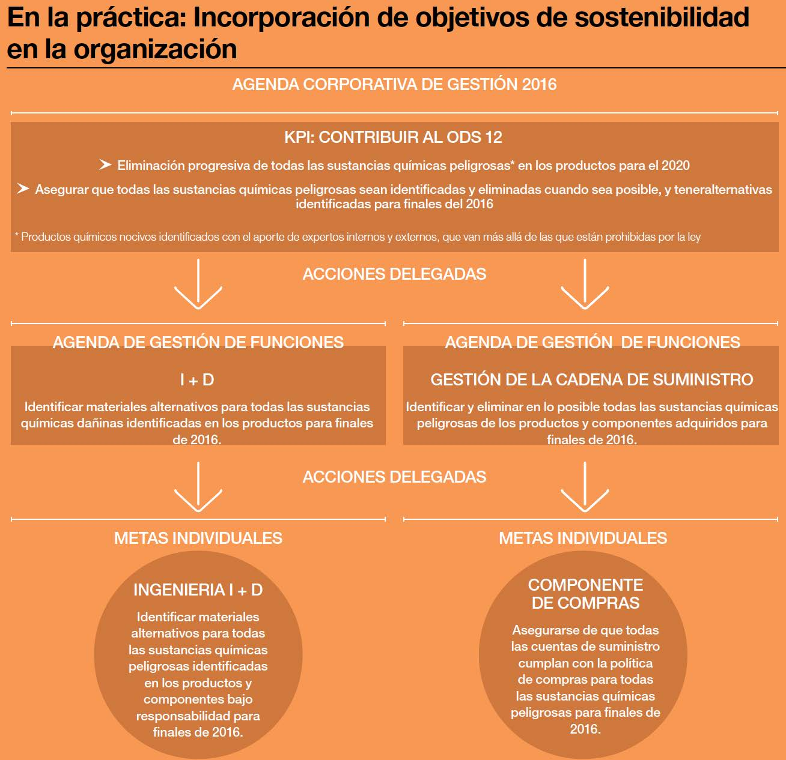
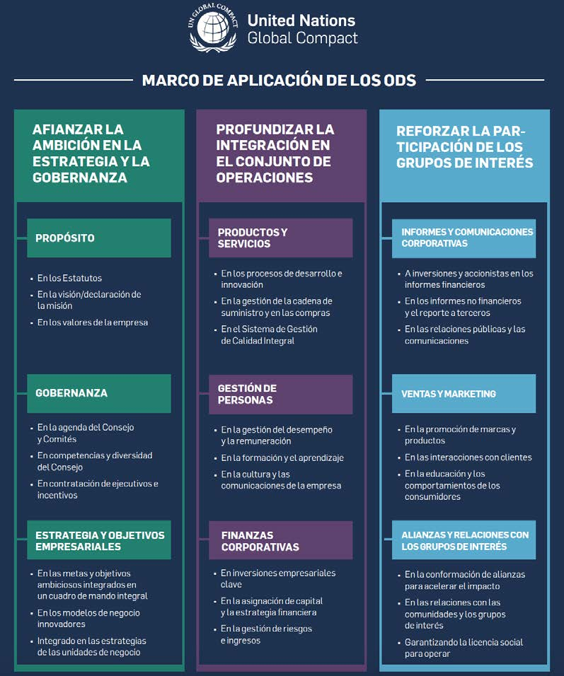

# La sostenibilidad y sus retos

## Índice

1. [Concepto de sostenibilidad y desarrollo sostenible](#1-concepto-de-sostenibilidad-y-desarrollo-sostenible)
2. [Agenda 2030 y Objetivos de Desarrollo Sostenible (ODS)](#2-agenda-2030-y-objetivos-de-desarrollo-sostenible-ods)
3. [Dimensiones ASG: ambiental, social y de gobernanza](#3-dimensiones-asg-ambiental-social-y-de-gobernanza)
4. [Marcos y estándares internacionales: GRI, CSRD, SASB](#4-marcos-y-estandares-internacionales-gri-csrd-sasb)
5. [Inversión socialmente responsable (ISR)](#5-inversion-socialmente-responsable-isr)
6. [Analistas, índices y agencias de sostenibilidad](#6-analistas-indices-y-agencias-de-sostenibilidad)
7. [Referencias](#7-referencias)

---

## 1. Concepto de sostenibilidad y desarrollo sostenible

### 1.1 Contexto histórico en el que aparece el concepto

Tras la Segunda Guerra Mundial se produjo un crecimiento económico intenso, sostenido por
la expansión del comercio internacional y por dos ideas dominantes de la época:

- Los recursos del planeta son **ilimitados**.
- Un crecimiento económico prolongado permitiría a los países menos desarrollados
  alcanzar el nivel de los países ricos.

La mayor producción industrial aceleró la contaminación atmosférica, la tecnificación del
campo provocó el éxodo rural y la intensificación agrícola deterioró el medioambiente. En
ese contexto surge la reflexión sobre los **límites del crecimiento**:

- **Club de Roma (1968).** Grupo de personalidades independientes reunidas en Roma para
  analizar las consecuencias a largo plazo de las tendencias globales. Entre sus
  fundadores, Aurelio Peccei (industrial italiano) y Alexander King (científico escocés).
- **Informe *Los límites del crecimiento* (1972).** Encargado por el Club de Roma a un
  equipo de científicos de sistemas del MIT dirigido por Donella Meadows. Mediante modelos
  matemáticos demostró que un crecimiento económico y demográfico exponencial en un
  planeta de recursos finitos es irracional y, sin cambios estructurales, conduce al
  colapso del sistema extracción–producción–consumo. Es uno de los primeros grandes
  estudios sobre sostenibilidad global.
- **Conferencia de Estocolmo (1972).** Primera Cumbre para la Tierra: por primera vez la
  problemática ambiental llega a la agenda política internacional. De ella surge el
  **PNUMA** (Programa de las Naciones Unidas para el Medio Ambiente).

### 1.2 El sistema productivo clásico y la globalización

Un **sistema productivo** es el conjunto de factores que se combinan para crear productos y
servicios que se venden en el mercado. Los factores de producción son cuatro: **materias
primas** (incluida la energía), **medios de producción** (máquinas), **mano de obra** y
**capital financiero**.

- **Economía de mercado.** La acción combinada de la **oferta** (cantidad de bienes y
  servicios puestos a la venta) y la **demanda** (cantidad que se desea adquirir) organiza
  la producción y el consumo.
- **Regulación imperfecta del mercado.** Los consumidores desconocen toda la oferta y dónde
  están los mejores precios; las empresas buscan legítimamente maximizar sus ganancias,
  pero el interés social es acceder a un precio justo en alimentación, energía, sanidad o
  educación. Gobiernos y organizaciones supranacionales han desarrollado una normativa
  reguladora que unos consideran excesiva y otros insuficiente.
- **Mercado a escala global.** La globalización económica se ha logrado por los avances
  tecnológicos y el impulso de la **Organización Mundial del Comercio (OMC)**, cuyo
  objetivo es facilitar el comercio exterior para favorecer el crecimiento económico
  mundial.
- **Problemas de la globalización.** Los beneficios del comercio internacional han crecido
  más en los países desarrollados que en los países en vías de desarrollo; la desigualdad
  creciente —entre países y entre clases dentro de cada nación— ha impulsado las
  migraciones, y muchas industrias han migrado a economías menos avanzadas para
  aprovechar mano de obra más barata y una normativa laboral y ambiental más laxa.

### 1.3 La definición de desarrollo sostenible: Informe Brundtland (1987)

El concepto tal como se usa hoy se acuña en 1987 en el informe ***Nuestro Futuro Común***
(*Our Common Future*), conocido como **Informe Brundtland**, elaborado por la Comisión
Mundial sobre el Medio Ambiente y el Desarrollo de la ONU (creada en 1983). Trata como una
sola cuestión el crecimiento económico y la protección del medioambiente, teniendo en
cuenta la limitación de recursos del planeta. Es el antecesor directo de los ODS y de la
Agenda 2030.

> **Desarrollo sostenible:** aquel que satisface las necesidades del presente sin
> comprometer la capacidad de las generaciones futuras para satisfacer las suyas.

Esta es la definición más aceptada, pero el informe incorpora otros conceptos que suelen
omitirse en los discursos corporativos:

- **Conciencia de límites.** No se trata de crecimiento infinito, sino de limitaciones
  impuestas por la tecnología y la organización social sobre los recursos del medio.
- **Erradicación de la pobreza como requisito previo.** La pobreza absoluta impide alcanzar
  la sostenibilidad; un mundo con carencias endémicas será siempre propenso a catástrofes
  ecológicas.
- **Propuesta de decrecimiento.** Las naciones ricas deben adoptar modos de vida acordes
  con la ecología del planeta, reduciendo su consumo de energía y recursos para que los
  países menos desarrollados ocupen su espacio de crecimiento.

El informe entiende el desarrollo sostenible como la **mejora constante del bienestar
humano a lo largo del tiempo**, y como el legado que una generación deja a la siguiente
(no solo un conjunto de recursos naturales).

*Extracto original del Informe Brundtland (1987). Fuente: Tema 1.*

### 1.4 Evolución posterior del concepto

Tras Brundtland el concepto siguió redefiniéndose, a menudo adaptándolo a la inercia de la
**economía lineal** (extracción–producción–consumo–desecho) de los países ricos:

| Fuente | Aportación |
| --- | --- |
| **Unión Mundial de la Conservación** (PNUMA y Fondo Mundial de la Naturaleza), 1991 | Sostenibilidad = mejora de la calidad de vida **dentro de los límites de los ecosistemas**. |
| **ICLEI (1994)** | Desarrollo que ofrece servicios ambientales, sociales y económicos básicos a toda la comunidad sin poner en peligro la viabilidad de los sistemas naturales, construidos y sociales de los que depende. |
| **Perspectiva ecológica** | Los sistemas económico-sociales deben ser reproducibles a corto, medio y largo plazo sin deteriorar los ecosistemas que los sustentan (viabilidad ecológica, preservación y capacidad de regeneración). |
| **Unión Europea** | Satisfacer las necesidades de las generaciones actuales sin comprometer las de las futuras. |

Aplicado a la empresa, la sostenibilidad consiste en **generar valor no solo económico,
sino también ambiental y social**, gestionando las relaciones con los grupos de interés
(empleados, clientes, proveedores, accionistas, comunidad) para producir un impacto
positivo en el entorno.

### 1.5 Recursos naturales renovables y no renovables. Explotación sostenible

La diferencia entre unos y otros está en su disponibilidad y en su capacidad de
regeneración:

- **Renovables:** el sol, el viento y el agua; su disponibilidad es prácticamente
  ilimitada.
- **No renovables:** el carbón mineral, el petróleo y el gas natural; se encuentran en el
  subsuelo en cantidades finitas y, al quemarse para producir energía, se destruyen para
  siempre.

El Informe Brundtland señala que los Gobiernos deberían asegurar unas **tasas de
explotación de los bosques y de los recursos pesqueros dentro de sus límites de rendimiento
sostenible**. La **Declaración del Milenio (2000)** es una secuela de ese informe:
establece un vínculo emocional con la sostenibilidad y subraya la urgencia de prevenir el
deterioro del planeta. En esta línea, la **economía debe considerarse un subsistema
integrado dentro del sistema Tierra** y observar cómo funcionan los ecosistemas terrestres.

### 1.6 La huella ecológica

**Huella ecológica:** área de territorio ecológicamente productivo necesaria para producir
los recursos utilizados y asimilar los residuos generados (se mide en hectáreas; la
capacidad del planeta se denomina **biocapacidad**).

- La humanidad consume recursos como si dispusiera de **1,75 planetas Tierra**.
- Impacto muy desigual: EE. UU. 8,2 ha/persona · España 3,7 ha/persona · Angola 0,9 ha/persona.
- Composición: **huella de carbono ≈ 60 %** (superficie de bosque necesaria para absorber
  el CO₂), huella forestal ≈ 10 %, huella de pastoreo ≈ 5 %.

Ejemplo de modelo lineal "usar y tirar": las botellas de plástico de un solo uso (más de
500 000 millones de unidades al año), que consumen petróleo y generan residuos y
contaminación.

### 1.7 Las tres dimensiones de la sostenibilidad (Triple Bottom Line)

El desarrollo sostenible del Informe Brundtland integra **tres dimensiones** que deben
estar en equilibrio:

- **Económica:** crecimiento sostenible, empleo, innovación, generación de valor.
- **Social:** bienestar humano, equidad, educación, salud.
- **Medioambiental:** protección de ecosistemas, biodiversidad, recursos naturales y su
  regeneración.

Si se combinan **solo de dos en dos**, aparecen modelos deseables pero **no sostenibles**
(omiten los límites de los recursos):

- Social + Medioambiental → desarrollo **soportable**.
- Social + Económica → desarrollo **equitativo**.
- Económica + Medioambiental → desarrollo **viable**.

**Sostenibilidad consistente (círculos concéntricos):** el medioambiente contiene a la
sociedad y esta contiene a la economía. No hay viabilidad económica sin una sociedad
estable, ni sociedad sin un ecosistema funcional. La economía es un **subsistema del
sistema Tierra** y debe respetar cómo funcionan los ecosistemas.

*Las tres dimensiones y la "sostenibilidad consistente". Fuente: Tema 1 (Estévez, 2017).*

### 1.8 Acciones para integrar la sostenibilidad en el sistema productivo

| Práctica | Descripción |
| --- | --- |
| Eficiencia energética | Reducir el consumo optimizando equipos, instalaciones y procesos. |
| Gestión de recursos naturales | Usar materias primas, agua y energía de forma responsable, evitando el desperdicio. |
| Diseño ecoeficiente | Productos y servicios que generen menos residuos y consuman menos recursos. |
| Cadena de suministro sostenible | Trabajar con proveedores que respeten criterios ambientales, sociales y éticos. |
| Innovación tecnológica | Tecnologías que mejoren la eficiencia y reduzcan el impacto ambiental. |
| Responsabilidad Social Corporativa (RSC) | Integrar acciones sociales y ambientales en la estrategia. |
| Transparencia y rendición de cuentas | Informar con claridad de las prácticas y los resultados en sostenibilidad. |

### 1.9 Por qué es necesaria la sostenibilidad: la base científica del cambio climático

**El planeta se está calentando.** El balance energético de la Tierra es positivo: entra
más energía procedente del Sol que la que sale como radiación infrarroja hacia el espacio
(si entra tanta como sale, el clima se mantiene estable; si entra más, se calienta).

*El efecto invernadero y el balance de radiación. Fuente: material gráfico de la unidad.*

- Los **gases de efecto invernadero (GEI)** retienen la radiación emitida por la Tierra y
  la calientan (**+2,72 W/m²**). Ejemplos: **CO₂** (quema de combustibles fósiles),
  **CH₄** (ganadería intensiva), **N₂O** (fertilizantes nitrogenados).
- Los **aerosoles y partículas contaminantes** reflejan la luz solar al espacio y enfrían
  (**−0,9 W/m²**): naturales (cenizas volcánicas, polvo del desierto, sal marina, humo de
  incendios) y humanos (combustión de carbón, petróleo y biomasa, industria, transporte
  diésel).
- El balance neto es positivo y coincide con el calentamiento observado (**≈1,2 °C** desde
  finales del siglo XIX).

**Es de origen antropogénico** (provocado por el ser humano). Principales pruebas:

- **Huella isotópica del carbono:** el CO₂ de origen fósil tiene menos carbono-13 y
  carbono-14; el aumento medido en la atmósfera corresponde a ese carbono fósil quemado.
- **Patrón de calentamiento:** se enfría la estratosfera mientras se calienta la
  troposfera, algo característico del aumento de GEI (si el Sol fuera la causa principal,
  ambas capas se calentarían a la vez).
- **Modelos climáticos:** con solo factores naturales (actividad solar, volcanes) no se
  explica el aumento de temperaturas desde 1950; al añadir los factores humanos
  (emisiones, deforestación, aerosoles), los modelos coinciden con las observaciones.
- **Coincidencia temporal:** el CO₂ atmosférico pasa de unas 280 ppm a unas 420 ppm tras
  la Revolución Industrial (NOAA, observatorio de Mauna Loa); el incremento actual es unas
  10 veces más rápido que en los ciclos naturales de glaciaciones.
- **Otros indicadores coherentes:** subida del nivel del mar (≈20 cm desde 1900), pérdida
  de hielo ártico (−13 % por década desde 1979 en verano) y acidificación oceánica
  (pH ≈ −0,1 desde la era preindustrial).

**El IPCC** (*Intergovernmental Panel on Climate Change*, Panel Intergubernamental sobre
Cambio Climático) es el organismo científico internacional creado en **1988** por la ONU (a
través de la OMM y el PNUMA). No realiza investigación propia: **revisa y sintetiza** los
miles de estudios publicados por científicos de todo el mundo y edita **Informes de
Evaluación (AR)**, la base científica que usan gobiernos, empresas y organizaciones
internacionales. Lo integran **195 países miembros** y miles de científicos voluntarios. Su
informe **AR6 (2021-2023)** concluye con confianza "muy alta" que el cambio climático
observado desde mediados del siglo XX se debe **principalmente a las actividades humanas**.

> Aunque el origen no fuera humano, apostar por un crecimiento sostenible no tendría
> efectos negativos; al contrario, resultaría beneficioso.

---

## 2. Agenda 2030 y Objetivos de Desarrollo Sostenible (ODS)

*"No dejar a nadie atrás": los ODS implican a gobiernos, empresas y personas. Fuente: Tema 2.*

### 2.1 De los ODM a los ODS

- **Objetivos de Desarrollo del Milenio (ODM), 2000.** 8 objetivos, centrados sobre todo en
  los países en desarrollo (pobreza extrema, hambre, enfermedades, falta de educación), con
  horizonte 2015. Interconectados entre sí.
- **Objetivos de Desarrollo Sostenible (ODS), 2015.** Adoptados en la Cumbre de la ONU del
  25 de septiembre de 2015 (algunos materiales de la unidad citan el 26 de septiembre) por
  los **193 Estados miembros**. **17 objetivos, 169 metas y 231 indicadores**,
  con horizonte 2030. Completan lo no logrado por los ODM y añaden dimensiones nuevas:
  cambio climático, paz, justicia, igualdad de género. Son de **aplicación universal** (a
  todos los países) e integran las esferas **económica, social y ambiental** de forma
  indivisible bajo el principio **"no dejar a nadie atrás"**.

La **Agenda 2030** es la hoja de ruta global que agrupa los 17 ODS: un plan de acción a
favor de las personas, el planeta y la prosperidad, que también busca fortalecer la paz y
el acceso a la justicia. Es un proyecto universal basado en el principio de
**responsabilidades comunes pero individualizadas**: cada país es responsable
individualmente de su parte del cumplimiento, adaptando sus políticas a cada objetivo y
haciendo medición y seguimiento de sus avances. Su responsabilidad ya no es exclusiva de
gobiernos y organismos internacionales: implica a **todos los sectores de la sociedad**,
incluidas las empresas y las personas a título individual.

### 2.2 Los 17 ODS y las 5 P

La ONU organiza los ODS en **5 grandes ejes (las 5 P)**: **Personas, Planeta, Prosperidad,
Paz y Alianzas** (a veces "Participación"). Son interdependientes: promueven sinergias y
evitan soluciones fragmentadas.

*Los 17 Objetivos de Desarrollo Sostenible. Fuente: Tema 2 (Naciones Unidas).*

*La "rueda de los ODS", símbolo de la interdependencia de los 17 objetivos. Fuente: Tema 2.*

| Eje | ODS | |
| --- | --- | --- |
| **Personas** | 1 Fin de la pobreza · 2 Hambre cero · 3 Salud y bienestar · 4 Educación de calidad · 5 Igualdad de género | Acceso de todas las personas a una vida saludable; equidad e inclusión. |
| **Planeta** | 6 Agua limpia y saneamiento · 12 Producción y consumo responsables · 13 Acción por el clima · 14 Vida submarina · 15 Vida de ecosistemas terrestres | Uso responsable de los recursos; clima y biodiversidad. |
| **Prosperidad** | 7 Energía asequible y no contaminante · 8 Trabajo decente y crecimiento económico · 9 Industria, innovación e infraestructura · 10 Reducción de las desigualdades · 11 Ciudades y comunidades sostenibles | Finanzas sostenibles, reparto justo de la riqueza, economía circular. |
| **Paz** | 16 Paz, justicia e instituciones sólidas | Sociedades pacíficas e inclusivas; acceso a la justicia. |
| **Alianzas** | 17 Alianzas para lograr los objetivos | Cooperación, intercambio de conocimiento y recursos entre gobiernos, empresas y ciudadanía. |

### 2.3 Relación con las tres dimensiones del desarrollo sostenible

Cada ODS puede asociarse predominantemente a una dimensión (con solapamientos):

- **Ambiental:** 6, 7, 9, 11, 12, 13, 14, 15.
- **Social:** 1, 2, 3, 4, 5, 8, 9, 10, 11, 12, 16.
- **Económica:** 7, 8, 9, 12, 16.

El **ODS 16** aparece explícitamente en las tres dimensiones: la guerra y la violencia
dificultan enormemente cualquier objetivo a largo plazo.

### 2.4 Objetivos, metas e indicadores

Estructura jerárquica: **objetivo → metas → indicadores**. Cada meta es un hito concreto y
lleva asociados indicadores de cumplimiento, todos **adaptables** a cada país, sector o
institución.

> *Ejemplo.* El ODS 4 tiene 7 metas. La meta 4.6 propone que, de aquí a 2030, todos los
> jóvenes y una proporción considerable de adultos estén alfabetizados y tengan nociones
> elementales de aritmética; su indicador mide la proporción de población que alcanza un
> nivel mínimo de competencia funcional, desglosada por sexo.

Los indicadores oficiales están recogidos en el Anexo **A/RES/71/313** de la Comisión de
Estadística de la ONU.

### 2.5 Interrelación: sinergias y contradicciones

Los ODS están todos interrelacionados. Pueden reforzarse o entrar en conflicto:

- *Sinergia:* incrementar la reforestación (meta del ODS 15) contribuye a mitigar el cambio
  climático (ODS 13).
- *Contradicción potencial:* esa misma reforestación puede competir por suelo agrícola y
  chocar con el ODS 2 (Hambre cero).

### 2.6 ¿Es obligatorio cumplir la Agenda 2030?

**No.** Es un acuerdo **voluntario** aprobado por consenso en 2015; no es jurídicamente
vinculante y no conlleva sanciones. Cada país elabora sus propios planes y presenta
**Informes Nacionales Voluntarios (VNR)** en el Foro Político de Alto Nivel de la ONU.
Se cumple por compromiso político y reputacional, presión internacional y social, acceso a
financiación internacional y por servir de marco común de coordinación.

### 2.7 Mecanismos de implementación

- **Nivel nacional / autonómico:** estrategias de desarrollo sostenible (p. ej. **Agenda
  Canaria 2030**), planes de acción por ODS, desarrollo de indicadores desde la situación
  de partida y mecanismos de participación ciudadana.
- **Cooperación internacional:** apoyo financiero y técnico a países en desarrollo,
  intercambio de conocimientos y fortalecimiento de alianzas.

### 2.8 Los NDC (Acuerdo de París)

Los **NDC** (*Nationally Determined Contributions*, Contribuciones Determinadas a Nivel
Nacional) son los planes climáticos que cada país presenta a la ONU bajo el Acuerdo de
París: cuánto reducirá sus emisiones de GEI, cómo se adaptará al cambio climático y cómo lo
financiará.

- **Diseño voluntario**, pero **presentación y actualización obligatorias** (revisión cada
  5 años, más ambiciosa cada vez). Medibles y transparentes; revisión global sin
  sanciones.
- *Ejemplos:* UE −55 % de emisiones en 2030 respecto a 1990 y neutralidad climática en
  2050; EE. UU. −50/52 % en 2030 respecto a 2005; India 500 GW de renovables en 2030;
  Etiopía −68 % en 2030 respecto a lo proyectado, **condicionado** a recibir apoyo
  financiero internacional.
- **España** (dentro del NDC de la UE), mediante el **PNIEC 2021-2030**: −23 % de GEI
  respecto a 1990, 42 % de renovables sobre el consumo final de energía, 74 % de
  electricidad renovable, +39,5 % de eficiencia energética, 5 millones de vehículos
  eléctricos y más de 250 000 empleos verdes.

### 2.9 Aplicación de los ODS por las empresas

Las empresas son fuentes principales de uso de recursos, empleo e impacto social, por lo
que su papel es fundamental. Pueden abordar los ODS desde tres perspectivas no excluyentes:

1. **Acciones filantrópicas** no relacionadas con la actividad (mejora reputacional).
2. **Reducción de impactos negativos** e incremento de los positivos para los *stakeholders*
   (eficiencia, ahorro de costes, atracción de talento y clientes).
3. **Productos y servicios innovadores** que contribuyen a los ODS y generan nuevas
   oportunidades de negocio.

Desde el **Pacto Mundial** se impulsan dos herramientas:

- **SDG Compass.** Guía para alinear la estrategia y medir la contribución a los ODS, en
  **cinco pasos**: (1) entender los ODS, (2) definir prioridades —mapeando la cadena de
  valor (actividades *upstream* y *downstream*) para identificar áreas de impacto positivo
  y negativo—, (3) establecer objetivos —seleccionando KPI específicos, medibles y con
  plazo, cubriendo las tres esferas (económica, social y ambiental) y evitando metas
  ambiguas del tipo "carbono cero" sin un alcance ni una fecha de finalización definidos—,
  (4) integrar la sostenibilidad en todas las funciones (I+D, compras, operaciones,
  RR. HH., marketing…) y
  en la gobernanza, y (5) reportar y comunicar. Parte del reconocimiento de que **toda
  empresa** debe cumplir la legislación aplicable, respetar los estándares internacionales
  mínimos y abordar como prioridad los impactos negativos sobre los derechos humanos. Está
  pensado para grandes multinacionales, pero es adaptable a pymes y aplicable a nivel de
  entidad, producto, sitio, división o región. Para seleccionar indicadores y recopilar
  datos usa el llamado **Modelo Lógico** (insumos → actividades → productos → resultados →
  impactos) y un inventario de indicadores de negocio apoyado en estándares reconocidos
  como **GRI** y **CDP**. Al comunicar el desempeño, la empresa revela por qué cada ODS es
  relevante y cómo lo identificó, sus impactos significativos (positivos y negativos), sus
  objetivos y el progreso alcanzado, y sus políticas y procesos de gestión (incluida la
  debida diligencia).
- **SDG Ambition.** Surge en 2019 ante la constatación de que el mundo no avanza al ritmo
  necesario. Reta a las empresas a fijar objetivos ambiciosos alineados con los ODS y los
  Diez Principios, organizados en tres áreas: anclar la ambición en la estrategia y la
  gobernanza, profundizar la integración en las operaciones y reforzar la participación de
  los grupos de interés.

*Los cinco pasos del SDG Compass. Fuente: Tema 2 (Pacto Mundial / GRI / WBCSD).*

*El Modelo Lógico: de los insumos a los impactos, para seleccionar indicadores. Fuente: Tema 2.*

*Cómo un objetivo ODS se despliega por funciones hasta llegar a metas individuales. Fuente: Tema 2.*

*Las tres áreas del marco SDG Ambition. Fuente: Tema 2 (Pacto Mundial de Naciones Unidas).*

### 2.10 La Agenda Canaria de Desarrollo Sostenible 2030

Creada en **2019** para posicionar a Canarias como referente de sostenibilidad social,
económica y ambiental, adaptando los ODS a la realidad del archipiélago. Aborda **5
dimensiones** —sostenibilidad social, ambiental y económica, **gobernanza pública** y
**dimensión cultural**—, cada una con sus retos y **políticas aceleradoras**.

Recursos de apoyo a la empresa canaria: **Guía para la Integración de los ODS en la Empresa
Canaria** (Confederación Canaria de Empresarios) con herramienta de **autodiagnóstico**;
**Manual de Buenas Prácticas Sostenibles de Elaborado en Canarias** (Asinca); plataforma
colaborativa **El Parteaguas**; y casos de éxito de empresas canarias (GF Hoteles, Avícola
Morales, Finca San Borondón).

### 2.11 El impacto de la COVID-19

La pandemia (marzo de 2020) puso en riesgo años o décadas de avances y provocó un
**retroceso en muchos indicadores** de los ODS.

---

## 3. Dimensiones ASG: ambiental, social y de gobernanza

**ASG** (o **ESG** en inglés: *Environmental, Social and Governance*) son los tres ámbitos
que se analizan hoy para medir el compromiso de una empresa con la sostenibilidad. Se usan
sobre todo en el ámbito **empresarial y de inversión** para gestionar riesgos y
oportunidades. Cada vez más inversores, clientes y trabajadores los tienen en cuenta al
decidir en qué empresas confiar, trabajar o colaborar.

### 3.1 A — Asuntos Ambientales

Impacto de la actividad sobre el medioambiente: uso de recursos naturales, emisiones de
CO₂, gestión de residuos, energía, agua y biodiversidad.

*Ejemplos en el sector TIC / desarrollo de software:*

- Eficiencia energética en centros de datos y servidores; virtualización y **Green IT**.
- Reducción del consumo eléctrico de dispositivos y redes.
- Minimizar la huella de carbono del software (ecodiseño, código optimizado).
- Uso de energías renovables en infraestructuras tecnológicas.
- Reciclaje y correcta gestión de residuos electrónicos (**RAEE**).

### 3.2 S — Asuntos Sociales

Todo lo relacionado con las personas: trabajadores, clientes, proveedores y comunidad.

*Ejemplos TIC:*

- Diversidad e inclusión en los equipos técnicos.
- Condiciones laborales dignas en toda la cadena de producción (especialmente en hardware).
- Protección de datos personales y privacidad de los usuarios.
- **Accesibilidad digital**: software y webs accesibles para personas con discapacidad.
- Uso responsable de la inteligencia artificial y los algoritmos (evitar sesgos).

### 3.3 G — Gobernanza

Cómo se dirige y organiza la empresa: valores éticos, toma de decisiones, transparencia,
rendición de cuentas y cumplimiento normativo. Una buena gobernanza genera confianza.

*Ejemplos TIC:*

- Políticas de ciberseguridad y protección de la información.
- Transparencia en el uso de datos y algoritmos.
- Cumplimiento del **RGPD**.
- Decisiones basadas en principios éticos, no solo en el beneficio económico.
- Canales internos para denunciar malas prácticas.

### 3.4 ASG frente al Triple Bottom Line

| Triple Bottom Line (3 dimensiones) | Enfoque ASG | Acciones clave de gestión |
| --- | --- | --- |
| Medioambiental | **Ambiental (A)** | Gestión del ambiente, ecoeficiencia, información e informes de impacto ambiental. |
| Social | **Social (S)** | Gestión de personas (resultados individuales y de equipo), filantropía, derechos humanos. |
| Económica | **Gobernanza (G)** | Códigos de buen gobierno, cumplimiento legal, transparencia y gestión de riesgos del negocio, del proceso y del sector. |

- Ambos enfoques son **complementarios, no contradictorios**.
- El ASG sustituye "Económica" por "Gobernanza": lo económico queda **implícito** en cómo
  se gobiernan los riesgos y los aspectos ambientales y sociales.
- El Triple Bottom Line se usa más en políticas públicas y ámbito académico; el ASG, en el
  ámbito corporativo y de inversión (evaluación de riesgos y decisiones de inversión).

### 3.5 Grupos de interés (*stakeholders*)

Personas u organizaciones afectadas por la actividad de la empresa o que influyen en ella:
clientes y usuarios, empleados y sindicatos, proveedores, inversores y accionistas,
administraciones públicas, comunidad local y medios de comunicación. Cada grupo espera
cosas distintas; identificar sus expectativas permite **priorizar los aspectos ASG más
relevantes**.

### 3.6 Riesgos y oportunidades ASG

Las dimensiones ASG no solo miden el compromiso con la sostenibilidad: son un **factor
estratégico** que genera riesgos u oportunidades según cómo se gestionen. No basta con
"hacer cosas sostenibles"; hay que **priorizar lo que de verdad importa a los grupos de
interés**, que es donde se juegan esos riesgos y oportunidades. El proceso tiene tres
pasos: (1) identificar los aspectos ASG **relevantes (materiales)** de entre todos los
posibles, (2) analizar qué espera cada **grupo de interés**, y (3) conectar cada aspecto
con los **riesgos y oportunidades** para la empresa.

**Riesgos de una mala gestión ASG:**

- Sanciones legales por incumplimiento normativo (p. ej. la **Ley 11/2018**).
- Pérdida de reputación ante clientes, medios y redes sociales.
- Fuga de talento hacia empresas más sostenibles y éticas.
- Exclusión de inversiones o de contratos públicos que exigen criterios ASG.
- Costes a largo plazo por daños ambientales, conflictos laborales o mala gobernanza.

**Oportunidades de una buena gestión ASG:**

- **Innovación verde**: soluciones que reducen impacto ambiental y costes a medio/largo
  plazo.
- Acceso a **financiación sostenible** de inversores responsables.
- Fidelización de clientes y atracción de talento comprometido.
- Ventaja competitiva: cumplimiento normativo y entrada en nuevos mercados.
- Nuevas oportunidades de negocio al integrar los ODS en la estrategia.

### 3.7 Materialidad y doble materialidad

En sostenibilidad, **materialidad = relevancia**: qué temas son realmente importantes para
la empresa y sus grupos de interés.

| Tipo | Pregunta clave | A quién importa |
| --- | --- | --- |
| **Materialidad de impacto** | ¿Qué impacto tiene mi empresa sobre el planeta, las personas y la sociedad? (hacia fuera) | A la sociedad y al medio ambiente |
| **Materialidad financiera** | ¿Qué impacto financiero tienen esos temas de sostenibilidad en mi empresa? (hacia dentro) | A los inversores y accionistas |

La **doble materialidad** une ambos puntos de vista.

> *Ejemplo (fábrica de baterías de litio).* Impacto: la extracción de litio consume mucha
> agua y afecta a comunidades locales. Financiero: en sequías, las autoridades pueden
> limitar el uso de agua industrial, reduciendo la producción y aumentando costes. El tema
> "uso del agua" es **material desde ambas perspectivas**.

---

## 4. Marcos y estándares internacionales: GRI, CSRD, SASB

Para que la sostenibilidad sea gestionable debe ser **comunicable y comparable**. La
normalización de la información no financiera actúa como protocolo común, mitiga el riesgo
de ***greenwashing*** y refuerza la confianza del mercado. Para los perfiles técnicos e
informáticos, estos marcos funcionan en la práctica como **definiciones de esquemas de
datos, taxonomías y KPI** (protocolos de intercambio de información auditable), en la línea
de las **Directrices de la OCDE** (1976).

### 4.1 Evolución de los marcos internacionales

| Año | Hito | Aportación |
| --- | --- | --- |
| 1972 | Conferencia / Declaración de Estocolmo | Primera conferencia mundial sobre medioambiente; nace el PNUMA. |
| 1976 | Directrices de la OCDE para empresas multinacionales | Alinear la actividad de las multinacionales con las políticas nacionales; palanca de responsabilidad empresarial. |
| 1987 | Informe Brundtland (*Our Common Future*) | Primera definición de "desarrollo sostenible". |
| 1987 | Protocolo de Montreal | Sustancias que agotan la capa de ozono. |
| 1992 | Cumbre de la Tierra (Río) | Declaración de Río, **Agenda 21**, Convenio de Diversidad Biológica (CNUDB), Convención Marco sobre Cambio Climático (CMNUCC), Declaración de Principios sobre los Bosques. |
| 1997 | Protocolo de Kioto | Primer acuerdo **vinculante** de reducción de emisiones de GEI para países desarrollados. |
| 1999 | Pacto Mundial (*Global Compact*) | Valores fundamentales en derechos humanos, normas laborales, medioambiente y lucha contra la corrupción (los **Diez Principios**). |
| 2000 | Declaración del Milenio | Respeto a la naturaleza y responsabilidad común como valores; origen de los ODM. |
| 2001 | Libro Verde (UE) | Abre el debate sobre la **Responsabilidad Social de las Empresas** en Europa. |
| 2002 | Cumbre de Johannesburgo | Multilateralismo como estrategia clave para aplicar el desarrollo sostenible. |
| 2006 | Informe Stern | Economía del cambio climático: invertir el **1 % del PIB mundial** en mitigación evita pérdidas de hasta el **20 % del PIB**. |
| 2007 | 4.º Informe del IPCC | Confirma el origen **antropogénico** del calentamiento global. |
| 2009 | Reunión del G20 (Londres) | Reforma del sistema financiero global para afrontar la crisis. |
| 2010 | Cumbre sobre el Cambio Climático (Cancún) | Se establece un **Fondo Climático Global**. |
| 2011 | Conferencia sobre el Cambio Climático (Durban) | Prórroga del Protocolo de Kioto hasta 2015 y mandato de negociar en 2015 un protocolo con fuerza legal que limite las emisiones para 2020. |
| 2012 | Río +20 | Economía verde y marco institucional para el desarrollo sostenible; origen de la Agenda 2030. |
| 2015 | ODS – Agenda 2030 · Acuerdo de París · Agenda de Addis Abeba | 17 ODS y 169 metas; límite del calentamiento por debajo de 2 °C con NDC; financiación del desarrollo sostenible. |
| 2016-2022 | COP22 (Marrakech) → COP27 (Sharm el-Sheij) | COP22: escasez y sostenibilidad del agua. COP24 (Katowice, 2018): reglas de aplicación del Acuerdo de París. COP26 (Glasgow, 2021): objetivo de limitar el calentamiento a 1,5 °C y debate sobre la eliminación del carbón. |
| 2023 | **COP28** (Dubái) | Primera decisión de una COP que menciona explícitamente la transición para abandonar (*transitioning away*) los combustibles fósiles; triplicar las renovables y duplicar la eficiencia energética para 2030. |

*Próximas COP previstas: COP29 en Bakú (Azerbaiyán, 2024) y COP30 en Belém (Brasil, 2025).*

### 4.2 Los estándares de reporte

#### GRI — *Global Reporting Initiative* (materialidad de impacto)

- Estándar **global** para informar de los impactos económicos, ambientales y sociales de
  una organización.
- Se centra en el efecto **hacia afuera** (sobre las personas y el planeta),
  independientemente de si afecta a las finanzas → **materialidad de impacto**.
- **Voluntario**, sin sanciones, pero es el **más utilizado del mundo** para los informes
  de sostenibilidad.
- *Ejemplo:* una empresa que genera residuos electrónicos debe reportarlo porque impacta al
  planeta y a la comunidad, aunque su coste económico sea bajo.

#### SASB — *Sustainability Accounting Standards Board* (materialidad financiera)

- Se centra en los temas de sostenibilidad que afectan al **valor económico o financiero**
  de la empresa → efecto **hacia adentro** (riesgos y oportunidades financieros) =
  **materialidad financiera**.
- Muy usado en EE. UU.; **voluntario**, preferido por inversores y mercados de valores.
- *Ejemplo:* si sube el precio de la electricidad, el consumo energético de los centros de
  datos afecta directamente a la rentabilidad.

#### CSRD — *Corporate Sustainability Reporting Directive* (doble materialidad)

- Normativa **europea obligatoria** que **combina** ambos enfoques (impacto + riesgo
  financiero), inspirándose en GRI y SASB pero creando un marco nuevo.
- Se aplica a las **grandes empresas** (más de 250 empleados, elevada facturación) y a las
  **cotizadas de la UE**, que deben seguir los **ESRS** (*European Sustainability Reporting
  Standards*). Los ESRS establecen cómo hacer el **análisis de doble materialidad** y qué
  indicadores publicar.
- Requiere **informes auditados** y **reporte digital** bajo taxonomías estructuradas (tipo
  **XBRL**) para facilitar la comparabilidad.
- Está vinculada legalmente a la **Taxonomía de la UE** y a la **SFDR**.
- *Ejemplo:* las emisiones de CO₂ de los centros de datos contribuyen al cambio climático
  (impacto hacia afuera, herencia del GRI); si la fiscalidad de las emisiones se endurece,
  aumentan los costes y riesgos financieros (impacto hacia adentro, herencia del SASB).

### 4.3 Normas complementarias del ecosistema europeo

| Norma / estándar | Qué regula | A quién aplica | Carácter |
| --- | --- | --- | --- |
| **GRI** | Impactos ambientales y sociales hacia afuera | Cualquier organización | Voluntario |
| **SASB** | Riesgos y oportunidades financieros hacia adentro | Cualquier organización | Voluntario |
| **CSRD + ESRS** | Impactos + riesgos (doble materialidad); alineación con la Taxonomía UE | Grandes empresas y cotizadas de la UE | Obligatorio (directiva a transponer) |
| **SFDR** (*Sustainable Finance Disclosure Regulation*) | Transparencia sobre si las inversiones son sostenibles; clasifica productos en Art. 6 (sin objetivos ASG), Art. 8 (promueven características ambientales/sociales) y Art. 9 (objetivo sostenible explícito) | Bancos, fondos de inversión y aseguradoras | Obligatorio (reglamento de aplicación directa) |
| **Taxonomía de la UE** — Reglamento (UE) 2020/852 | Sistema de clasificación de actividades económicas sostenibles; lenguaje común de qué es "verde". Se concreta en actos delegados (p. ej. Reg. Del. 2021/2139 sobre clima; Reg. Del. 2023/2485 sobre agua, economía circular, contaminación y biodiversidad) | Empresas, bancos e inversores | Obligatorio |

Las **leyes que obligan a informar** son la **CSRD** (empresas) y la **SFDR** (entidades
financieras); ambas usan la **Taxonomía de la UE** como marco común. Las entidades sujetas
a la SFDR deben publicar su información en **formatos y plantillas estándar** aprobados por
la Comisión Europea y la **ESMA** (p. ej. un fondo verde puede declarar que el 70 % de su
cartera está alineada con la Taxonomía UE, Artículo 9).

### 4.4 Normas ISO de gestión

- **ISO 14001** — sistemas de gestión ambiental.
- **ISO 26000** — responsabilidad social.
- **ISO 50001** — gestión de la energía / eficiencia energética.

### 4.5 Marco legal español

- **Ley 11/2018**, de información no financiera y diversidad: obliga a determinadas empresas
  a identificar los aspectos ASG relevantes e informar sobre impactos, riesgos, medidas y
  efectos en los grupos de interés (medioambiente, personal, derechos humanos, lucha contra
  la corrupción). Su incumplimiento puede acarrear sanciones económicas.
- **RD 1514/2007** — Plan General de Contabilidad, adaptado para incluir criterios ASG.
- **Ley 7/2021** — cambio climático y transición energética.
- **Ley 2/2011** — economía sostenible.
- **Directiva europea sobre diligencia debida en sostenibilidad**: exige a las grandes
  empresas prevenir y mitigar impactos negativos sobre derechos humanos y medioambiente.
- **Código de Derecho de la Sostenibilidad** (recopilación oficial de normativa) y portal
  del **Ministerio para la Transición Ecológica y el Reto Demográfico**.

### 4.6 Gobernanza y ética corporativa

Desde la dimensión de gobernanza, las organizaciones deben implantar códigos de buen
gobierno y ética empresarial, cumplimiento legislativo estricto, transparencia en el
reporte y gestión proactiva de riesgos operativos, reputacionales y sectoriales.

---

## 5. Inversión socialmente responsable (ISR)

### 5.1 Concepto

La **Inversión Socialmente Responsable (ISR)** es una estrategia que combina los criterios
financieros tradicionales (**rentabilidad y riesgo**) con criterios **ambientales, sociales
y de buen gobierno (ASG)**. Consiste en destinar capital a empresas o proyectos que,
además de ser rentables, cumplen criterios ASG.

**Objetivo:** obtener rentabilidad económica a la vez que se promueven prácticas
empresariales sostenibles y éticas, seleccionando empresas con **menor exposición a riesgos
sistémicos**.

### 5.2 Estrategias / características

- **Criterios negativos (exclusión):** se evita invertir en sectores con impacto negativo
  (armas, tabaco, juego, combustibles fósiles…).
- **Criterios positivos o de selección:** se priorizan empresas con buenas
  prácticas en sostenibilidad, igualdad, derechos humanos o innovación ambiental.
- **Integración ASG:** los factores ambientales, sociales y de gobernanza se incorporan al
  análisis financiero.
- **Inversión de impacto:** busca beneficios sociales y ambientales **medibles** junto con
  la rentabilidad económica.

### 5.3 Lógica económica

- **Informe Stern (2006):** invertir el 1 % del PIB mundial en mitigación climática es
  altamente rentable; el coste de la inacción podría alcanzar el 20 % del PIB mundial.
- **Círculo virtuoso:** si las empresas quieren atraer inversión, deben mejorar sus
  prácticas sostenibles → más inversión para empresas responsables → más impacto positivo
  en el entorno.

### 5.4 Marco regulador

La ISR se apoya en la **SFDR** (transparencia sobre inversiones sostenibles), la
**Taxonomía de la UE** (qué es "verde") y, en España, la **Ley 11/2018**.

### 5.5 Relación con la RSC

La **Responsabilidad Social Corporativa (RSC)** es el compromiso **voluntario** de las
empresas de integrar aspectos sociales, ambientales y éticos en su gestión, más allá del
cumplimiento legal. La ISR y la RSC están estrechamente ligadas: la ISR **canaliza los
recursos financieros hacia las empresas que demuestran un comportamiento responsable**,
premiando así la RSC.

### 5.6 Impacto en la transformación empresarial

- Fomenta la transparencia y la rendición de cuentas.
- Impulsa modelos de negocio sostenibles y de bajo impacto ambiental.
- Motiva estrategias de gobernanza más éticas.
- Favorece la innovación y la eficiencia energética, reduciendo costes y riesgos a largo
  plazo.
- Aumenta la confianza y la reputación ante inversores, consumidores y empleados.

---

## 6. Analistas, índices y agencias de sostenibilidad

### 6.1 Analistas e inversores

- **Analistas financieros.** Evalúan el desempeño económico y los riesgos de las empresas
  **incorporando los criterios ASG** a sus modelos de valoración, para identificar
  compañías con menor exposición a riesgos sistémicos.
- **Inversores institucionales y particulares.** Orientan su capital hacia empresas
  responsables, influyendo en su comportamiento y fomentando la sostenibilidad a largo
  plazo.

### 6.2 Agencias de calificación ASG

Recopilan y evalúan datos sobre sostenibilidad y ética empresarial, y elaboran **informes y
puntuaciones ASG (*ratings*)** que guían a los inversores responsables.

*Ejemplos:* **MSCI ESG Ratings**, **Sustainalytics**, **Vigeo Eiris**, **ISS ESG**.

### 6.3 Índices de sostenibilidad

Miden el desempeño bursátil de las empresas más comprometidas con los criterios ASG y
sirven de referencia a los fondos de ISR.

| Índice | Descripción |
| --- | --- |
| **Dow Jones Sustainability Index (DJSI)** | Creado en 1999. Evalúa a las empresas líderes en sostenibilidad a nivel mundial, cubriendo aspectos económicos (gobierno corporativo, gestión del riesgo), ambientales (emisiones, eficiencia energética) y sociales (diversidad, derechos laborales). |
| **FTSE4Good** | Lanzado por FTSE Russell (Londres). Incluye empresas que cumplen estándares globales en derechos humanos, lucha contra la corrupción y gestión ambiental. Referencia para inversores éticos y fondos de ISR. Variante regional: **FTSE4Good Europe**. |
| **MSCI ESG Leaders** / **MSCI Europe ESG Leaders** | Agrupa a las empresas líderes en sostenibilidad (del mercado europeo, en su versión regional). |
| **IBEX ESG** | Empresas del IBEX 35 comprometidas con la transparencia y la responsabilidad social y ambiental. |
| **IBEX Gender Equality Index** (España) · **Euronext Vigeo Eiris** | Índices centrados, respectivamente, en igualdad de género y en desempeño ASG europeo. |

### 6.4 Ejemplos de empresas

- **Indra** — incluida en el **FTSE4Good**; ejemplo de empresa tecnológica comprometida con
  los ODS.
- **Telefónica** — incluida en el **IBEX ESG**; publica su Informe ESG anual.
- **Iberdrola** — integra los ODS en su estrategia, su sistema de gobernanza y su
  sostenibilidad.

### 6.5 Señales de mercado recientes

Las agencias evalúan el desempeño ASG apoyándose en hitos como la **COP28 (2023)**, donde
por primera vez una decisión formal incluyó la necesidad de **transicionar fuera de los
combustibles fósiles** en los sistemas energéticos, una señal inequívoca para los mercados
sobre la dirección de la economía.

---

## 7. Referencias

Materiales de la unidad analizados para elaborar este resumen:

- *Tema 1. Aspectos ambientales, sociales y de gobernanza (ASG) relativos a la
  sostenibilidad* — IES Fernando Sagaseta.
- *Tema 2. Los Objetivos de Desarrollo Sostenible como guía para identificar y superar
  retos ambientales y sociales* — IES Fernando Sagaseta.
- *Unidad didáctica 1. Del desarrollo sostenible a la sostenibilidad: Agenda 2030 y
  objetivos de desarrollo sostenible* — Ediciones Paraninfo.
- *Sostenibilidad y sus retos (Unidad 1)* — Departamento de Informática (`u1_SOJ_ASR`).
- *UT 1. Sostenibilidad y ASG*.
- *Informe Integral de Sostenibilidad: De la Teoría a la Gestión ASG*.

Fuentes primarias citadas en dichos materiales: Comisión Mundial sobre el Medio Ambiente y
el Desarrollo, *Nuestro futuro común* (1987); Meadows, D. H., Meadows, D. L. & Randers, J.,
*Los límites del crecimiento* (1972, ed. 1992); Naciones Unidas, *Agenda 2030 y Objetivos
de Desarrollo Sostenible* (2015); Pacto Mundial, *SDG Compass* y *SDG Ambition*; Gobierno
de Canarias, *Agenda Canaria de Desarrollo Sostenible 2030* (2019); Ley 11/2018;
Reglamento (UE) 2020/852 (Taxonomía).

### Imágenes

Las imágenes de la carpeta `img_resumen/` se han extraído de los PDF de la unidad (sobre
todo de *Tema 1* y *Tema 2*), salvo `efecto-invernadero.jpg`, que es material gráfico de
apoyo de la propia unidad. Los iconos y el panel de los ODS son de Naciones Unidas; los
esquemas del SDG Compass, el Modelo Lógico y SDG Ambition proceden del Pacto Mundial.
Se reproducen con fines educativos.
