# Retos ambientales y sociales

## Índice

1. [Retos ambientales: cambio climático, contaminación, energía, residuos](#1-retos-ambientales-cambio-climatico-contaminacion-energia-residuos)
2. [Retos sociales: desigualdad, brecha digital, condiciones laborales](#2-retos-sociales-desigualdad-brecha-digital-condiciones-laborales)
3. [Impactos sobre las personas y los sectores productivos](#3-impactos-sobre-las-personas-y-los-sectores-productivos)
4. [Cooperación y alianzas para el desarrollo sostenible (ODS 17)](#4-cooperacion-y-alianzas-para-el-desarrollo-sostenible-ods-17)
5. [Ejemplos en el sector tecnológico y digital](#5-ejemplos-en-el-sector-tecnologico-y-digital)
6. [Glosario rápido](#glosario-rapido)
7. [Repaso: 10 preguntas para autoevaluarte](#repaso-10-preguntas-para-autoevaluarte)
8. [De dónde sale esto (fuentes de la carpeta)](#de-donde-sale-esto-fuentes-de-la-carpeta)

## De qué va esta unidad

En la UT1 vimos qué es la sostenibilidad y el marco de la Agenda 2030 con sus 17 Objetivos de Desarrollo Sostenible (ODS). En esta unidad bajamos al detalle: **cuáles son los grandes problemas que la Agenda 2030 quiere resolver**, por qué son un problema, a quién afectan y qué se puede hacer. Los PDF los llaman "retos" o "desafíos", y los dividen en dos familias: **retos ambientales** (los que comprometen el planeta) y **retos sociales** (los que comprometen la vida de las personas). Las dos familias están conectadas: una sequía provocada por el cambio climático dispara el precio de los alimentos, y eso empuja a más gente a la pobreza. Por eso los materiales hablan de un **enfoque integral** y de que la relación entre lo ambiental y lo social es **bidireccional**.

Un **reto socioambiental** se define en los materiales como *un fenómeno, situación o desafío que la sociedad en conjunto está obligada a afrontar y resolver para asegurar un desarrollo sostenible*. La palabra clave es "en conjunto": ningún país, empresa o persona lo arregla en solitario. En su resolución tienen que estar implicadas las organizaciones supranacionales, los gobiernos, las empresas y la ciudadanía a nivel individual y familiar.

Para que te hagas la foto grande: la Agenda 2030 define **169 desafíos** (metas) repartidos entre los 17 ODS, y cada uno tiene indicadores que permiten medir si se avanza o no. Esta unidad recorre los desafíos ambientales y sociales más urgentes, mira su impacto sobre las personas y sobre los sectores productivos (incluido el sector tecnológico), y termina con la idea de que hacen falta **alianzas** para lograrlo (ODS 17).

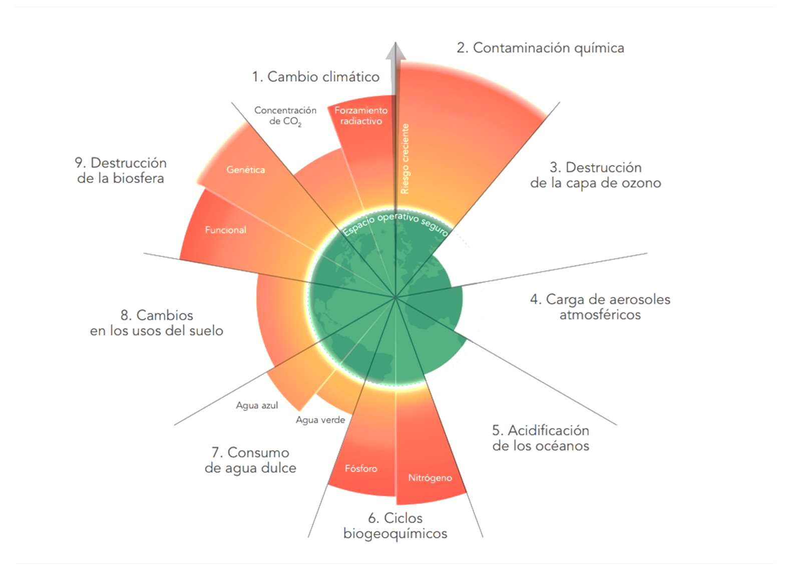
*Figura: los "límites planetarios". El círculo verde central es el "espacio operativo seguro" para la humanidad; las cuñas naranjas que se salen del círculo son procesos en los que ya hemos sobrepasado ese límite. Sirve para ver de un vistazo que los retos ambientales no van por separado. Origen: `UNIDAD_2.pdf`.*

## Qué deberías saber hacer al terminar (resultados de aprendizaje)

El resultado de aprendizaje de esta unidad (RA2) dice, en versión oficial: *"Caracteriza los retos ambientales y sociales a los que se enfrenta la sociedad, describiendo los impactos sobre las personas y los sectores productivos y proponiendo acciones para minimizarlos."*

Traducido a lo que tendrás que ser capaz de hacer:

- **Identificar y explicar los principales retos ambientales y sociales** (criterio a): saber qué es el cambio climático, la contaminación, la pérdida de biodiversidad, la pobreza, la desigualdad, la brecha digital, etc., y por qué cada uno es un problema.
- **Relacionar cada reto con la actividad económica** (criterio b): entender que la industria, la agricultura, la ganadería, el transporte, el turismo o el sector TIC generan impactos concretos, y también que el crecimiento económico bien hecho es parte de la solución.
- **Analizar el efecto de los impactos sobre las personas y los sectores productivos** (criterio c): saber decir a quién perjudica cada problema (salud, empleo, precios, competitividad) y con qué "efecto cascada".
- **Proponer medidas y acciones para minimizar los impactos** (criterio d): conocer las medidas de mitigación y de adaptación, la gestión de residuos, la eficiencia energética, la RSC, etc.
- **Valorar la importancia de las alianzas y del trabajo transversal y coordinado** (criterio e): entender por qué el ODS 17 es imprescindible y qué papel juegan gobiernos, empresas, ONG y organismos internacionales.

---

## 1. Retos ambientales: cambio climático, contaminación, energía, residuos

Los materiales presentan los retos ambientales de varias maneras. El PDF principal enumera **siete**: contaminación atmosférica, cambio climático, deforestación, alimentación, pérdida de la biodiversidad, plásticos marinos y sobrepesca. Otro PDF los agrupa en **cuatro grandes temas**: cambio climático, desaparición de los recursos naturales, degradación del medioambiente y destrucción de los ecosistemas. La programación pide organizarlos en cuatro bloques —**cambio climático, contaminación, energía y residuos**—, así que seguimos ese orden y al final añadimos los retos ambientales que quedan sueltos (deforestación, biodiversidad, alimentación, agua y océanos).

### 1.1. Cambio climático

El **cambio climático**, según la ONU, se refiere a *los cambios a largo plazo de las temperaturas y los patrones climáticos*. Puede tener causas naturales (variaciones de la actividad solar, grandes erupciones volcánicas), pero desde el siglo XIX, con la Revolución Industrial, **la actividad humana es el principal motor**, sobre todo por la quema de combustibles fósiles (carbón, petróleo y gas). De forma más precisa, es el **calentamiento global** de la superficie terrestre por el aumento en la atmósfera de los **gases de efecto invernadero (GEI)**, principalmente el CO₂.

**El efecto invernadero.** Ciertos gases de la atmósfera —dióxido de carbono (CO₂), vapor de agua, metano, ozono, óxidos de nitrógeno y clorofluorocarburos (CFC)— dejan pasar la radiación del sol que calienta la Tierra, pero retienen parte del calor que esta emite para enfriarse, igual que la cubierta de plástico de un invernadero. Gracias a ese efecto natural la temperatura media del planeta es agradable para la vida. El problema es que la actividad humana ha aumentado la concentración de esos gases, se retiene más energía y se rompe el equilibrio térmico.

**Cuánto ha subido la temperatura.** Desde los años setenta la temperatura media del planeta ha subido **0,8 °C**, y desde 2015 la temperatura media global ha superado en **más de 1 °C** el valor medio anterior a la Revolución Industrial (previo a 1850). El **reto** es mantener el calentamiento por debajo de los objetivos críticos: **+2 °C en 2100**, y preferiblemente no pasar de **+1,5 °C**.

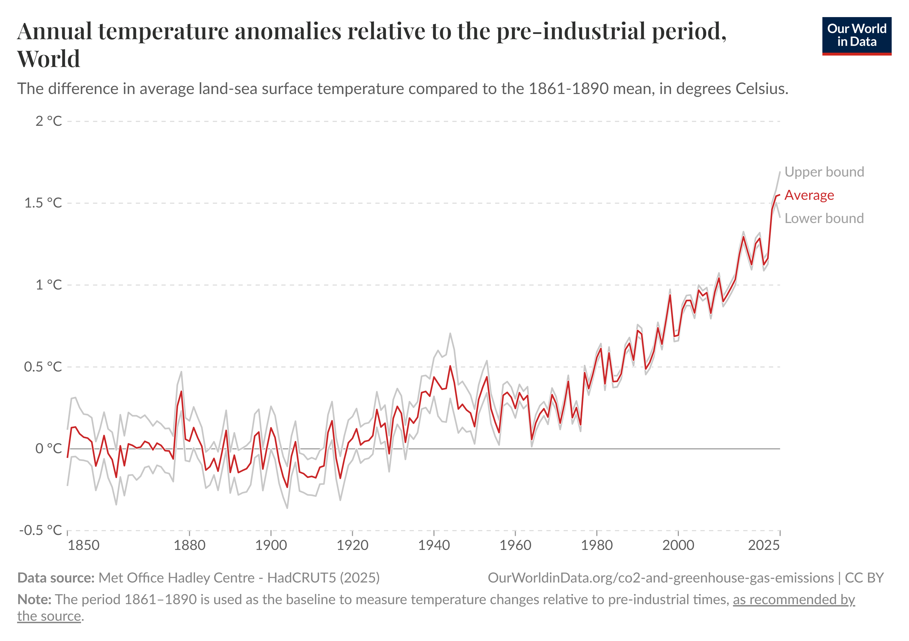
*Figura: la temperatura media mundial comparada con la época preindustrial. La subida es lenta hasta 1980 y muy rápida después; en los últimos años roza el objetivo de +1,5 °C. Origen: `UT 2 Retos ambientales y sociales.pdf`.*

**El presupuesto de carbono.** El clima responde al **total acumulado** de CO₂, no solo a las emisiones de un año concreto. El "presupuesto de carbono" es la cantidad total de CO₂ que podemos emitir antes de superar los 2 °C. Cuanto más tarde empecemos a reducir emisiones, más rápido se consume ese presupuesto y más bruscos y difíciles serán después los recortes (habría que llegar antes a **emisiones netas cero o incluso negativas**). Resumen de los materiales: *"cuanto más tarde actuemos, más drástico y difícil será el ajuste."*

**De dónde vienen las emisiones.** A escala global, los mayores emisores de GEI son la **Energía (73,2 %)**, la **Agricultura, Silvicultura y Uso del Suelo (18,4 %)** y la **Industria (5,2 %)**. Dentro del transporte (que supone en torno al 16 % del total de GEI), los **vehículos de carretera** generan el **74 %** de las emisiones. Hay que distinguir dos formas de contar:

- **Emisiones basadas en la producción:** CO₂ liberado al quemar carbón, petróleo y gas, o en procesos industriales como la producción de cemento y acero.
- **Emisiones basadas en el consumo:** CO₂ causado por lo que un país consume, sin importar dónde se fabricaron los bienes. Los países industrializados **importan** CO₂ a través de productos manufacturados; los países manufactureros lo **exportan**.

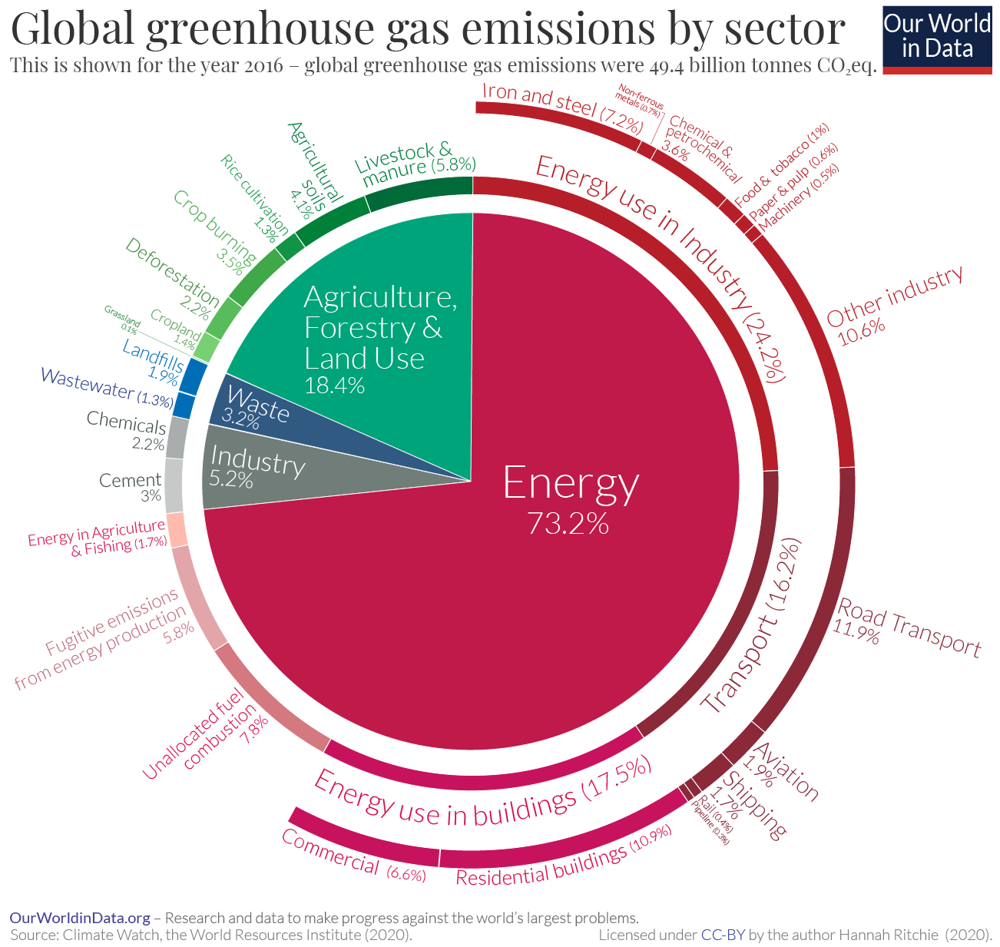
*Figura: reparto de las emisiones mundiales de GEI por sector. El grueso (casi tres cuartas partes) es el uso de energía en industria, edificios y transporte. Origen: `UT 2 Retos ambientales y sociales.pdf`.*

**Qué se puede hacer.** Los materiales distinguen dos tipos de medidas:

- **Mitigación (reducir emisiones):** transición a energías verdes; sustituir los vehículos de carretera por el **vehículo eléctrico**; **poner precio al carbono** para que los productos hipocarbónicos salgan más baratos (un todoterreno costaría más que un eléctrico; la carne de vacuno más que una hamburguesa vegetal), canalizando lo recaudado hacia los hogares más pobres. El objetivo es la **neutralidad climática antes de 2050**: reducir las emisiones hasta lo que pueden absorber de forma natural la vegetación y los océanos.
- **Adaptación (resiliencia):** **sacar a la población de la pobreza** para reducir la vulnerabilidad ante catástrofes; mejorar la resiliencia de los cultivos a sequías e inundaciones mediante mejora genética; adaptar edificios y ciudades al calor (aislamiento, aire acondicionado, mantenimiento de desagües).

**Un dato importante: sostenibilidad y crecimiento no están reñidos.** Muchos países han **crecido económicamente (más PIB) reduciendo a la vez sus emisiones** de CO₂. Es lo que se llama **desacoplamiento**. El **PIB (Producto Interior Bruto)** es el valor monetario de todos los bienes y servicios finales producidos en un país en un periodo, y sirve para medir la actividad económica. Ejemplo de los materiales: el ciudadano medio del Reino Unido emitía **11 toneladas de CO₂ al año en 1950** y hoy emite **menos de 5**; en 1950 el 90 % de su energía venía del carbón y hoy este aporta menos del 2 % de la electricidad. Además, el consumo de energía per cápita ha bajado alrededor de un **25 % desde los años sesenta** porque los aparatos son más eficientes. También hay enormes diferencias entre países ricos: un sueco emite de media la cuarta parte que un estadounidense.

> **Ejemplo actual — El coche eléctrico "paga" su deuda de carbono.** Un coche eléctrico, cuando sale de fábrica, ya ha emitido más CO₂ que uno de gasolina porque fabricar la batería consume mucha energía. Pero a lo largo de su vida "amortiza" esa deuda porque emite mucho menos al circular. Marcas como las que venden en España (Renault, Kia, Tesla, BYD, Cupra) han multiplicado su oferta eléctrica entre 2023 y 2025, y las matriculaciones de eléctricos e híbridos enchufables han ido creciendo año a año. Ilustra la medida de mitigación "sustituir los vehículos de carretera por el vehículo eléctrico".

> **En las noticias — Récords de temperatura.** Servicios climáticos como Copernicus informaron de que 2023 y 2024 fueron los años más cálidos jamás registrados, y de que 2024 fue el primer año natural que superó de media el umbral de +1,5 °C respecto a la época preindustrial. Según se informó, esto no significa que el objetivo del Acuerdo de París ya esté incumplido (ese objetivo se mide en promedios de varias décadas), pero conecta directamente con lo que dice el temario: el margen del "presupuesto de carbono" se está agotando y cada año de retraso encarece el ajuste.

### 1.2. Contaminación

La **contaminación** (o polución) es *la alteración de un medio, sustancia o elemento por la presencia de una impureza o elemento no deseable que lo afecta negativamente y puede causar daños a las personas, a otros seres vivos o al medioambiente*. Casi siempre es resultado directo o indirecto de la acción humana: industria, transporte, calefacción, agricultura. La **degradación del medioambiente** es el deterioro del agua, el aire o el suelo por cambios perjudiciales en su composición.

**Contaminación atmosférica.** Obedece a un hecho muy simple: **quemar cosas** (madera, cultivos, carbón, petróleo). Al quemar se generan pequeñas partículas no deseadas que **penetran profundamente en los pulmones** y provocan problemas respiratorios y cardiovasculares. Un **combustible fósil** es una fuente de energía **no renovable** formada a partir de restos de plantas y animales descompuestos durante millones de años, que se transforman en petróleo, carbón y gas natural y se usan para producir energía por combustión.

- **Impacto.** La OMS calcula unos **8 millones de muertes al año** por contaminación atmosférica: en torno a **4,2 millones al aire libre** y **3,8 millones por contaminación en interiores** (quema de leña y carbón para cocinar). *(Nota: el PDF más antiguo de la carpeta daba la cifra de 7 millones; los materiales más recientes y el gráfico de referencia hablan de unos 8 millones. Usamos 8 millones por ser la cifra de la versión más completa.)*
- **Medidas.** Generalizar el acceso a **combustibles limpios para cocinar** (lo que exige acabar con la pobreza); poner fin a la **quema agrícola estacional**; **eliminar el azufre** de los combustibles fósiles; abandonar los fósiles en favor de las **renovables y la solar**; **conducir menos** y fomentar bici, caminar y transporte público.

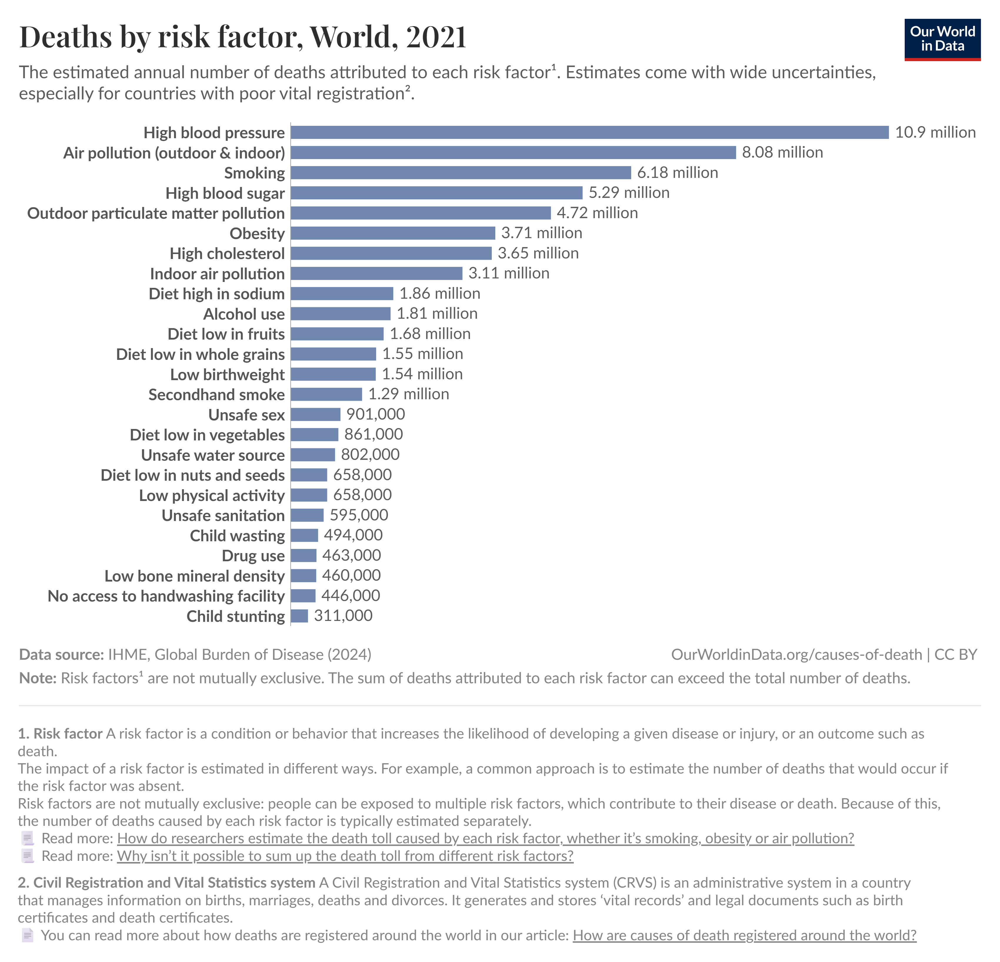
*Figura: muertes atribuidas a cada factor de riesgo. La contaminación del aire (unos 8 millones) es el segundo factor de riesgo de muerte del mundo, y el "agua no potable" figura también entre los principales. Origen: `UT 2 Retos ambientales y sociales.pdf`.*

**Otros tipos de contaminación** que recogen los materiales:

- **Del agua:** contaminación de agua potable (aguas residuales, actividades agropecuarias, vertidos incontrolados) y **contaminación marina** (vertidos urbanos, industriales y agropecuarios; hidrocarburos de barcos y accidentes, como el derrame del *Exxon Valdez* en Alaska en 1989).
- **Del suelo:** erosión, deforestación, sobreexplotación y sustancias tóxicas provocan aridización o **desertización**, con pérdida de productividad agrícola.
- **Acústica:** ruido y vibraciones que molestan o dañan a personas y animales.
- **Lumínica:** exceso de luz artificial que aumenta el brillo del cielo nocturno, impide ver las estrellas y altera los ciclos vitales de animales y plantas.

**Dos problemas de contaminación que ya se resolvieron** (y que dan motivos para el optimismo):

- **Lluvia ácida.** Los combustibles fósiles emiten óxidos de azufre (SO₂) y de nitrógeno (NOₓ) que, con la luz solar y el vapor de agua, forman ácido sulfúrico y nítrico que precipitan al suelo, provocando acidificación del suelo y del agua, destrucción de hojas y corrosión de materiales. Se resolvió instalando **sistemas de desulfuración de gases (*scrubbers*)** en las chimeneas —que "lavan" los humos con cal o piedra caliza y transforman el SO₂ en yeso reutilizable—, reduciendo el azufre de los combustibles, poniendo **catalizadores** en los coches y aprobando leyes y acuerdos internacionales. Las emisiones de SO₂ bajaron **más del 80 %**.
- **Agujero de la capa de ozono.** Los **CFC** (de aerosoles, refrigerantes y espumas) subían a la estratosfera, donde la radiación ultravioleta liberaba cloro que destruía el ozono (O₃), con más cánceres de piel, problemas oculares y menor fotosíntesis. En **1987 se firmó el Protocolo de Montreal**, que prohibió progresivamente los CFC. Se espera que la capa de ozono vuelva a niveles casi normales **hacia 2050-2060**.

> **En las noticias — La ONU confirma la recuperación del ozono.** Evaluaciones científicas respaldadas por Naciones Unidas han reiterado en los últimos años que la capa de ozono va camino de recuperarse por completo a mediados de siglo si se mantiene el Protocolo de Montreal. Es el ejemplo que usan los propios materiales de que "tecnología + regulación + cooperación internacional" sí funciona.

### 1.3. Energía

La energía es el reto ambiental que conecta casi todos los demás: la mayor parte de las emisiones de GEI vienen de producir y usar energía. El **modelo de desarrollo actual** se basa en **recursos no renovables** y en un ritmo de consumo muy alto.

**Tipos de recursos naturales** (un **recurso natural** es *un elemento procedente de la naturaleza usado por los seres humanos para cubrir una necesidad o desarrollar una actividad*):

- **Renovables perpetuos:** siempre disponibles y el consumo humano apenas los afecta (energía solar, viento).
- **Potencialmente renovables:** se regeneran, pero si el consumo supera el ritmo de reposición se agotan; requieren gestión racional (biomasa, pesca, bosques, agua dulce).
- **No renovables:** existen en cantidades fijas y no se regeneran (minerales, combustibles fósiles).

**El problema.** Consumimos los recursos potencialmente renovables más rápido de lo que se reponen y dependemos a gran escala de los no renovables. El **Día de la Deuda Ecológica** (o del sobregiro) marca la fecha en que la humanidad ha consumido todos los recursos que el planeta puede generar en un año: en **1970 fue el 29 de diciembre**; en **2023, el 2 de agosto**. Es decir, cada año agotamos antes el "presupuesto" anual del planeta.

**Hacia dónde ir.** La producción de electricidad solar y eólica está aumentando, pero de momento **no está reduciendo el uso de combustibles fósiles** porque también crece la demanda total de electricidad. El ODS relacionado es el **ODS 7 (Energía asequible y no contaminante)**, cuya meta 7.2 pide aumentar considerablemente la proporción de energía renovable en el conjunto de fuentes energéticas de aquí a 2030. Recuerda: **una de cada cinco personas del mundo vive sin electricidad**, y la electricidad hace funcionar la agricultura, la industria, las comunicaciones, el transporte, la educación y la sanidad.

> **Ejemplo actual — El sol como primera fuente de electricidad en España.** En 2024, según datos de Red Eléctrica difundidos por la prensa, las energías renovables cubrieron alrededor del 56 % de la generación eléctrica peninsular, con la eólica y la solar fotovoltaica como grandes protagonistas y récords de producción solar. Es un caso concreto del ODS 7 y de la "transición a energías verdes" que piden los materiales; el reto pendiente, como dice el temario, es que las renovables desplacen a los fósiles y no solo cubran el aumento de demanda.

### 1.4. Residuos

Los **residuos** son *materiales o productos que se desechan*. Cualquier material puede acabar siendo un residuo, por eso hay muchas clasificaciones:

- **Según su origen:** domiciliarios o sólidos urbanos, comerciales, municipales (limpieza viaria, poda), industriales, hospitalarios o sanitarios, de construcción y demolición.
- **Según su peligrosidad:** no peligrosos, de manejo especial (electrodomésticos, componentes electrónicos, equipos informáticos, neumáticos, vidrio…), y **peligrosos** (corrosivos, reactivos, explosivos, tóxicos, inflamables o biológico-infecciosos).
- **Según su composición:** orgánicos o biorresiduos (se descomponen) e inorgánicos (tardan mucho o no llegan a descomponerse).
- **Según su comportamiento:** inertes (arena, vidrio, metales) y no inertes (pilas, restos de comida).

El **caso del plástico** resume bien el problema de los residuos. No es tanto que se produzca mucho —**más de 450 millones de toneladas al año**— sino que se **gestiona mal**: solo el **9 % del plástico global se recicla**, la mitad va a vertedero y otra quinta parte se gestiona mal. Entre **1 y 2 millones de toneladas** de plástico (alrededor del **0,5 %** del total de residuos plásticos) llegan a los océanos cada año, y allí dañan sobre todo a la fauna marina. La mayor parte del plástico que llega al mar procede hoy de **países de ingresos medios**, sobre todo en Asia, por su infraestructura de gestión de residuos más deficiente (aunque los países ricos producen más plástico per cápita).

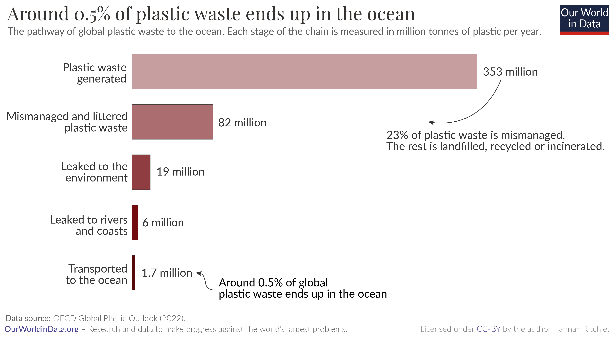
*Figura: solo un 0,5 % del plástico acaba en el mar, pero el problema real es la mala gestión: casi una cuarta parte del plástico del mundo se abandona o se gestiona incorrectamente. Origen: `UT 2 Retos ambientales y sociales.pdf`.*

**El "timo del reciclaje infinito".** Al reciclar plástico (normalmente reciclaje mecánico) el material se **degrada** y se usa para fabricar algo de menor calidad. La mayoría de los plásticos solo se pueden reciclar **una o dos veces** y luego van al vertedero: el reciclaje **no elimina** los residuos, solo retrasa el proceso. Además, hay usos (sanitarios, conservación de alimentos, aligerar vehículos) en los que el plástico es difícil de sustituir sin generar otros impactos. Por eso las **medidas más efectivas** que señalan los materiales son **mejorar la gestión de residuos a nivel global** (vertederos sellados, buenos sistemas de recogida) y que los **países ricos inviertan** en la infraestructura de gestión de residuos de los países de ingresos bajos y medios. También se citan proyectos de limpieza como los interceptores de *Ocean Cleanup*.

> **Ejemplo actual — Los móviles y la basura electrónica.** Cambiamos de móvil cada pocos años y muchos aparatos se sustituyen cuando todavía funcionan. Los equipos informáticos, los móviles o los electrodomésticos son "residuos de manejo especial" con metales y minerales valiosos. En la Unión Europea, el nuevo reglamento que obliga desde finales de 2024 a un **cargador único USB-C** para móviles, tablets y otros dispositivos busca precisamente reducir la cantidad de cargadores que acaban en la basura.

> **En las noticias — Tratado global de plásticos sin acuerdo.** Las negociaciones de la ONU para un tratado internacional jurídicamente vinculante sobre la contaminación por plásticos (rondas celebradas entre 2023 y 2025) terminaron, según se informó, sin un texto final por las diferencias entre los países que querían limitar la producción y los que preferían centrarse solo en la gestión de residuos. Es un ejemplo de lo difícil que resulta el "trabajo coordinado" que pide el criterio (e) de la unidad.

### 1.5. Otros retos ambientales relacionados: deforestación, biodiversidad, alimentación, agua y océanos

**Deforestación.** Es la *conversión permanente de superficie forestal a otros usos* (agricultura, pastos, infraestructura). Se ha perdido cerca de **un tercio del bosque original** del planeta y **la mitad de esa pérdida ocurrió en el siglo XX**. Hace ~10.000 años el 57 % de la tierra habitable era bosque (~6.000 millones de hectáreas); hoy quedan unos **4.000 millones de hectáreas**. El principal motor es la **agricultura** (cultivos y, sobre todo, pastos y soja para pienso). La deforestación para agricultura emite unas **2,6 Gt de CO₂ al año** (~6,5 % de las emisiones globales) y destruye hábitat: el **80 % de la biodiversidad terrestre** vive en bosques. Dato optimista: desde los años 80 ya se superó el "pico de deforestación"; mientras la población creció un 147 % desde 1961, la superficie agrícola solo aumentó un 7 % gracias a mejores rendimientos. Medidas: mejorar el rendimiento agrícola, cambiar la dieta (menos vacuno), **restaurar** bosques y monitorizar por satélite.

*Figura: la humanidad ha destruido cerca de un tercio de los bosques del mundo para ganar tierra agrícola; cerca de tres cuartas partes de la tierra agrícola se dedican a la ganadería (pastos + pienso). Origen: `UT 2 Retos ambientales y sociales.pdf`.*

**Pérdida de biodiversidad.** La **biodiversidad** es *la variedad de vida en la Tierra a nivel de genes, especies y ecosistemas*. La extinción actual es **miles de veces más rápida** que el ritmo natural: estamos en la **sexta extinción masiva**, y a diferencia de las cinco anteriores (por causas naturales), esta la provoca la actividad humana. El **Índice Planeta Vivo (LPI)** mide el cambio medio del tamaño de las poblaciones de miles de especies de vertebrados: ha caído en torno a un **73 % desde 1970** (no significa que hayan desaparecido el 73 % de los animales, sino que el tamaño medio de las poblaciones monitorizadas ha bajado unas tres cuartas partes). La biomasa de mamíferos silvestres se ha reducido un **85 %** desde el inicio de la civilización; hoy los humanos y su ganado son casi toda la biomasa de mamíferos terrestres. Impacto: se degradan los **servicios ecosistémicos** (polinización —el 75 % de los cultivos alimentarios dependen al menos en parte de polinizadores—, purificación del agua, regulación del clima) y aumenta el **riesgo de pandemias** por zoonosis. La biodiversidad se considera **capital natural**.

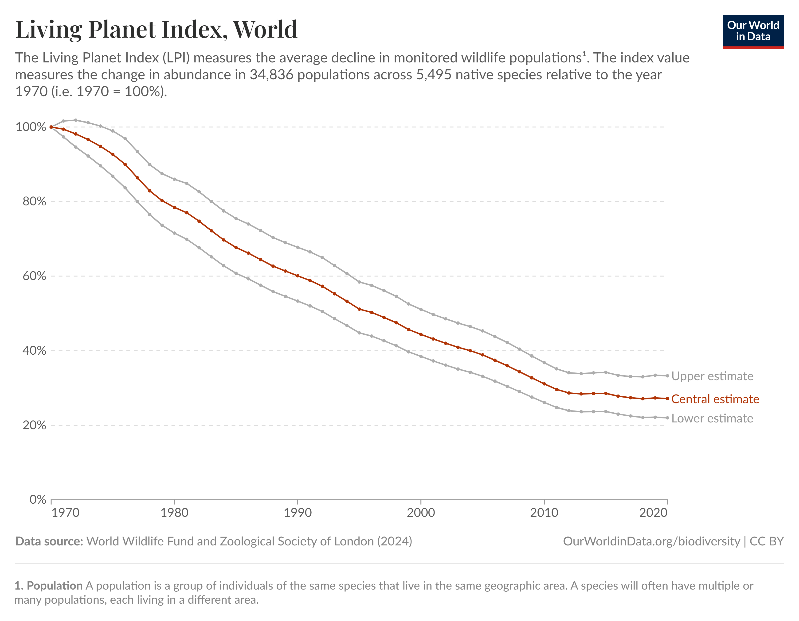
*Figura: el Índice Planeta Vivo. La estimación central indica que las poblaciones de vertebrados monitorizadas han perdido de media unas tres cuartas partes de sus individuos desde 1970. Origen: `UT 2 Retos ambientales y sociales.pdf`.*

**Alimentación.** Producir alimentos usa **la mitad de la superficie habitable** del planeta, el **70 % del agua dulce** global y genera cerca del **26 % de las emisiones de GEI**. La **ganadería** (sobre todo vacuno) es la más intensiva: usa unos **¾ de la tierra agrícola** para producir solo **~18 % de las calorías** y **~37 % de la proteína**. Más del **80 %** de la huella de carbono de la mayoría de alimentos procede del **cambio de uso del suelo y de la etapa de granja** (fertilizantes, fermentación entérica de los rumiantes), no del transporte ni del envasado: por eso, para reducir tu huella alimentaria, importa más **qué comes** que si es "producto local". Medidas: comer menos carne y lácteos, reducir el consumo excesivo y el **desperdicio alimentario**, y adoptar mejores prácticas agrarias.

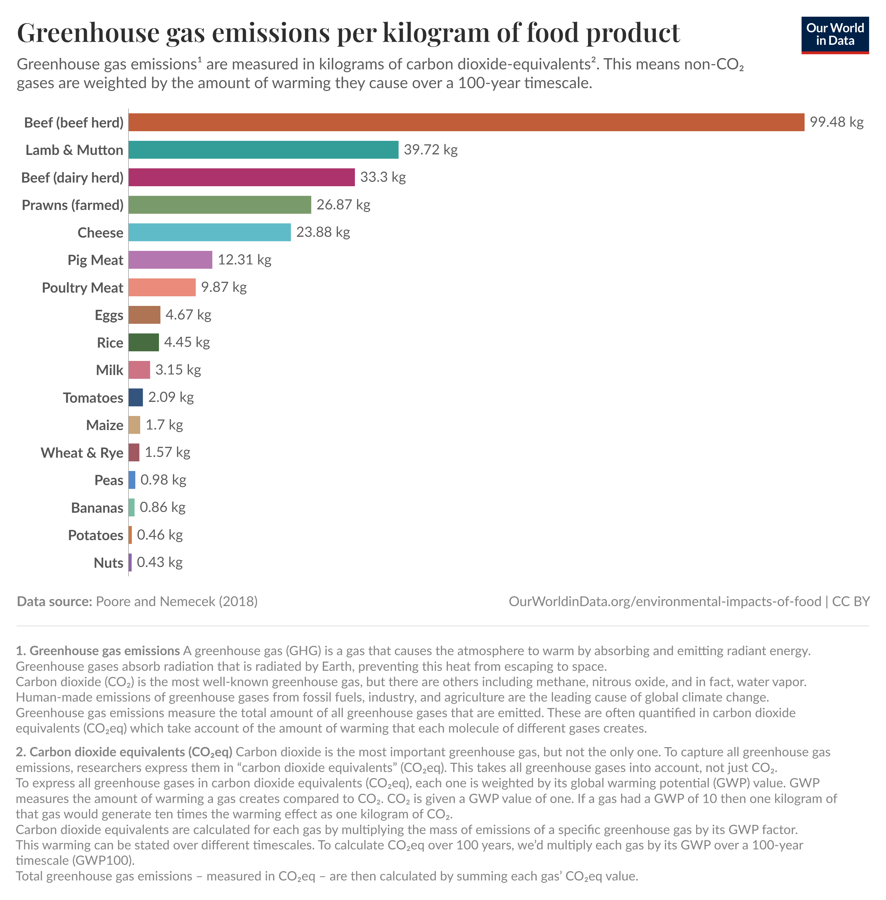
*Figura: la huella de carbono por kilo de alimento. La carne de vacuno emite decenas de veces más que las proteínas vegetales. Útil para las secciones de alimentación, energía y residuos. Origen: `UT 2 Retos ambientales y sociales.pdf`.*

**Agua.** El **ODS 6 (Agua limpia y saneamiento)** quiere garantizar la disponibilidad y la gestión sostenible del agua y el saneamiento para todos en 2030. **Una de cada cuatro personas** en el mundo no tiene acceso a **agua potable gestionada de forma segura** (fuente mejorada, en las instalaciones, disponible cuando se necesita y libre de contaminación). El agua insegura causa **más de un millón de muertes al año** y es factor de riesgo de cólera, disentería y fiebre tifoidea; las tasas de muerte por esta causa son **más de 1.000 veces superiores** en países de bajos ingresos. En España el 99,5 % del agua es apta para consumo, pero el problema es el **estrés hídrico** (la demanda supera a la disponibilidad).

**Océanos y sobrepesca.** La **sobrepesca** ocurre cuando se extraen peces más rápido de lo que las poblaciones pueden regenerarse (por encima del **rendimiento máximo sostenible, MSY**). En **2017**, alrededor del **34 %** de los stocks evaluados estaban sobreexplotados y un 60 % se pescaban justo al límite. Medidas: cuotas y vedas, ampliar las **zonas marinas protegidas**, mejorar el control y fomentar la **acuicultura** para aliviar la presión sobre las poblaciones salvajes.

### Ideas clave de esta sección

- El cambio climático está causado sobre todo por la quema de combustibles fósiles; el reto es no pasar de +1,5/+2 °C, y el clima responde al CO₂ **acumulado**.
- La energía es el mayor emisor de GEI (73,2 %); mitigación (reducir emisiones) y adaptación (reducir vulnerabilidad) son complementarias.
- Se puede **crecer económicamente reduciendo emisiones** (desacoplamiento): sostenibilidad y PIB no están reñidos.
- La contaminación del aire mata a unos 8 millones de personas al año; la lluvia ácida y el agujero de ozono demuestran que los problemas ambientales **sí se pueden resolver** con tecnología, regulación y cooperación.
- Con los residuos, **reciclar no basta**: la clave es una buena gestión global y reducir lo que generamos.
- Deforestación, pérdida de biodiversidad, alimentación, agua y sobrepesca están todos conectados con la agricultura y el consumo.

---

## 2. Retos sociales: desigualdad, brecha digital, condiciones laborales

Los **retos sociales** hay que gestionarlos para asegurar buenas condiciones de vida a la población de hoy y, sobre todo, a la del mañana, avanzando hacia una sociedad más justa. El PDF principal enumera seis (pobreza, hambre cero, salud y bienestar, educación, igualdad de género y agua potable); otro material los agrupa en tres ejes: **desigualdad, demografía y salud/alimentación**. La programación pide centrarse en **desigualdad, brecha digital y condiciones laborales**, así que ese es el hilo de esta sección.

### 2.1. Desigualdad

La **desigualdad económica** es *la diferencia que existe en la distribución de la riqueza, tanto dentro de una comunidad o país como entre países*. Es el origen determinante de casi todas las demás desigualdades, porque las personas más desfavorecidas socialmente suelen serlo porque son más pobres. La desigualdad económica se traduce en desigualdad **educativa** (el acceso desigual a educación de calidad limita las oportunidades desde el origen), **en la salud** (acceso diferente a los servicios sanitarios y a su calidad), **en el empleo** (salarios, horarios, condiciones), **cultural y étnica** (que a menudo es también discriminación), **en la vivienda** y **en las nuevas tecnologías**. A esto se suman factores como la desigualdad de género, de orientación sexual, de diversidad familiar o de discapacidad.

**Pobreza.** Es *la persistencia de la privación material extrema que impide cubrir las necesidades básicas*. El objetivo es erradicarla (**ODS 1**). Se define la **pobreza extrema** como vivir con menos de **2,15 dólares internacionales al día** (línea del Banco Mundial ajustada por poder adquisitivo). Aproximadamente **800 millones de personas** —una de cada diez— siguen en pobreza extrema (estimaciones para 2025). La población pobre es la **más vulnerable** a choques externos como pandemias y cambio climático: la **COVID-19 provocó el primer aumento de la pobreza global en más de 20 años**. La acción más efectiva, según los materiales, es garantizar el **crecimiento económico en las naciones más pobres**, junto con inversión en educación, salud e infraestructura.

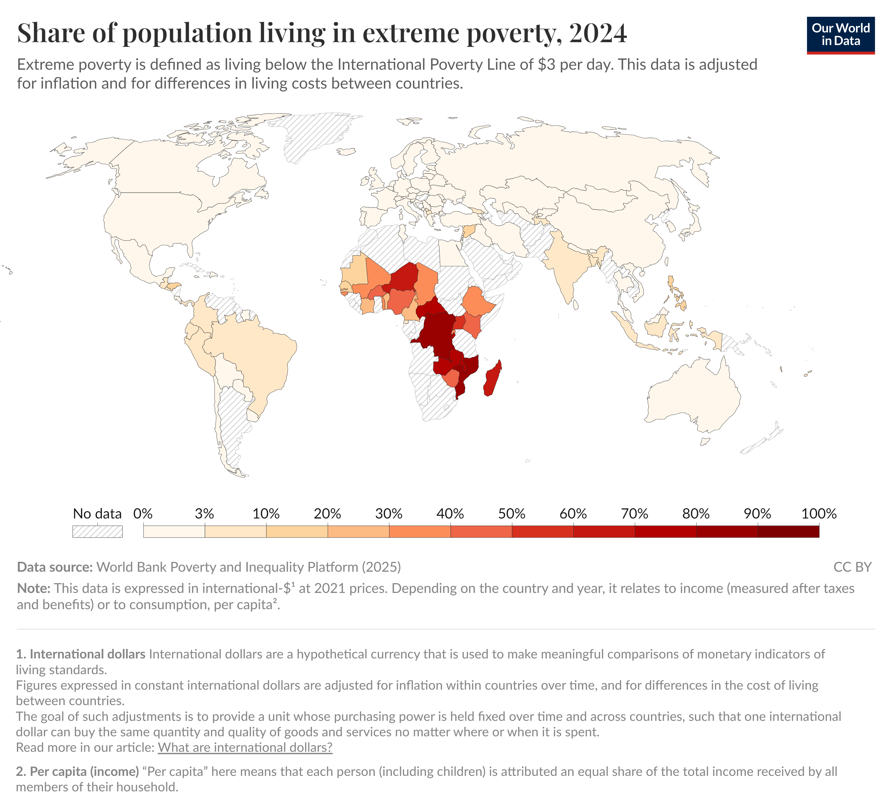
*Figura: la pobreza extrema se concentra hoy en el África subsahariana y en algunas economías estancadas. El temario define la pobreza extrema como vivir con menos de 2,15 $/día. Origen: `UT 2 Retos ambientales y sociales.pdf`.*

**Hambre cero.** El **ODS 2** busca poner fin al hambre, lograr la seguridad alimentaria, mejorar la nutrición y promover la agricultura sostenible para 2030. El reto no es solo la **desnutrición** (falta de calorías), sino todas las formas de **malnutrición**: *stunting* (retraso del crecimiento, baja altura para la edad), *wasting* (emaciación, bajo peso para la altura) y también el **sobrepeso y la obesidad** cuando la dieta es excesiva en energía y pobre en nutrientes. La proporción de personas subalimentadas en países en desarrollo bajó de **~33 % en 1970 a ~12 % en 2015**, pero el ritmo de mejora se ha ralentizado: **una de cada diez personas** sigue sin obtener suficientes calorías para una vida activa y sana. Se mide con la **Escala de Experiencia de Inseguridad Alimentaria (FIES)**, que distingue inseguridad **moderada** (no poder comer dietas sanas con regularidad) y **severa** (reducir la ingesta y pasar hambre).

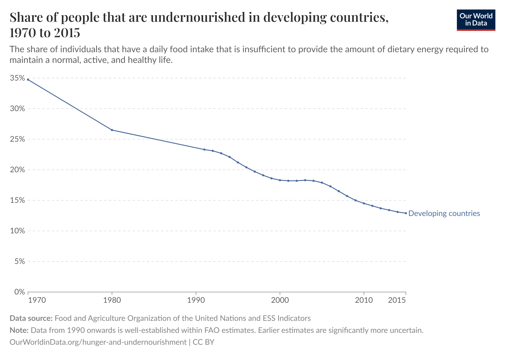
*Figura: el hambre ha retrocedido mucho en medio siglo, pero la mejora se ha frenado en los últimos años. Origen: `UT 2 Retos ambientales y sociales.pdf`.*

**Salud y bienestar.** El **ODS 3** quiere garantizar una vida sana y el bienestar para todas las edades. El indicador principal es la **esperanza de vida al nacer**. Hay una enorme **inequidad**: en algunos países del África subsahariana está por debajo de **60 años**, frente a **más de 80** en Japón o buena parte de Europa. La **mortalidad infantil** (niños menores de cinco años) y la **materna** son mucho más altas en los países de bajos ingresos, donde además la disponibilidad de **medicamentos esenciales** en el sistema público es muy baja. Las medidas: más **inversión sanitaria** (los resultados de salud mejoran mucho con el gasto, sobre todo en los niveles más bajos), **ayuda internacional** bien gestionada y **saneamiento**.

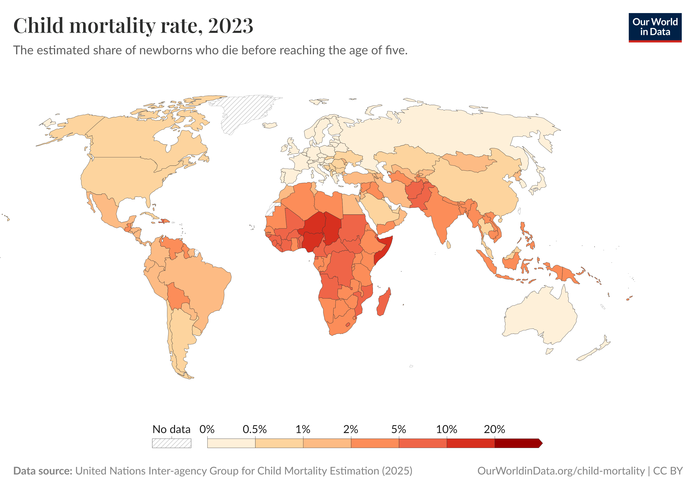
*Figura: la mortalidad de menores de cinco años refleja las desigualdades globales en salud. Origen: `UT 2 Retos ambientales y sociales.pdf`.*

**Educación.** El **ODS 4** busca una educación inclusiva, equitativa y de calidad y oportunidades de aprendizaje durante toda la vida. El foco se ha desplazado de la **cantidad** (asistencia) a la **calidad** (aprendizaje real). En muchos países de bajos ingresos, **menos del 20 % de los niños** alcanzan la competencia mínima en lectura al final de primaria; en los países más pobres los niños reciben menos de **tres años** de escolaridad "ajustada por aprendizaje", frente a más de **diez** en los ricos. Aún hay cientos de millones de niños y adolescentes sin escolarizar (**unos 244 millones en 2023**). A nivel global, la **brecha de género en la asistencia escolar prácticamente se ha cerrado** (e incluso se ha invertido en la educación superior).

**Igualdad de género.** El **ODS 5** quiere alcanzar la igualdad de género y empoderar a todas las mujeres y niñas. El reto son las **grandes desigualdades económicas** entre hombres y mujeres en salarios, empleos y control de la riqueza. La **brecha salarial de género** mide la diferencia de ingresos entre mujeres y hombres (no siempre equivale a discriminación). Se distingue la **brecha no ajustada** (compara a todos los hombres con todas las mujeres) de la **brecha ajustada** por capital humano (educación, experiencia, ocupación); lo que queda sin explicar suele atribuirse a discriminación o factores estructurales. En 2010 las mujeres ganaban de media el **91,6 %** del salario de los hombres (unos 9 puntos menos), y la brecha se ha reducido. Es **pequeña al inicio de la carrera** y **aumenta con la edad**, sobre todo cuando las mujeres se casan o tienen hijos, por las **responsabilidades familiares no remuneradas**. La **segregación ocupacional** (hombres y mujeres en trabajos distintos) explica cada vez más la brecha: pasó del 10,7 % del gap en 1980 al 32,9 % en 2010. Medidas: flexibilidad laboral, **licencia parental equitativa**, cambiar las **normas sociales** sobre el trabajo de cuidados y seguir invirtiendo en educación (que ya ha reducido mucho la brecha).

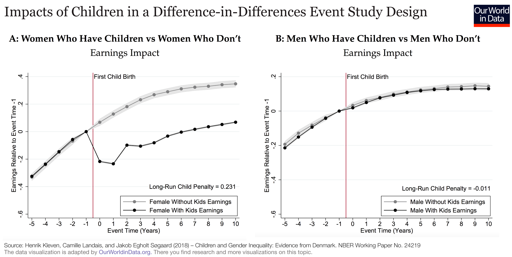
*Figura: la "penalización por maternidad". Al tener el primer hijo, los ingresos de las mujeres se desploman y no se recuperan del todo; en los hombres el efecto es prácticamente nulo. Explica por qué la brecha salarial crece con la edad. Origen: `UT 2 Retos ambientales y sociales.pdf`.*

**¿"Los niños son mejores en matemáticas"?** Es un argumento frecuente para justificar las diferencias laborales como si fueran "naturales". Pero los datos de pruebas internacionales tipo **PISA** **no muestran una ventaja consistente** de los niños en todos los países: en unos rinden mejor los niños, en otros las niñas, y en muchos la diferencia es pequeña y varía con el tiempo y el país, lo que apunta a factores **sociales, culturales y educativos**. La conclusión de los materiales: aunque existieran pequeñas diferencias medias, serían **demasiado pequeñas** para explicar las grandes desigualdades salariales y ocupacionales.

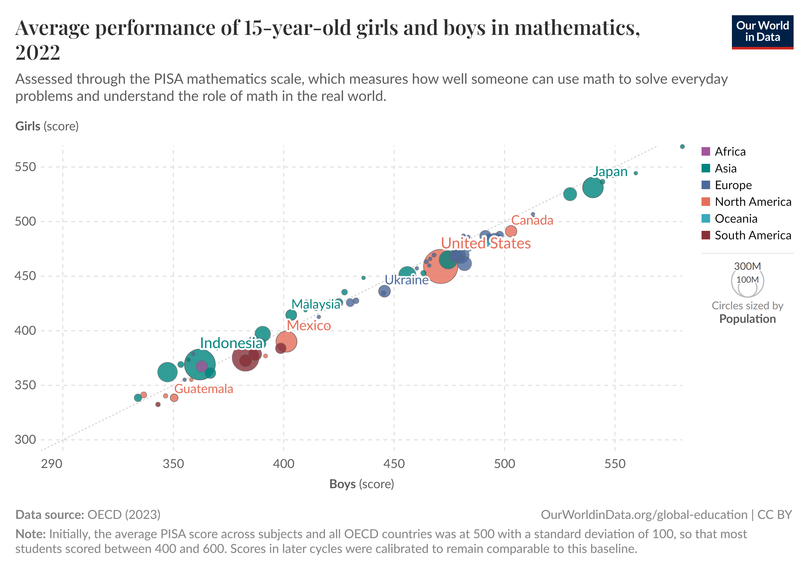
*Figura: rendimiento en matemáticas de niñas y niños de 15 años por países. La nube de puntos se pega a la diagonal: donde a los niños les va bien, a las niñas también, y viceversa. Origen: `UT 2 Retos ambientales y sociales.pdf`.*

### 2.2. Brecha digital

La **brecha digital** aparece en los materiales como una de las caras de la desigualdad: *limita las oportunidades educativas, laborales y de participación de aquellas personas y colectivos sin acceso a recursos TIC o sin formación en ellos*. No es solo "tener o no tener internet": también es saber usarlo.

El temario pone un ejemplo muy claro: **el dominio de la tecnología se ha impuesto en gestiones cotidianas imprescindibles** —pedir cita médica, solicitar una ayuda, operar con el banco—, y eso ha aumentado la **vulnerabilidad de colectivos como las personas mayores**, que muchas veces no disponen de dispositivos, no saben usarlos y tienen dificultades para acceder a formación o a tecnologías adaptadas a sus capacidades. La brecha digital también tiene una dimensión **territorial** (zonas rurales peor conectadas) y **económica** (hogares que no pueden permitirse dispositivos o conexión).

> **Ejemplo actual — "Soy mayor, no idiota".** La campaña que impulsó en 2022 un jubilado valenciano, que reunió cientos de miles de firmas pidiendo a los bancos una atención más humana, llevó al sector bancario español y al Gobierno a firmar protocolos para reforzar la atención presencial y telefónica a personas mayores. Es un caso real y reconocible de brecha digital: la digitalización de un servicio esencial dejó fuera a una parte de la población.

> **En las noticias — Zonas rurales y "banda ancha".** Los planes de despliegue de fibra óptica y 5G en zonas rurales (financiados en parte con fondos europeos) siguen apareciendo en prensa como forma de cerrar la brecha digital territorial. Según se informó, la cobertura de banda ancha ultrarrápida en España es muy alta en las ciudades pero todavía desigual en municipios pequeños y despoblados, lo que enlaza con el reto demográfico del despoblamiento rural.

### 2.3. Condiciones laborales

Las **condiciones laborales** (salarios, horarios, estabilidad, seguridad y salud, oportunidades) son otra cara de la desigualdad social. Los materiales las tratan sobre todo a través de tres asuntos:

- **Desigualdad en el empleo:** diferencias en las oportunidades laborales y en la **calidad** del empleo (salarios, jornada, condiciones). Se conecta con la brecha salarial de género y con la infrarrepresentación de las mujeres en los puestos de alta dirección y su sobrerrepresentación en empleos peor pagados.
- **Desempleo:** el aumento de población y el paso a una sociedad más industrializada y tecnificada pueden hacer que **baje la demanda de mano de obra**. En este contexto hay que valorar el efecto de la **inteligencia artificial**.
- **Trabajo digno y seguridad y salud laboral:** aparecen como retos ligados a los derechos humanos en el trabajo.

**IA generativa y empleo.** Según un estudio de la **Organización Internacional del Trabajo (OIT)** publicado en **agosto de 2023** (*Generative AI and jobs*), la irrupción de la IA generativa supondrá una **exposición parcial a la automatización** en la mayoría de empleos e industrias: **complementará** los puestos existentes, cambiando su calidad (carga e intensidad de trabajo), **más que destruir empleo de golpe**. Ahora bien, el impacto será muy desigual:

- Casi **una cuarta parte del trabajo administrativo** está en riesgo alto de desaparecer.
- En los **países de renta alta**, hasta el **5,5 %** del empleo total está potencialmente expuesto; en los de **renta baja**, solo el **0,4 %**.
- El impacto sobre el **empleo femenino puede ser el doble** que sobre el masculino, por la sobrerrepresentación de las mujeres en tareas administrativas.

Las repercusiones dependerán, en gran medida, de **cómo se gestionen** la difusión, la implantación y el uso de esta tecnología.

> **Ejemplo actual — Repartidores y algoritmos.** En España, la "ley rider" (en vigor desde 2021) obliga a las plataformas de reparto a considerar asalariados a sus repartidores y a informar a la representación de los trabajadores sobre las reglas de los **algoritmos** que asignan tareas y evalúan el desempeño. Es un ejemplo de cómo la tecnología cambia las condiciones laborales y de cómo la regulación intenta proteger el "trabajo digno".

> **En las noticias — IA en las oficinas.** Desde 2023, numerosas empresas han anunciado que usan asistentes de IA generativa para redactar correos, resumir documentos o programar. Varios informes difundidos en prensa (consultoras, OIT, OCDE) coinciden, según se informó, en que a corto plazo la IA transforma tareas dentro de los puestos administrativos y técnicos más que eliminarlos por completo, en la línea de lo que dice el estudio de la OIT recogido en el temario.

### Ideas clave de esta sección

- La **desigualdad económica** es el origen de casi todas las demás desigualdades (educación, salud, empleo, vivienda, tecnología).
- La pobreza extrema (menos de 2,15 $/día) afecta a unos 800 millones de personas; los ODS 1, 2, 3, 4, 5 y 6 abordan pobreza, hambre, salud, educación, igualdad de género y agua.
- La **brecha digital** excluye de servicios esenciales a quien no tiene acceso o formación en TIC; golpea sobre todo a mayores, zonas rurales y hogares con menos renta.
- En **condiciones laborales**, la IA generativa (estudio OIT 2023) sobre todo **transforma** tareas, con más riesgo en el trabajo administrativo y un impacto doble sobre el empleo femenino.

---

## 3. Impactos sobre las personas y los sectores productivos

Los problemas ambientales y sociales **están interconectados y tienen efectos en cascada**. Esta sección responde al criterio (c): analizar cómo esos impactos golpean a las personas y a las actividades económicas.

### 3.1. Cada reto tiene su impacto ambiental… y su impacto sobre la gente

**Efectos de los impactos ambientales:**

- **Cambio climático:** fenómenos extremos (sequías, inundaciones, olas de calor) que provocan pérdidas económicas y desplazamientos de población.
- **Gestión inadecuada de residuos:** la acumulación de plásticos y otros residuos contamina suelo, agua y aire, y daña la fauna y la salud humana.
- **Contaminación:** enfermedades respiratorias, problemas de piel, peor calidad de los alimentos, daño a los ecosistemas y menos biodiversidad.
- **Pérdida de biodiversidad:** los ecosistemas dejan de prestar servicios esenciales (polinización, purificación del agua, regulación del clima).
- **Pérdida de recursos hídricos:** escasez de agua que afecta a la salud y a la agricultura y aumenta el riesgo de incendios.

**Efectos de los impactos sociales:**

- **Pobreza y desigualdad:** limitan el acceso a vivienda, alimentos y educación, y perpetúan ciclos de pobreza **intergeneracional**.
- **Discriminación:** daño psicológico y emocional, menos oportunidades laborales y educativas, y debilitamiento de la cohesión social y la democracia.
- **Envejecimiento de la población:** menos fuerza laboral activa, más dependencia económica y presión sobre pensiones y servicios sociales.
- **Conflictos armados:** pérdida de vidas, destrucción de infraestructuras, desplazamientos masivos y traumas.
- **Corrupción:** pérdida de confianza en las instituciones, deterioro económico y desvío de recursos públicos.
- **Desempleo:** el aumento de población y una sociedad más tecnificada pueden reducir la demanda de mano de obra.

### 3.2. Impacto por sectores productivos

Los materiales relacionan cada gran sector con sus impactos ambientales clave y con los principios sostenibles que debería aplicar:

| Sector | Impactos ambientales clave | Principios sostenibles |
| --- | --- | --- |
| **Industrial** | Emisiones de GEI; contaminación del agua y del aire; residuos tóxicos; degradación de ecosistemas | Tecnologías limpias; gestión de residuos para su reintegración; energías renovables |
| **Agrícola** | Uso excesivo de pesticidas; deforestación; contaminación de agua y suelo; erosión y pérdida de biodiversidad | Gestión adecuada de suelo y agua; rotación de cultivos; abonos orgánicos y control biológico de plagas |
| **Ganadero** | Emisión de GEI (metano); deforestación para pastos; contaminación de agua y suelo por estiércol | Uso eficiente de recursos; condiciones dignas para el ganado; reducción de antibióticos |
| **Transporte** | Emisiones de GEI; contaminación del aire | Eficiencia energética; modos de transporte alternativos; planificación urbana orientada a la movilidad sostenible |
| **Turístico** | Construcción masiva de infraestructuras; consumo excesivo de agua y energía; residuos y degradación de ecosistemas | Conservación del medio ambiente; respeto por la cultura local; equilibrio entre beneficio económico y protección |

**Impacto sobre las personas:** salud (enfermedades respiratorias y de la piel, olas de calor), empleo (transformación o pérdida de puestos), precios (los shocks en los mercados alimentarios desestabilizan sobre todo a los países pobres) y calidad de vida. **Impacto sobre la competitividad y la estabilidad económica:** la degradación del capital natural (suelos, agua, pesca, biodiversidad) es un **riesgo sistémico** porque destruye la base de recursos de la que dependen industrias como la agricultura, el turismo o la farmacéutica.

### 3.3. Impacto en el sector TIC y en la actividad técnica

Aunque el sector tecnológico parezca "limpio", tiene impactos concretos que los materiales subrayan:

- **Huella hídrica de la IA:** se calcula que una conversación sencilla de unas **35 preguntas y respuestas** con una IA generativa consume **aproximadamente medio litro de agua**, sobre todo para enfriar los servidores y las unidades de procesamiento gráfico (GPU). Hacer un uso responsable reduce tanto el consumo energético como el de agua potable.
- **Consumo eléctrico de los centros de datos:** el crecimiento del uso de la IA y la proliferación de datos, almacenamientos y dispositivos conectados hace crecer rápidamente las emisiones asociadas a la infraestructura digital.
- **Residuos electrónicos:** los equipos informáticos son "residuos de manejo especial" con materiales y minerales valiosos; su reutilización y reciclaje son parte de la solución.

*Figura: los centros de datos son solo una parte del crecimiento de la demanda eléctrica mundial hasta 2030; incluso escenarios de crecimiento alto o bajo de los centros de datos no cambian el panorama de forma radical. Origen: imagen de apoyo de la carpeta UD02 (informe de la Agencia Internacional de la Energía).*

> **Ejemplo actual — El agua de los centros de datos.** Grandes empresas tecnológicas publican desde hace unos años informes de sostenibilidad en los que reconocen que sus centros de datos consumen millones de metros cúbicos de agua al año para refrigeración, y anuncian objetivos de ser "water positive". En España, la instalación de grandes centros de datos en zonas con estrés hídrico (Aragón, Madrid, Castilla-La Mancha) ha generado debate público. Conecta con el dato del temario sobre la huella hídrica de la IA.

> **En las noticias — La IA dispara la demanda eléctrica.** Desde 2024, la Agencia Internacional de la Energía y varias eléctricas han advertido, según se informó, de que la demanda eléctrica de los centros de datos crecerá con fuerza esta década por la IA, aunque seguiría siendo una fracción del total mundial. Es un ejemplo directo del impacto del sector TIC sobre el reto energético.

### Ideas clave de esta sección

- Los impactos ambientales y sociales van **en cascada**: un problema ambiental se convierte en problema económico y social, y al revés.
- Cada sector productivo (industria, agricultura, ganadería, transporte, turismo) tiene impactos ambientales típicos y principios sostenibles asociados.
- La degradación del **capital natural** es un riesgo para la competitividad y la estabilidad económica.
- El sector TIC no es neutro: **agua, electricidad y residuos electrónicos** son sus impactos principales.

---

## 4. Cooperación y alianzas para el desarrollo sostenible (ODS 17)

Ningún reto de esta unidad se resuelve en solitario. Por eso la Agenda 2030 incluye el **ODS 17 (Alianzas para lograr los objetivos)**, centrado en **fortalecer la cooperación, el intercambio de conocimientos y la movilización de recursos**. Esta sección responde al criterio (e): valorar la importancia de las alianzas y del trabajo transversal y coordinado.

### 4.1. Qué es una alianza de sostenibilidad

Una **alianza de sostenibilidad** es *un acuerdo entre dos o más partes con diferentes capacidades con el fin de alcanzar sus objetivos relacionados con la sostenibilidad*. Los materiales distinguen varios tipos de cooperación:

- **Alianzas entre países (gobernanza global):** cooperación internacional para problemas que cruzan fronteras, como el cambio climático, la sobrepesca o la deforestación. Ejemplo recogido en el temario: en la cumbre **COP26**, **más de 100 países** firmaron un compromiso para **detener y revertir la pérdida de bosques para 2030**.
- **Cooperación público-privada:** gobiernos y empresas colaboran, comparten recursos e implementan políticas conjuntas para alcanzar objetivos de sostenibilidad.
- **Papel de administraciones, ONG y empresas tecnológicas:** definir y coordinar las responsabilidades de cada actor en la transición a modelos de producción más sostenibles, con un enfoque de ética, justicia y colaboración.

### 4.2. Instrumentos concretos de cooperación

- **Ayuda Oficial al Desarrollo (AOD):** flujos financieros de países desarrollados para apoyar a países en desarrollo en salud, educación o infraestructura. En **1972 la ONU acordó destinar el 0,7 % del Producto Nacional Bruto (PNB)** a esta ayuda (un objetivo que la mayoría de países ricos todavía no cumple).
- **Tres pasos que prioriza la ONU:** preparar la gobernanza y las instituciones; priorizar políticas e inversiones justas; y aumentar la financiación para los ODS.
- **Fondo Verde para el Clima:** los países desarrollados se comprometieron a movilizar **100.000 millones de dólares anuales** para la acción climática en los países en desarrollo (meta 13.a del ODS 13).
- **Fondo de Transición Justa (Unión Europea):** mecanismo para apoyar a las regiones más afectadas por la transición hacia la neutralidad climática (por ejemplo, las dependientes del carbón), con un presupuesto de **17.500 millones de euros para 2021-2027**.

La contaminación por plásticos ilustra por qué hacen falta alianzas: aunque un país reduzca a la mitad su producción, el problema persiste si otros no mejoran su gestión de residuos; y limpiar los océanos o proteger caladeros compartidos exige acuerdos entre Estados.

> **Ejemplo actual — El Tratado de Alta Mar de la ONU.** En 2023 se aprobó el Tratado sobre la biodiversidad marina en zonas fuera de las jurisdicciones nacionales (conocido como "Tratado de Alta Mar" o BBNJ), que permite crear áreas marinas protegidas en aguas internacionales. Es exactamente el tipo de "alianza entre países" para "conservar el mar" del que hablan los materiales; a lo largo de 2024 y 2025 los países fueron ratificándolo para que entrara en vigor.

> **En las noticias — Financiación climática en las cumbres del clima.** En las cumbres del clima de 2023 (Dubái) y 2024 (Bakú) se aprobó poner en marcha un **fondo de pérdidas y daños** para los países más vulnerables y se discutió un nuevo objetivo de financiación climática que, según se informó, sustituye al viejo compromiso de 100.000 millones de dólares anuales. Muestra que las alianzas del ODS 17 existen, pero que llevarlas a la práctica (que "los compromisos pasen a la acción") es lo difícil.

### Ideas clave de esta sección

- El **ODS 17** es el "pegamento" de la Agenda 2030: sin cooperación, el resto de objetivos no se alcanzan.
- Una **alianza de sostenibilidad** une a partes con capacidades distintas (gobiernos, empresas, ONG, organismos internacionales).
- Instrumentos a recordar: **AOD (0,7 % del PNB, acordado en 1972)**, **Fondo Verde para el Clima (100.000 M$/año)** y **Fondo de Transición Justa de la UE (17.500 M€, 2021-2027)**.
- El compromiso de la COP26 de **más de 100 países** para frenar la deforestación en 2030 es el ejemplo de alianza global del temario.

---

## 5. Ejemplos en el sector tecnológico y digital

La programación pide cerrar la unidad con ejemplos aplicados al **sector tecnológico y digital**, que es transversal a todos los ciclos que cursan este módulo. La idea de fondo: los perfiles técnicos e informáticos **no son ajenos** a los retos de esta unidad, ni como fuente de impactos ni como parte de la solución.

### 5.1. El impacto del propio sector

- **Energía y emisiones.** Los centros de datos y la infraestructura digital consumen electricidad, y su demanda crece con la IA y con la multiplicación de datos, almacenamientos y dispositivos conectados. Aun así, como muestra la figura de la Agencia Internacional de la Energía de la sección 3, los centros de datos son solo **una parte** del crecimiento de la demanda eléctrica mundial hasta 2030.
- **Agua.** Recuerda el dato del temario: una conversación de ~35 preguntas y respuestas con una IA generativa gasta **en torno a medio litro de agua** de refrigeración.
- **Residuos electrónicos.** Ordenadores, servidores y móviles contienen materiales y minerales valiosos; alargar su vida útil, repararlos y reciclarlos reduce el impacto.
- **Empleo.** La automatización y la IA generativa **transforman** las tareas de los puestos técnicos y administrativos (estudio de la OIT de 2023).

### 5.2. La tecnología como parte de la solución

Los materiales incluyen un informe sobre **infraestructura digital** (encuesta a **1.501 responsables de TI** de diez países/regiones, con datos de julio-agosto de 2024) que muestra cómo el sector intenta reducir su huella:

- El **71 %** de los responsables de TI tiene un papel directo en definir la estrategia de sostenibilidad de su empresa, y el **38 %** afirma que el impacto ambiental y la gobernanza **dirigen todas** sus decisiones sobre infraestructura digital.
- El **40 %** ya tiene infraestructura digital "inteligente" de extremo a extremo en 2024 (frente al 34 % en 2023).
- Las funciones que más ayudan a reducir emisiones de carbono: **rutas de red optimizadas de forma sostenible** (mencionadas por el 83 %), **tecnología bajo demanda / "red como servicio" (NaaS)** (81 %) y capacidades basadas en **IA**. Estas técnicas enrutan los datos de forma eficiente, virtualizan funciones de red para usar menos dispositivos y hacen que las organizaciones consuman solo el ancho de banda que necesitan.
- Los clientes exigen transparencia: los **datos de emisiones de alcance 3** (las de toda la cadena de valor) son el factor más importante al elegir un proveedor de infraestructura digital, y el **62 %** pediría a un proveedor que revisara sus objetivos ambientales si no se alinearan con los suyos (un 16 % se cambiaría de proveedor). Un **10 %** sospecha que su operador hace **"lavado de imagen verde" (*greenwashing*)**.

*Figura: qué opciones dicen los responsables de TI que les ayudan a reducir emisiones de carbono. También se pregunta si la IA es "causa o solución" de los retos ambientales. Origen: `IMPACTO SOSTENIBLE Y ALCANCE SIN ESFUERZO-COLT_ES GC3 Digital Infrastructure Report 2024 03.pdf`.*

Otras buenas prácticas del sector que citan los materiales: **eficiencia energética** y auditorías energéticas en oficinas y fábricas, **servidores eficientes**, **optimización de datos** y desarrollo de software con criterios de bajo consumo ("*green coding*"), retirada del software antiguo y aplicación de la **economía circular** a los equipos.

### 5.3. Ejemplos de sostenibilidad en sectores cercanos (Canarias)

Uno de los materiales recoge casos reales de aplicación de criterios de sostenibilidad:

- **Sector pesquero:** la Cofradía de Pescadores de **La Graciosa** (Lanzarote) usa **artes de pesca selectivas** y colabora con científicos marinos para evaluar la salud de los ecosistemas y garantizar la viabilidad a largo plazo de la actividad.
- **Sector turístico:** el **Parque Nacional de Garajonay** (La Gomera) promueve el **ecoturismo** con senderos interpretativos y centros de visitantes, y hace reforestación de áreas degradadas y protección de especies endémicas, con principios como "dar prioridad a la protección", "involucrar a todas las partes interesadas" y "perseguir la mejora continua".
- **Sector energético:** el **Parque Eólico de Agüimes** (Gran Canaria) genera energía limpia con aerogeneradores y reduce la dependencia de los combustibles fósiles en la isla.

> **Ejemplo actual — El Reglamento de Ecodiseño y el "pasaporte digital de producto".** La Unión Europea aprobó en 2024 un reglamento de ecodiseño para productos sostenibles que introducirá un "pasaporte digital de producto" con información sobre reparabilidad, materiales y reciclaje, y que limitará la destrucción de productos no vendidos. Afecta de lleno a la electrónica de consumo y encaja con la idea de "diseñar productos duraderos y reciclables" que piden los materiales.

> **En las noticias — Etiquetas de eficiencia y reparabilidad.** Desde 2021 los móviles y tablets vendidos en la UE llevan etiqueta energética y un índice de reparabilidad, y los fabricantes están obligados a ofrecer piezas de repuesto y actualizaciones de software durante varios años. Es un ejemplo cotidiano de cómo la regulación empuja al sector tecnológico hacia la sostenibilidad y la economía circular (que se estudiará a fondo en la UT4).

### Ideas clave de esta sección

- El sector TIC impacta en **energía, agua y residuos electrónicos**, y la IA generativa transforma el empleo técnico.
- La propia tecnología ofrece soluciones: **eficiencia**, virtualización de redes, "red como servicio", *green coding*, servidores eficientes y economía circular de los equipos.
- Las empresas ya piden a sus proveedores datos de **emisiones de alcance 3** y desconfían del ***greenwashing***.
- Hay ejemplos cercanos (pesca selectiva, ecoturismo, energía eólica en Canarias) de cómo se aplican criterios de sostenibilidad en la práctica.

---

## Glosario rápido

| Término | En una frase |
| --- | --- |
| **Reto socioambiental** | Desafío que la sociedad en conjunto debe resolver para asegurar un desarrollo sostenible. |
| **Gases de efecto invernadero (GEI)** | Gases (CO₂, metano, vapor de agua, óxidos de nitrógeno, ozono, CFC) que retienen el calor en la atmósfera. |
| **Efecto invernadero** | Proceso natural por el que los GEI mantienen caliente el planeta; la actividad humana lo ha intensificado. |
| **Presupuesto de carbono** | Cantidad total de CO₂ que se puede emitir antes de superar un límite de calentamiento (2 °C). |
| **Mitigación / adaptación** | Reducir las emisiones de GEI / reducir la vulnerabilidad ante los efectos ya inevitables del cambio climático. |
| **Desacoplamiento** | Crecer económicamente (más PIB) reduciendo a la vez las emisiones. |
| **PIB** | Valor monetario de todos los bienes y servicios finales producidos en un país en un periodo. |
| **Combustible fósil** | Fuente de energía no renovable (petróleo, carbón, gas) formada por restos orgánicos durante millones de años. |
| **Recurso renovable / no renovable** | Se regenera con buena gestión (biomasa, agua, pesca) / existe en cantidad fija y se agota (minerales, fósiles). |
| **Día de la Deuda Ecológica** | Fecha en que la humanidad ha consumido los recursos que el planeta genera en un año (2 de agosto en 2023). |
| **Contaminación** | Alteración de un medio por un elemento no deseable que causa daño a personas, seres vivos o medioambiente. |
| **Lluvia ácida** | Precipitación de ácidos formados a partir de SO₂ y NOₓ; se resolvió con *scrubbers*, catalizadores y acuerdos. |
| **Protocolo de Montreal (1987)** | Acuerdo global que prohibió los CFC para recuperar la capa de ozono (previsto para 2050-2060). |
| **Deforestación** | Conversión permanente de bosque a otros usos; se ha perdido un tercio del bosque original. |
| **Biodiversidad** | Variedad de vida a nivel de genes, especies y ecosistemas. |
| **Índice Planeta Vivo (LPI)** | Indicador del tamaño medio de las poblaciones de vertebrados; ha caído ~73 % desde 1970. |
| **Servicios ecosistémicos** | Beneficios gratuitos de la naturaleza: polinización, agua limpia, regulación del clima. |
| **Capital natural** | Los recursos y ecosistemas vistos como un "activo" del que depende la economía. |
| **MSY (rendimiento máximo sostenible)** | Cantidad de pesca que una población puede soportar sin dejar de regenerarse. |
| **Pobreza extrema** | Vivir con menos de 2,15 dólares internacionales al día (línea del Banco Mundial). |
| **Malnutrición** | Nutrición inadecuada: *stunting* (retraso del crecimiento), *wasting* (emaciación) y también sobrepeso/obesidad. |
| **Brecha salarial de género** | Diferencia de ingresos entre mujeres y hombres; la parte no explicada se atribuye a discriminación. |
| **Brecha digital** | Desigualdad entre quienes tienen acceso y formación en TIC y quienes no. |
| **Estrés hídrico** | Situación en que la demanda de agua supera a la disponible. |
| **AOD** | Ayuda Oficial al Desarrollo; la ONU fijó en 1972 el objetivo del 0,7 % del PNB. |
| **ODS 17** | Objetivo de "Alianzas para lograr los objetivos": cooperación, conocimiento y financiación. |
| **Alianza de sostenibilidad** | Acuerdo entre partes con capacidades distintas para alcanzar objetivos de sostenibilidad. |
| **Emisiones de alcance 3** | Emisiones indirectas de toda la cadena de valor de una organización. |
| **Greenwashing** | "Lavado de imagen verde": aparentar ser sostenible sin serlo. |
| **NaaS ("red como servicio")** | Consumir capacidad de red bajo demanda, pagando solo por lo que se usa, para gastar menos energía. |

## Repaso: 10 preguntas para autoevaluarte

1. ¿Qué significa que la relación entre los retos ambientales y los sociales es "bidireccional"? Pon un ejemplo.
2. Explica la diferencia entre **mitigación** y **adaptación** frente al cambio climático, con un ejemplo de cada una.
3. ¿Por qué se dice que "el clima responde al CO₂ acumulado y no solo a las emisiones de un año"? ¿Qué es el presupuesto de carbono?
4. ¿Qué sector genera la mayor parte de las emisiones globales de GEI y qué porcentaje aproximado supone?
5. Da dos ejemplos de problemas de contaminación que ya se han resuelto y explica cómo.
6. ¿Por qué "reciclar no basta" en el caso del plástico? ¿Cuál es, según los materiales, la medida más efectiva?
7. Clasifica los residuos según su peligrosidad y pon un ejemplo de cada categoría.
8. ¿Qué es la brecha digital y a qué colectivos afecta especialmente? Pon un ejemplo cotidiano.
9. Según el estudio de la OIT de 2023, ¿la IA generativa destruye empleo o lo transforma? ¿A quién afecta más?
10. ¿Qué es una alianza de sostenibilidad? Nombra dos instrumentos concretos de cooperación internacional que aparezcan en la unidad.

Respuestas orientativas

1. Que se influyen mutuamente: lo ambiental afecta a la sostenibilidad del planeta y lo social a la gente que vive en él (p. ej., una sequía por el cambio climático encarece los alimentos y aumenta la pobreza). Sección 1.
2. Mitigación = reducir emisiones de GEI (transición a renovables, coche eléctrico, precio al carbono). Adaptación = reducir la vulnerabilidad (sacar a la población de la pobreza, cultivos resistentes a la sequía, edificios aislados). Sección 1.2 del bloque de cambio climático (1.1).
3. Porque los GEI se acumulan en la atmósfera; el "presupuesto de carbono" es el CO₂ total que podemos emitir antes de superar los 2 °C, y cuanto más se tarda en recortar, más brusco es el ajuste. Sección 1.1.
4. La energía, con un 73,2 % de las emisiones de GEI. Sección 1.1.
5. La lluvia ácida (con *scrubbers* de desulfuración, catalizadores en los coches, menos azufre en los combustibles y acuerdos internacionales: el SO₂ bajó más del 80 %) y el agujero de la capa de ozono (Protocolo de Montreal de 1987, que prohibió los CFC). Sección 1.2.
6. Porque el reciclaje mecánico degrada el plástico, que solo se recicla una o dos veces y luego va al vertedero. La medida más efectiva es mejorar la gestión de residuos a nivel global y que los países ricos inviertan en la infraestructura de los países de ingresos bajos y medios. Sección 1.4.
7. No peligrosos (papel, chatarra, restos de alimentos), de manejo especial (electrodomésticos, equipos informáticos, neumáticos, vidrio) y peligrosos (corrosivos, tóxicos, inflamables, biológico-infecciosos). Sección 1.4.
8. Es la desigualdad entre quienes tienen acceso y formación en TIC y quienes no; afecta sobre todo a personas mayores, zonas rurales y hogares con menos renta (p. ej., no poder pedir cita médica o hacer gestiones bancarias por internet). Sección 2.2.
9. Sobre todo lo transforma: complementa los puestos y cambia su calidad más que destruirlos de golpe. Afecta más al trabajo administrativo, a los países de renta alta y, aproximadamente el doble, al empleo femenino. Sección 2.3.
10. Un acuerdo entre dos o más partes con capacidades distintas para alcanzar objetivos de sostenibilidad. Instrumentos: la Ayuda Oficial al Desarrollo (0,7 % del PNB, 1972), el Fondo Verde para el Clima (100.000 M$/año) y el Fondo de Transición Justa de la UE (17.500 M€, 2021-2027). Sección 4.

## De dónde sale esto (fuentes de la carpeta)

- **`UT 2 Retos ambientales y sociales.pdf`** — PDF principal y más completo de la unidad. Aporta las definiciones y cifras de contaminación atmosférica, cambio climático, deforestación, alimentación, biodiversidad, plásticos marinos, sobrepesca y de los retos sociales (pobreza, hambre cero, salud, educación, igualdad de género, agua). De aquí salen casi todos los gráficos del resumen.
- **`UT 2 Retos ambientales y sociales antiguo.pdf`** — Versión previa del anterior. Coincide en casi todo; se usa para contrastar (p. ej., la cifra de muertes por contaminación del aire: 7 millones en esta versión frente a 8 en la nueva) y para detalles como el "timo del reciclaje infinito", la Gran Niebla de Londres o la relación de cada reto con el crecimiento económico.
- **`UT2_los retos socioambientales_v2.pdf`** — Enfoque más "de libro de texto": definición de reto socioambiental, ámbitos (atmósfera, litosfera, hidrosfera, biosfera, sociosfera, tecnosfera), tipos de recursos naturales, clasificación de residuos, tipos de contaminación, retos demográficos (migraciones, envejecimiento, concentración urbana), tabla de impacto por sectores, efectos en cascada, IA generativa y empleo (OIT 2023), huella hídrica de la IA y sección de alianzas y ODS 17 (AOD, Fondo de Transición Justa).
- **`UNIDAD_2.pdf`** — Presentación (Ediciones Paraninfo) que organiza los retos ambientales en 8 y los vincula a ODS concretos (13, 7, 15, 6, 11, 14, 12). Aporta el diagrama de los **límites planetarios**, el efecto albedo, la desertificación en España y metas e indicadores de varios ODS.
- **`Tema 3.pdf`** — Material breve (IES Fernando Sagaseta). Asocia los grandes desafíos ambientales a los ODS 6, 7, 13 y 15 y los sociales a los ODS 1, 3, 4 y 10; incluye medidas de sostenibilidad en la actividad profesional y personal y **casos reales en Canarias** (pesca en La Graciosa, ecoturismo en Garajonay, eólica en Agüimes).
- **`IMPACTO SOSTENIBLE Y ALCANCE SIN ESFUERZO-COLT_ES GC3 Digital Infrastructure Report 2024 03.pdf`** — Informe sobre infraestructura digital (encuesta a 1.501 responsables de TI, 2024). Fuente de los ejemplos del sector tecnológico: rutas de red sostenibles, "red como servicio" (NaaS), IA como causa/solución, emisiones de alcance 3 y *greenwashing*.
- **`industrias_separadas.png` / `industrias_no_separadas.png`** — Figura de la Agencia Internacional de la Energía sobre el peso de los centros de datos en el crecimiento de la demanda eléctrica mundial 2023-2030.
