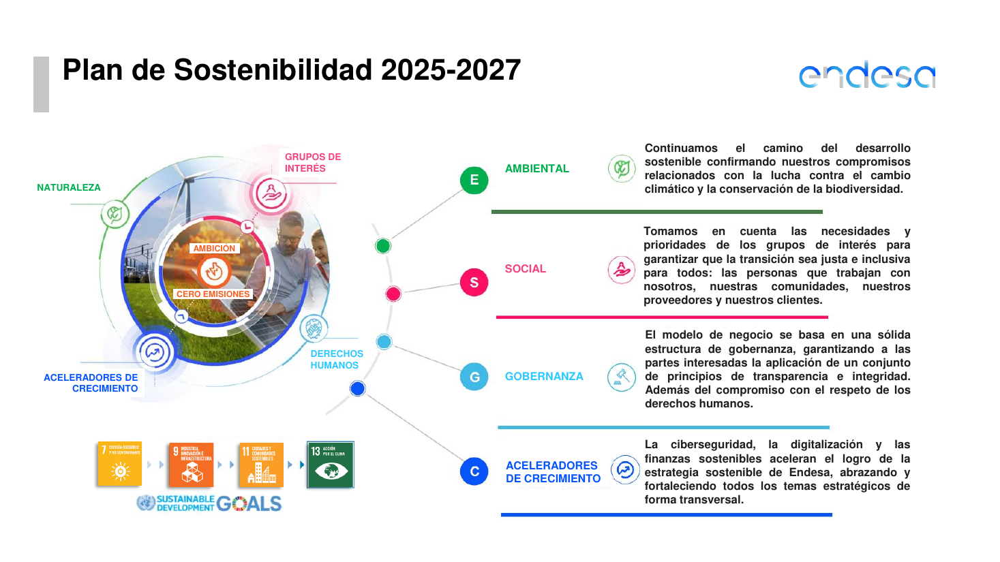
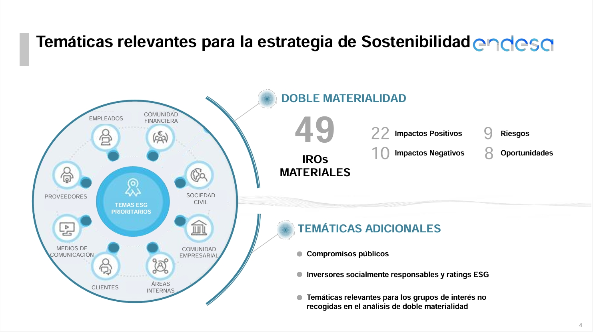
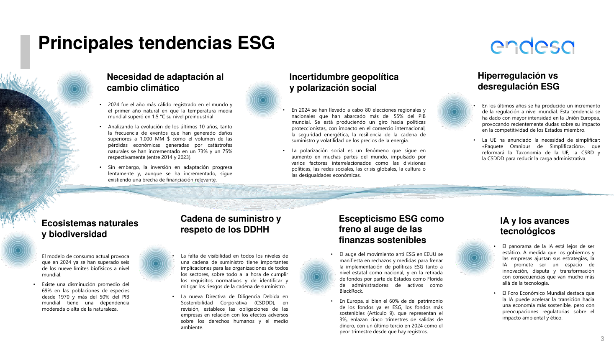
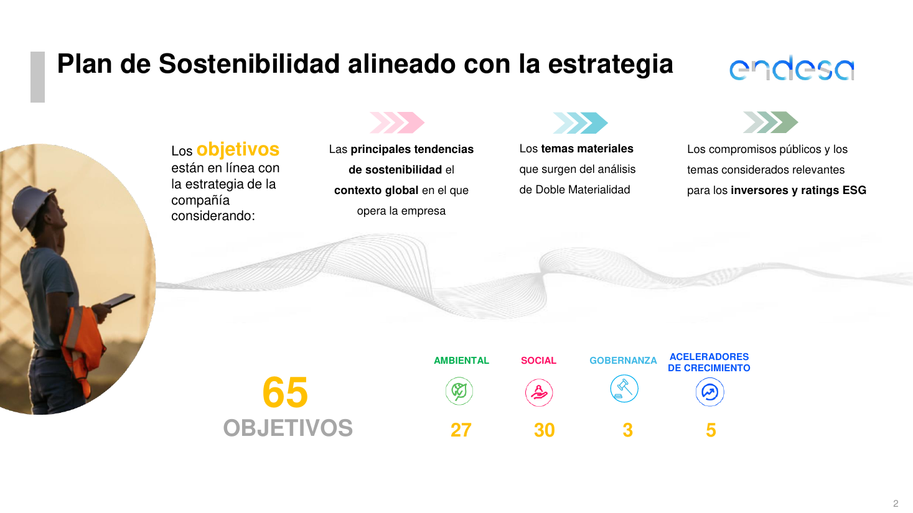
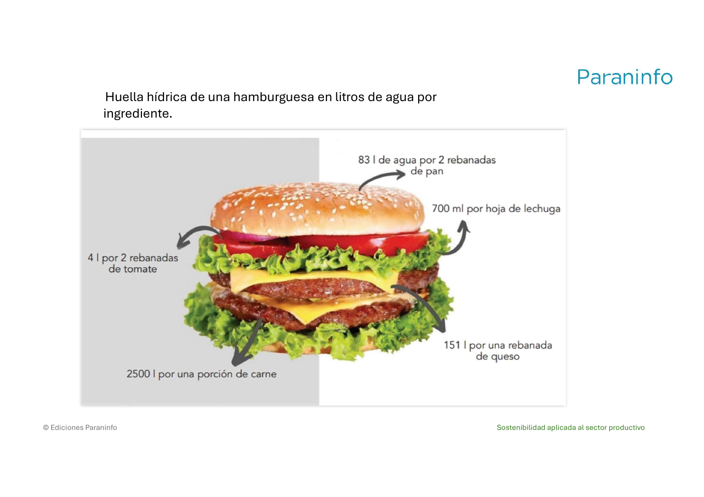
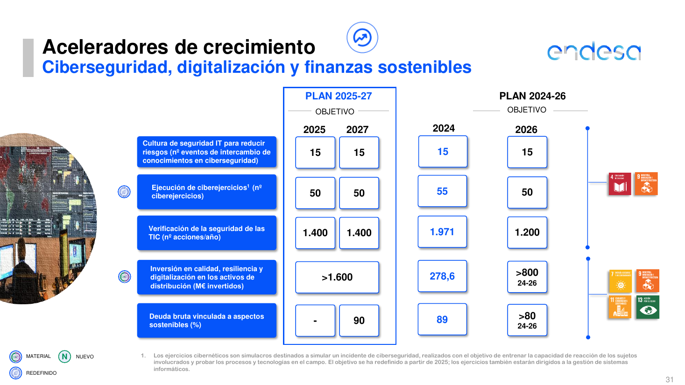
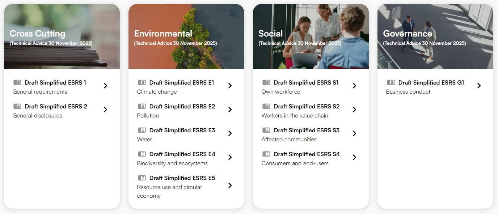
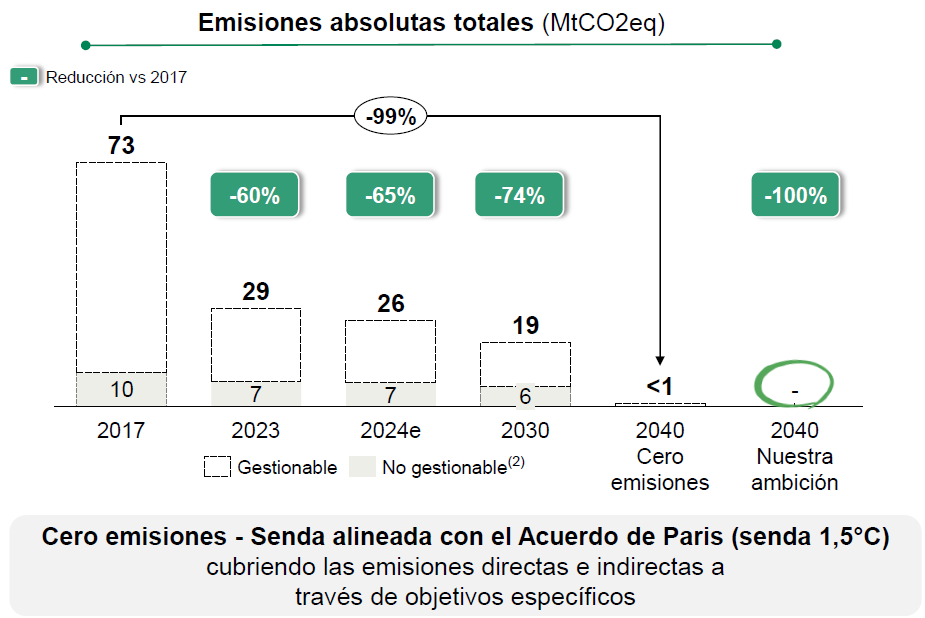

# Sostenibilidad en lo profesional y personal

## Índice

1. [ODS vinculados al sector TIC y productivo](#1-ods-vinculados-al-sector-tic-y-productivo)
2. [Riesgos y oportunidades en la práctica profesional](#2-riesgos-y-oportunidades-en-la-practica-profesional)
3. [Responsabilidad individual y profesional](#3-responsabilidad-individual-y-profesional)
4. [Acciones sostenibles en la vida cotidiana y laboral](#4-acciones-sostenibles-en-la-vida-cotidiana-y-laboral)
5. [Ética y responsabilidad digital](#5-etica-y-responsabilidad-digital)
6. [Glosario rápido](#glosario-rapido)
7. [Repaso: 10 preguntas para autoevaluarte](#repaso-10-preguntas-para-autoevaluarte)
## De qué va esta unidad

En las unidades anteriores vimos qué es la sostenibilidad, qué son los ODS y cuáles son los grandes retos ambientales y sociales del planeta. Todo eso estaba planteado "en grande": el clima, la biodiversidad, la pobreza, la desigualdad. En esta unidad bajamos al suelo. La pregunta ahora es mucho más concreta: **¿qué tiene que ver todo esto con mi trabajo y con mi vida diaria?** O dicho de otra forma, ¿cómo se aplica la sostenibilidad cuando yo soy quien diseña un sistema, configura un servidor, mantiene una red o toma una decisión de compra en una empresa?

La idea central es la de **desempeño sostenible**. El desempeño es simplemente la forma en que una persona hace sus cosas, tanto en el trabajo (desempeño profesional) como en su vida personal (desempeño personal). Que ese desempeño sea sostenible significa que se puede mantener en el tiempo sin comprometer los recursos de las generaciones futuras, y que tiene en cuenta los impactos sociales y ambientales de lo que hacemos. Un desempeño profesional sostenible es eficiente, eficaz y ético, se preocupa por el bienestar de las personas y del planeta, y contribuye al desarrollo sostenible de la sociedad. Un desempeño personal sostenible es equilibrado y saludable, tiene en cuenta el efecto de nuestras acciones en el entorno y se preocupa por el bienestar propio y de los demás.

Para orientar ese desempeño usamos como brújula los **Objetivos de Desarrollo Sostenible (ODS)** de la Agenda 2030 de Naciones Unidas. En esta unidad aprenderás a identificar qué ODS son los más relevantes para un perfil técnico e informático, a analizar qué **riesgos y oportunidades** te plantean esos objetivos en tu práctica profesional, y a proponer **acciones concretas** que puedes poner en marcha tanto en tu puesto de trabajo como en tu casa. También veremos cómo las empresas organizan todo esto de forma seria mediante el marco de los **IRO** (Impactos, Riesgos y Oportunidades), la **doble materialidad** y la normativa europea de información sobre sostenibilidad (CSRD, ESRS, CSDDD). Y cerraremos con la parte más personal: la **ética y la responsabilidad digital**, y la sostenibilidad como un conjunto de hábitos cotidianos.

## Qué deberías saber hacer al terminar (resultados de aprendizaje)

El resultado de aprendizaje de esta unidad (RA3 de la programación) dice que el alumnado *"establece la aplicación de criterios de sostenibilidad en el desempeño profesional y personal, identificando los elementos necesarios"*. Traducido a lo que tú deberías ser capaz de hacer:

- **Sabré identificar los ODS más relevantes para mi actividad profesional**: no los 17 de memoria como una lista, sino saber decir "en un trabajo técnico como el mío, los que más se tocan son estos y por estas razones concretas".
- **Sabré analizar los riesgos y las oportunidades que representan los ODS** para una organización y para mi puesto: qué puede salir mal si no se gestiona bien (residuos, consumo energético, mala reputación, sanciones) y qué se puede ganar si se hace bien (ahorro de costes, innovación, nuevos mercados, mejor imagen).
- **Sabré proponer acciones para atender retos ambientales y sociales** desde dos frentes: desde la actividad profesional (cómo hago mi trabajo) y desde el entorno personal (cómo vivo, consumo y me informo).
- **Entenderé cómo una empresa formaliza todo esto**: el marco IRO, la doble materialidad, el papel de un comité de sostenibilidad y las normas europeas que obligan a informar (CSRD), a clasificar la información (ESRS) y a actuar (CSDDD).
- **Reconoceré la dimensión ética y de responsabilidad digital** de mi profesión y la sostenibilidad personal como práctica de hábitos coherentes y mantenidos en el tiempo.

---

## 1. ODS vinculados al sector TIC y productivo

### 1.1. Recordatorio rápido: qué son los ODS

Los **Objetivos de Desarrollo Sostenible (ODS)** son un conjunto de **17 metas globales** establecidas por la **ONU en 2015** como parte de la **Agenda 2030**. Su finalidad es abordar los grandes desafíos del mundo —la pobreza, el cambio climático, la desigualdad y la degradación ambiental— promoviendo un desarrollo equilibrado entre tres dimensiones: la **social**, la **económica** y la **ambiental**.

En el ámbito profesional, los ODS son útiles porque:

- Ayudan a **identificar los impactos** sociales y ambientales de nuestro trabajo.
- **Orientan** las actividades hacia un desarrollo sostenible.
- Mejoran la **reputación y la competitividad** de las organizaciones.
- Fomentan la **colaboración** con otras personas y organizaciones.
- Permiten **medir y comunicar** los avances en sostenibilidad.
- Crean **valor** para la sociedad y para las empresas.
- Identifican **oportunidades de innovación** y de mejora.
- Ayudan a **prevenir y gestionar riesgos** ambientales y sociales.

### 1.2. Los ODS que más se tocan en un trabajo técnico e informático

No todos los ODS pesan lo mismo en cada profesión. Según el material de la unidad, en el sector de la informática y la tecnología los **tres ODS más relevantes** suelen ser:

| ODS | Nombre | Por qué es clave en el sector TIC |
| --- | --- | --- |
| **ODS 9** | Industria, Innovación e Infraestructura | Promueve la innovación tecnológica y el desarrollo de **infraestructuras sostenibles** (redes, centros de datos, conectividad). |
| **ODS 12** | Producción y Consumo Responsables | Fomenta el **uso eficiente de recursos** y la **reducción de residuos electrónicos** (RAEE). |
| **ODS 13** | Acción por el Clima | Busca **reducir las emisiones de carbono** y mitigar el impacto ambiental de la actividad. |

Esto no significa que los demás ODS no cuenten. Un servicio digital bien hecho puede contribuir al ODS 4 (educación de calidad), al ODS 3 (salud y bienestar) o al ODS 10 (reducción de las desigualdades) si mejora el acceso a servicios para colectivos vulnerables. La clave es la que te pide la actividad de la unidad: **coger los ODS que has elegido como importantes y enlazarlos con una actividad profesional concreta**. Por ejemplo, el material propone: *"ODS 12: implementar sistemas de reciclaje de hardware en empresas"*. Ese es el nivel de concreción que se busca; no basta con decir "yo apoyo el ODS 12", hay que decir *qué acción* lo materializa.

*Figura: cómo una gran empresa del sistema productivo ordena su estrategia en las dimensiones Ambiental, Social y Gobernanza (ASG) y añade unos "aceleradores de crecimiento" (ciberseguridad, digitalización y finanzas sostenibles). Fíjate en que enlaza su actividad directamente con ODS concretos: 7 (energía asequible y no contaminante), 9 (industria, innovación e infraestructura), 11 (ciudades sostenibles) y 13 (acción por el clima). Origen: `plan-sostenibilidad-2025-2027.pdf`.*

> **Ejemplo actual — El cargador único USB-C en la Unión Europea.** Desde finales de 2024 la mayoría de teléfonos móviles, tablets, auriculares y cámaras que se venden en la UE deben llevar puerto **USB-C**, y a partir de 2026 se extiende a los portátiles. El objetivo declarado es que no tengas que cambiar de cargador cada vez que cambias de dispositivo, lo que reduce la cantidad de cables y adaptadores que acaban en la basura. Es un caso muy claro de **ODS 12**: una decisión de diseño y de normativa que ataca directamente los residuos electrónicos.

> **En las noticias — Los informes de sostenibilidad de las grandes tecnológicas y la IA.** Durante 2024, varias de las mayores empresas de tecnología publicaron informes en los que reconocían que sus **emisiones de gases de efecto invernadero habían subido** en los últimos años, en buena parte por la energía que consumen los centros de datos dedicados a la inteligencia artificial. Según se informó, algunas admitieron aumentos de sus emisiones de entre el 30 % y el 50 % respecto a su año de referencia, lo que aleja el cumplimiento de sus compromisos de "cero neto". Conecta de lleno con el **ODS 13** y con el **ODS 9**: la misma infraestructura que impulsa la innovación puede disparar la huella de carbono si no se alimenta con energía limpia y no se diseña para ser eficiente.

### Ideas clave de esta sección
- Los ODS son **17 metas** de la **ONU (2015)**, dentro de la **Agenda 2030**, con tres dimensiones: social, económica y ambiental.
- En el sector TIC y productivo destacan el **ODS 9** (innovación e infraestructura), el **ODS 12** (consumo responsable y residuos electrónicos) y el **ODS 13** (clima).
- Lo que se evalúa no es recitar la lista, sino **enlazar cada ODS con una actividad profesional concreta**.
- Las empresas del sistema productivo enganchan su estrategia a ODS concretos y la organizan por dimensiones **ASG** (ambiental, social, gobernanza).

---

## 2. Riesgos y oportunidades en la práctica profesional

### 2.1. Qué es un riesgo y qué es una oportunidad

- **Riesgos**: son los posibles **impactos negativos** que pueden surgir si no se gestionan bien las actividades relacionadas con los ODS. Ejemplos del sector: el aumento de **residuos electrónicos** o el **consumo excesivo de energía** en los centros de datos.
- **Oportunidades**: son las **ventajas o beneficios** que se pueden obtener al implementar prácticas sostenibles. Ejemplos: **mejorar la reputación** de una empresa o **desarrollar soluciones tecnológicas innovadoras**.

En tecnología, riesgos y oportunidades van muy unidos al uso de recursos, a la innovación y al impacto ambiental. El material lo ilustra con una pareja muy visual:

- **Riesgo**: la **obsolescencia programada** de los dispositivos electrónicos genera grandes cantidades de residuos.
- **Oportunidad**: crear **software que optimice el uso de energía** en dispositivos y centros de datos.

Otro ejemplo de oportunidad que aparece en la unidad: usar la tecnología como herramienta para resolver problemas globales, por ejemplo **desarrollar aplicaciones para la educación o la salud**.

### 2.2. El marco IRO: Impactos, Riesgos y Oportunidades

Cuando una empresa se toma esto en serio, no habla solo de "riesgos y oportunidades" en abstracto, sino que usa el marco **IRO**, que significa **Impactos, Riesgos y Oportunidades**. Es un marco clave dentro de la normativa europea (la **CSRD** y los **ESRS**, que veremos en la sección 5). Sirve para que la empresa informe de dos cosas a la vez: por un lado, de sus **efectos sobre el planeta y la sociedad**; por otro, de los **factores ASG** (ambientales, sociales y de gobernanza) que afectan a su propio **resultado financiero**.

Los tres componentes:

| Componente | Qué es | Ejemplos |
| --- | --- | --- |
| **Impactos** (*Impacts*) | Efectos **positivos o negativos** que la empresa tiene sobre el medio ambiente y la sociedad. | Emisiones de carbono, creación de empleo, consumo de recursos. |
| **Riesgos** (*Risks*) | **Amenazas financieras** potenciales para la empresa derivadas de factores ASG. | Regulaciones climáticas, interrupciones en la cadena de suministro, riesgos reputacionales. |
| **Oportunidades** (*Opportunities*) | **Beneficios** potenciales que la empresa puede obtener de la sostenibilidad. | Ahorro de costes por eficiencia energética, acceso a nuevos mercados, innovación. |

*Figura: resultado del análisis de IRO de una empresa real. De todos los temas analizados, 49 se consideraron "materiales" (importantes): 22 impactos positivos, 10 impactos negativos, 9 riesgos y 8 oportunidades. Alrededor aparecen los grupos de interés (empleados, clientes, proveedores, sociedad civil, comunidad financiera…). Origen: `UT 3 Sostenibilidad en lo profesional y lo personal.pdf` (a su vez del plan de sostenibilidad de Endesa).*

### 2.3. Doble materialidad: cuándo un tema es "importante"

Las empresas tienen que investigar si sus IRO son **importantes o no**. A esa importancia se le llama **materialidad**, y se mira desde dos ángulos:

- **Materialidad de impacto** (enfoque *inside-out*, "de dentro hacia fuera"): mide el impacto —negativo o positivo— que la empresa **genera hacia fuera**, sobre el medio ambiente y las personas. El equipo de sostenibilidad investiga qué impactos son materiales, es decir, cuáles importan de verdad.
- **Materialidad financiera** (enfoque *outside-in*, "de fuera hacia dentro"): mide los **riesgos y las oportunidades** que tienen para la empresa aplicar —o no aplicar— medidas de sostenibilidad. El equipo investiga qué riesgos y oportunidades son materiales.

Cuando se combinan las dos, se habla de **doble materialidad**. Una regla práctica que da el material: **la mayoría de los impactos materiales acaban convirtiéndose en riesgos u oportunidades financieras**. Por ejemplo:

- Un **impacto negativo** (contaminar un río) genera un **riesgo financiero** (multas legales y pérdida de reputación).
- Un **impacto positivo** (desarrollar tecnología circular) genera una **oportunidad** (nuevos mercados y ahorro de costes).

Pero también hay riesgos u oportunidades **sin impacto previo**, que surgen de **dependencias externas**. Ejemplo del material: la **escasez de agua** en una región es un riesgo para la empresa **aunque ella no sea la causante principal** de esa escasez, porque depende de ese recurso.

### 2.4. Cómo se evalúan y puntúan los IRO

Lo primero que hace el equipo de sostenibilidad es **identificar los IRO** teniendo en cuenta la actividad de la empresa, su **cadena de valor** y la participación de los ***stakeholders*** (personal, clientes, proveedores, etc.). Después, cada elemento se mide con criterios concretos antes de incluirlo en el informe:

- **Impactos**: se evalúan por su **severidad**, que se compone de:
  - ***Scope*** (alcance): a cuántas personas o territorios afecta.
  - ***Scale*** (escala): la gravedad o intensidad del impacto.
  - ***Irremediability*** (irremediabilidad): la dificultad para reparar el daño.
  - Y, si el impacto es solo potencial, también su ***Likelihood*** (probabilidad) de que ocurra.
- **Riesgos y oportunidades**: se evalúan por:
  - ***Magnitude*** (magnitud): el tamaño del efecto económico u operativo.
  - ***Likelihood*** (probabilidad): la posibilidad de que ocurran, en el corto, medio o largo plazo.

**Cuanto mayor es la puntuación, mayor es la materialidad** del IRO y del tema de sostenibilidad asociado. El paso final es **documentar todo el proceso**, justificar los criterios usados y **mapear los temas materiales a los estándares ESRS**, para poder elaborar el informe de sostenibilidad y someterlo a **verificación y auditoría**.

*Figura: el "contexto" del que salen muchos riesgos y oportunidades para cualquier organización. Aquí se citan datos como que **2024 fue el año más cálido registrado** y el primero que superó en **1,5 °C** el nivel preindustrial, que ya se han superado **seis de los nueve límites biofísicos** del planeta y que las poblaciones de especies silvestres han caído un **69 % de media desde 1970**. También aparece la IA como fuente de innovación y, a la vez, de preocupación ambiental y ética. Origen: `plan-sostenibilidad-2025-2027.pdf`.*

> **Ejemplo actual — Trabajo infantil en la cadena de suministro.** El propio material lo usa como caso: si una empresa descubre que existe el **riesgo de que sus proveedores en Asia usen trabajo infantil**, la ley europea le obliga a informarlo (porque es un riesgo material), a clasificarlo dentro del estándar **ESRS S2** (trabajadores en la cadena de valor) y a explicar cómo lo detectó y qué está haciendo para eliminarlo. Es un riesgo **social y reputacional** que se convierte en riesgo **financiero** en cuanto sale a la luz.

> **En las noticias — El "Paquete Ómnibus" de simplificación de la UE.** En 2025 la Comisión Europea anunció la necesidad de **simplificar** varias normas de sostenibilidad. Ese paquete, conocido como **Ómnibus de Simplificación**, plantea reformar la **Taxonomía de la UE**, la **CSRD** y la **CSDDD** para **reducir la carga administrativa** de las empresas, después de que se plantearan dudas sobre su impacto en la competitividad. Es un buen ejemplo de un **riesgo regulatorio** que va en las dos direcciones: primero llegó una ola de "hiperregulación" y ahora una corriente de "desregulación", y las empresas tienen que adaptarse a ambas. (Este movimiento aparece mencionado en el propio `plan-sostenibilidad-2025-2027.pdf`.)

### Ideas clave de esta sección
- **Riesgo** = impacto negativo posible si no se gestiona; **oportunidad** = beneficio posible si se gestiona bien.
- El marco **IRO** = **Impactos** (efectos sobre planeta y sociedad), **Riesgos** (amenazas financieras por factores ASG) y **Oportunidades** (beneficios de la sostenibilidad).
- **Doble materialidad** = mirar a la vez la **materialidad de impacto** (de dentro hacia fuera) y la **materialidad financiera** (de fuera hacia dentro).
- Los impactos se puntúan por **alcance, escala, irremediabilidad y probabilidad**; los riesgos y oportunidades, por **magnitud y probabilidad**. A más puntuación, más materialidad.
- En tecnología, los riesgos típicos son **residuos electrónicos, consumo energético y obsolescencia programada**; las oportunidades típicas son **software eficiente e innovación con impacto social** (educación, salud).

---

## 3. Responsabilidad individual y profesional

### 3.1. Dos niveles de responsabilidad que van juntos

La unidad distingue el **desempeño profesional** (cómo hago mi trabajo, cómo llevo a cabo mis tareas y responsabilidades laborales) del **desempeño personal** (cómo llevo a cabo mis actividades y responsabilidades cotidianas). La sostenibilidad exige cuidar **los dos**: no tiene mucho sentido reciclar en casa con esmero y, en el trabajo, diseñar sistemas que derrochan recursos; ni al revés.

Un desempeño **profesional** sostenible, según el material:

- Se realiza de forma **eficiente, eficaz y ética**.
- Tiene en cuenta los **impactos sociales y ambientales** de la actividad profesional.
- Se preocupa por el **bienestar de las personas y del planeta**.
- Contribuye al **desarrollo sostenible** de la sociedad.

Un desempeño **personal** sostenible:

- Se realiza de forma **equilibrada y saludable**.
- Tiene en cuenta los **impactos de nuestras acciones en el entorno**.
- Se preocupa por el **bienestar propio y de los demás**.
- Contribuye al **desarrollo sostenible** de la sociedad.

### 3.2. La responsabilidad de la empresa: cultura y comité de sostenibilidad

Para ser social y económicamente sostenible, una empresa debe desarrollar su actividad considerando **criterios ambientales, sociales y de gobernanza (ASG)**. El material subraya que existe una **correlación entre sostenibilidad y rentabilidad**: las empresas que impulsan planes de sostenibilidad obtienen **mejores resultados que sus competidores a medio y largo plazo**, además de una mejor imagen ante consumidores y sociedad.

Eso sí, hay una curva de esfuerzo: al principio, implantar políticas sostenibles supone **asumir costes** que reducen las ganancias. Con el tiempo, gracias a la planificación y a la **cultura de sostenibilidad**, esos costes bajan mientras los **beneficios económicos y sociales aumentan**.

Para instalar esa cultura hace falta trabajo constante en **todos los departamentos**, y se recomienda crear un **comité de sostenibilidad** que se encargue de:

- **Analizar** los aspectos del negocio que necesitan mejora y proponer cómo conseguirla.
- Definir las **acciones** para lograr las mejoras propuestas.
- Realizar **auditorías periódicas** para analizar, detectar y proponer mejoras.

Además, la empresa debe:

- **Crear un entorno favorable**: un ambiente saludable y un sentido de pertenencia al grupo.
- **Capacitar a los empleados**: darles la información necesaria para hacer sus tareas de forma sostenible.
- Lanzar **campañas de concienciación**: que la plantilla conozca qué acciones puede realizar para aumentar la sostenibilidad del negocio.

**Ventajas** de tener un plan y una cultura de sostenibilidad, según el material:

- **Aumento de clientes** y consumidores que buscan productos y servicios de empresas sostenibles.
- **Reducción de costes** empresariales al aplicar las recomendaciones y políticas ligadas a los ODS.
- **Aumento del valor de la imagen de marca**.

Una idea importante: al implantar este plan, la empresa **no debe priorizar solo lo económico**; debe primar la consideración conjunta de los factores **ambientales, sociales y de gobernanza**, porque su éxito depende en gran medida de su relación con el medio ambiente y con la población.

*Figura: así se concreta la "responsabilidad profesional" a nivel de organización. El plan fija **65 objetivos** medibles (27 ambientales, 30 sociales, 3 de gobernanza y 5 de "aceleradores de crecimiento"), alineados con la estrategia de la compañía, con las tendencias globales, con los temas materiales de la doble materialidad y con lo que piden inversores y ratings ESG. Origen: `plan-sostenibilidad-2025-2027.pdf`.*

> **Ejemplo actual — Certificaciones y sellos que ya te vas a encontrar.** Cada vez más empresas del sistema productivo publican una **memoria de sostenibilidad** anual y buscan sellos como **B Corp**, la certificación **ISO 14001** de gestión ambiental o la etiqueta **EU Ecolabel**. Para un perfil técnico esto se traduce en tareas nuevas: recoger datos de consumo eléctrico de la sala de servidores, medir el número de dispositivos reutilizados frente a los desechados, o documentar de dónde viene el hardware que se compra. La sostenibilidad deja de ser "cosa del departamento de marketing" y pasa a pedir **datos que salen de sistemas informáticos**.

> **En las noticias — Multas por *greenwashing*.** En los últimos años, organismos de consumo y competencia de varios países europeos han sancionado o abierto expedientes a compañías de moda, alimentación y transporte por hacer **afirmaciones ecológicas engañosas** ("100 % sostenible", "climáticamente neutro") sin poder demostrarlas. La UE ha impulsado normativa para exigir que esas afirmaciones estén **verificadas**. Moraleja profesional: comunicar sostenibilidad sin datos que la respalden es hoy un **riesgo legal y reputacional** real, no solo una cuestión de imagen.

### Ideas clave de esta sección
- La responsabilidad tiene **dos niveles inseparables**: cómo trabajo (profesional) y cómo vivo (personal).
- Un desempeño profesional sostenible es **eficiente, eficaz y ético** y considera los impactos sociales y ambientales.
- La empresa sostenible se apoya en una **cultura de sostenibilidad**, un **comité de sostenibilidad** (análisis, acciones, auditorías) y en **formar y concienciar** a la plantilla.
- Hay una **correlación entre sostenibilidad y rentabilidad** a medio y largo plazo; las ventajas incluyen más clientes, menos costes y más valor de marca.
- No se trata de priorizar solo lo económico, sino de equilibrar los factores **ambientales, sociales y de gobernanza (ASG)**.

---

## 4. Acciones sostenibles en la vida cotidiana y laboral

Las **acciones sostenibles** son medidas concretas que se toman para **reducir los impactos negativos** y **maximizar los beneficios** en términos de sostenibilidad. Se aplican en dos ámbitos: el profesional y el personal.

### 4.1. Acciones desde la actividad profesional

El material propone tres líneas muy claras para un entorno técnico:

- **Diseño de software eficiente**: crear programas que consuman **menos recursos y menos energía** (código optimizado, menos procesos innecesarios, menos transferencias de datos).
- **Gestión de residuos electrónicos**: implantar **sistemas de reciclaje** para los dispositivos obsoletos, en lugar de tirarlos.
- **Uso de energías renovables**: alimentar los **centros de datos** con energía **solar o eólica**.

En un plan de acción para hacer más sostenible a una empresa tecnológica también encajan medidas como **reducir el uso de papel**, **fomentar el teletrabajo** o **usar servidores más eficientes**.

### 4.2. Acciones desde el entorno personal

- **Consumo responsable**: comprar dispositivos electrónicos **solo cuando de verdad hacen falta** y **reciclar los antiguos**.
- **Ahorro de energía**: **apagar los dispositivos** cuando no se usan.
- **Educación ambiental**: **informarse** y **compartir conocimientos** sobre sostenibilidad.

Otras acciones cotidianas que menciona la unidad: usar **transporte público** o **reducir el consumo energético en casa**. La educación ambiental funciona: distintos estudios recogidos en el material indican que hasta el **83 % de los niños y niñas** que reciben clases de educación ambiental **mejoran su comportamiento ecológico**.

### 4.3. Acciones para atender retos ambientales y sociales concretos

La unidad conecta estas acciones con los grandes retos que ya conoces. Algunos datos del material para dimensionar el problema:

- La **población mundial** superó los **8 000 millones** de personas en **2022** y se prevé que alcance los **9 700 millones en 2050**. Se ha estimado que la "capacidad de carga" del planeta, con estándares económicos medios de los años ochenta, rondaría los **5 000 millones**. La **huella de carbono** aporta el **60 %** de la huella ecológica total y la **huella de tierras de cultivo**, el **19 %**.
- **Seguridad alimentaria**: existe cuando todas las personas tienen, en todo momento, acceso físico, social y económico a alimentos suficientes, inocuos y nutritivos. En España, según el informe de 2021 del Ministerio de Agricultura, se tiraron a la basura **1 246 millones de kg/l** de alimentos y bebidas (unas **8 veces** lo que repartieron los bancos de alimentos en el mismo periodo). Reducir el consumo de carne, evitar la degradación del suelo y desarrollar nuevas tecnologías son vías para lograr la seguridad alimentaria sin roturar más bosques.
- **Pobreza y desigualdad**: en **2022** había en España **4,2 millones** de personas en pobreza severa (hogares con ingresos diarios inferiores a **19 euros**).
- **Despoblamiento rural**: en España, el **90 % de la población** vive en el **20 % del territorio**; **3 926** de los **8 131** municipios españoles están por debajo de **12,5 habitantes/km²**, el umbral que la UE considera de **riesgo demográfico**. La conectividad (internet, servicios digitales) es una de las herramientas para fijar población.

*Figura: los impactos ambientales están "escondidos" en decisiones cotidianas. Una sola hamburguesa arrastra unos **2 500 litros de agua** por la carne, **151** por el queso, **83** por el pan, **4** por el tomate y **0,7** por la lechuga. Sirve para entender por qué "consumir menos carne" aparece entre las acciones para la seguridad alimentaria. Origen: `UNIDAD_3.pdf` (Ediciones Paraninfo).*

*Figura: ejemplo de acciones profesionales medibles en el terreno digital. La empresa fija objetivos concretos de **ciberejercicios** (simulacros de incidente de ciberseguridad para entrenar la respuesta), de **verificación de la seguridad de las TIC** y de **inversión en digitalización**, y los enlaza con los ODS 4, 7, 9, 11 y 13. Origen: `plan-sostenibilidad-2025-2027.pdf`.*

> **Ejemplo actual — Alargar la vida de los aparatos: Fairphone, Framework y los reacondicionados.** Frente a la obsolescencia programada, han crecido productos pensados para **durar y repararse**: móviles modulares cuyas piezas (batería, pantalla, cámara) se cambian con un destornillador, portátiles con componentes reemplazables y numeración de módulos, y un mercado enorme de **dispositivos reacondicionados** (plataformas de segunda mano con garantía). En el plano profesional, la acción equivalente es **ampliar el ciclo de renovación** del parque informático de la empresa de 3 a 5 años, o montar un circuito interno de reutilización de equipos antes de comprar nuevos.

> **En las noticias — El "derecho a reparar" europeo.** La UE aprobó en 2024 una directiva de **derecho a reparación** que obliga a los fabricantes a facilitar piezas, herramientas e información para arreglar ciertos productos durante años, y a no bloquear las reparaciones con software. Para los servicios de soporte y mantenimiento esto abre la puerta a reparar en lugar de sustituir, que es justo lo que pide el **ODS 12**.

### Ideas clave de esta sección
- **Acción sostenible** = medida concreta para reducir impactos negativos y aumentar beneficios.
- **En el trabajo**: software eficiente, reciclaje de residuos electrónicos, energías renovables en centros de datos, menos papel, teletrabajo, servidores eficientes.
- **En lo personal**: consumo responsable, apagar dispositivos, educación ambiental, transporte público, ahorro energético en casa.
- Cada acción se puede **enganchar a un reto concreto** (clima, seguridad alimentaria, pobreza, despoblamiento) y, a ser posible, **medirse**.
- La educación ambiental **cambia comportamientos** (hasta un 83 % de mejora en el comportamiento ecológico infantil, según el material).

---

## 5. Ética y responsabilidad digital

Esta última sección tiene dos caras: la **normativa y los estándares** con los que las organizaciones formalizan su compromiso (y que marcan lo que está bien y lo que no), y la **sostenibilidad personal** entendida como coherencia ética en el día a día. En los PDF de la unidad la parte de ética digital "pura" (privacidad, sesgos algorítmicos, uso responsable de la IA) está poco desarrollada como texto; lo que sí está muy trabajado es el marco normativo europeo, que es donde hoy se juega buena parte de la "responsabilidad" de un perfil técnico.

### 5.1. La normativa europea: informar, clasificar y actuar

Conviene quedarse con esta secuencia de tres pasos y qué norma cubre cada uno:

| Norma | Nombre completo | Para qué sirve | Qué te obliga a hacer |
| --- | --- | --- | --- |
| **CSRD** | *Corporate Sustainability Reporting Directive* | Directiva de la UE que exige a grandes empresas y cotizadas **informar** de forma estandarizada y detallada sobre sus impactos en sostenibilidad (ASG). | **Informar** sobre tus IRO. Solo informar. |
| **ESRS** | *European Sustainability Reporting Standards* (Normas Europeas de Información sobre Sostenibilidad) | Conjunto de estándares de la UE para reportar de forma **estandarizada y comparable** el desempeño ASG, dentro del marco de la CSRD. Definen **qué información, métricas e indicadores** hay que divulgar (clima, biodiversidad, derechos humanos, gobernanza…). | **Clasificar** tus IRO dentro de un estándar. Hay **12 ESRS**. |
| **CSDDD** (también CSDD) | *Corporate Sustainability Due Diligence Directive* (Directiva de Diligencia Debida en Sostenibilidad Corporativa) | Normativa de la UE que obliga a grandes empresas a **identificar, prevenir y mitigar** impactos negativos en derechos humanos y medio ambiente en **toda su cadena de valor** (incluidos proveedores) y a rendir cuentas públicamente. | **Actuar** frente a los impactos y los riesgos, no solo informar. Aprobada en **2024**, con aplicación **progresiva**. |

Dos actores más que aparecen en el material:

- **EFRAG**: grupo consultivo europeo en materia de información financiera. Es una asociación de carácter privado que **asesora a la Comisión Europea** (históricamente, sobre el uso de las NIIF en Europa) y que ha elaborado los ESRS. Su web es la referencia para consultar los estándares.
- **GRI** (*Global Reporting Initiative*): estándar **internacional voluntario** para elaborar memorias de sostenibilidad/ASG. A diferencia de los ESRS, es **voluntario**, se centra **solo en los impactos** (no en la doble materialidad) y es **mucho más flexible**. En el aula hay disponibles el PDF con todos los GRI y dos plantillas (Word y Excel) de la Cámara de Comercio de España para hacer un plan de sostenibilidad bajo estándares GRI.

Cómo encajan las piezas, con el ejemplo del material: detectas un **riesgo** de trabajo infantil en proveedores de Asia → la **CSRD** te obliga a informarlo (es un riesgo material) → vas a los **ESRS** y lo clasificas en el estándar **ESRS S2** (trabajadores en la cadena de valor) → sigues las instrucciones del ESRS S2 para explicar cómo lo detectaste y qué haces para eliminarlo, que es la parte de **diligencia debida** (**CSDDD**).

*Figura: los **12 ESRS** agrupados en cuatro bloques. Transversales: ESRS 1 (requisitos generales) y ESRS 2 (divulgaciones generales). Ambientales (E1-E5): cambio climático, contaminación, agua, biodiversidad y ecosistemas, uso de recursos y economía circular. Sociales (S1-S4): personal propio, trabajadores de la cadena de valor, comunidades afectadas, consumidores y usuarios finales. Gobernanza: G1 (conducta empresarial). Origen: `UT 3 Sostenibilidad en lo profesional y lo personal.pdf` (captura de la web del EFRAG).*

*Figura: un objetivo cuantificado y auditable, del tipo que la CSRD y los ESRS obligan a divulgar. La senda de descarbonización está **alineada con el Acuerdo de París (1,5 °C)** y va de **73 MtCO2eq en 2017** a **"cero emisiones" en 2040**. Origen: `plan-sostenibilidad-2025-2027.pdf`.*

### 5.2. Responsabilidad digital del perfil técnico

Aunque el material no lo desarrolle punto por punto, de todo lo anterior se deduce con claridad la **responsabilidad digital** que asume un perfil técnico e informático:

- **Eficiencia como criterio de diseño**: el material lo dice de forma explícita ("diseño de software eficiente: crear programas que consuman menos recursos y energía"). Elegir arquitecturas y algoritmos sobrios, no mover datos sin necesidad y dimensionar bien la infraestructura son decisiones **éticas**, porque tienen impacto ambiental.
- **Gestión responsable del hardware**: reciclaje de RAEE, reutilización de equipos, alargar el ciclo de vida.
- **Datos veraces**: si tu sistema alimenta el informe de sostenibilidad de la empresa (consumos, residuos, indicadores sociales), esos datos deben poder pasar una **verificación y auditoría**. Falsear o "maquillar" cifras es *greenwashing* y un riesgo legal.
- **Cadena de valor**: fijarse en de dónde viene el hardware y el software que se compra (condiciones laborales, minerales en conflicto, impacto ambiental de los proveedores), en línea con lo que exige la CSDDD.

### 5.3. La sostenibilidad en lo personal

El material define la **sostenibilidad personal** como *"la capacidad de vivir bien hoy sin comprometer el bienestar de las personas ni los recursos del mañana"*. Y matiza dos ideas potentes:

- **No se trata de grandes gestos**, sino de **hábitos cotidianos coherentes, mantenidos en el tiempo**.
- Es, en el fondo, una forma de **responsabilidad individual con impacto colectivo**: lo que hace una persona sola parece poco, pero multiplicado por millones cambia el resultado.

Esto enlaza directamente con las acciones personales de la sección 4 (consumo responsable, ahorro de energía, educación ambiental, transporte) y con la actitud ética en el trabajo: la coherencia entre lo que defiendo y lo que hago, dentro y fuera de la oficina.

> **Ejemplo actual — La huella de nuestras herramientas digitales.** Cada vídeo en streaming, cada búsqueda, cada consulta a un asistente de IA y cada foto guardada "en la nube" consume energía en algún centro de datos. Prácticas personales coherentes: bajar la resolución del vídeo cuando no aporta nada, borrar correos y archivos que no sirven, no dejar procesos ni descargas corriendo sin necesidad, y preferir el wifi a la red móvil (consume menos). Son "hábitos cotidianos mantenidos en el tiempo", exactamente lo que describe el material.

> **En las noticias — El Reglamento Europeo de Inteligencia Artificial.** La UE aprobó en 2024 su reglamento sobre **inteligencia artificial**, que empezó a aplicarse por fases a partir de 2025 y clasifica los sistemas de IA por nivel de riesgo, con obligaciones de transparencia y de supervisión humana para los usos considerados de alto riesgo. Para un perfil técnico, la **ética digital** deja de ser una recomendación y pasa a tener artículos y sanciones: sesgos, explicabilidad y uso de datos personales son ya requisitos legales, no solo buenas intenciones.

### Ideas clave de esta sección
- Secuencia europea: **CSRD** (informar) → **ESRS** (clasificar; hay **12**) → **CSDDD** (actuar; aprobada en **2024**).
- **EFRAG** elabora y publica los ESRS y asesora a la Comisión Europea; el **GRI** es un estándar **voluntario**, centrado solo en impactos y más flexible.
- La **doble materialidad** solo la exigen los ESRS; el GRI no.
- La **responsabilidad digital** del perfil técnico incluye eficiencia en el diseño, gestión responsable del hardware, datos veraces y control de la cadena de valor.
- **Sostenibilidad personal** = vivir bien hoy sin hipotecar el mañana, a base de **hábitos coherentes mantenidos en el tiempo**; responsabilidad individual con **impacto colectivo**.

---

## Glosario rápido

| Término | En una frase |
| --- | --- |
| **Desempeño sostenible** | Forma de hacer el trabajo (o de vivir) que se mantiene en el tiempo sin comprometer los recursos futuros y que es eficiente, eficaz y ética. |
| **ODS** | Los 17 Objetivos de Desarrollo Sostenible de la ONU (2015), dentro de la Agenda 2030. |
| **ASG (ESG)** | Las tres dimensiones con las que se evalúa la sostenibilidad de una organización: Ambiental, Social y de Gobernanza. |
| **IRO** | Impactos, Riesgos y Oportunidades: el marco con el que una empresa organiza su información de sostenibilidad bajo la CSRD y los ESRS. |
| **Impacto** | Efecto positivo o negativo que la empresa tiene sobre el medio ambiente y la sociedad. |
| **Materialidad de impacto** | Enfoque *inside-out*: cuánto importan los impactos que la empresa genera hacia fuera. |
| **Materialidad financiera** | Enfoque *outside-in*: cuánto afectan los riesgos y oportunidades ASG al resultado económico de la empresa. |
| **Doble materialidad** | Mirar a la vez la materialidad de impacto y la financiera. |
| **Severidad de un impacto** | Se mide por alcance (*scope*), escala (*scale*) e irremediabilidad (*irremediability*); si es potencial, también por su probabilidad (*likelihood*). |
| **Stakeholders** | Grupos de interés de una organización: personal, clientes, proveedores, comunidades, inversores, etc. |
| **Cadena de valor** | Conjunto de actividades y agentes (proveedores incluidos) que intervienen desde el origen hasta el cliente final. |
| **CSRD** | Directiva europea que obliga a grandes empresas y cotizadas a **informar** sobre sostenibilidad de forma estandarizada. |
| **ESRS** | Los 12 estándares europeos que dicen **qué** información de sostenibilidad hay que divulgar y **cómo**. |
| **CSDDD / CSDD** | Directiva europea de **diligencia debida**: obliga a **actuar** frente a impactos negativos en derechos humanos y medio ambiente en toda la cadena de valor (aprobada en 2024). |
| **EFRAG** | Grupo consultivo europeo que asesora a la Comisión Europea y ha elaborado los ESRS. |
| **GRI** | *Global Reporting Initiative*: estándar internacional **voluntario** de memorias de sostenibilidad, centrado solo en impactos y más flexible que los ESRS. |
| **Greenwashing** | Aparentar sostenibilidad con afirmaciones que no se pueden demostrar; hoy es un riesgo legal y reputacional. |
| **Obsolescencia programada** | Diseñar productos para que dejen de servir antes de tiempo; genera residuos electrónicos. |
| **RAEE** | Residuos de aparatos eléctricos y electrónicos (residuos electrónicos). |
| **Huella ecológica / de carbono / hídrica** | Medidas del impacto ambiental de una actividad; la de carbono aporta el 60 % de la huella ecológica total, la de tierras de cultivo el 19 %. |
| **Comité de sostenibilidad** | Grupo interno que analiza el negocio, propone acciones y realiza auditorías periódicas de sostenibilidad. |
| **Sostenibilidad personal** | Vivir bien hoy sin comprometer el bienestar y los recursos del mañana, mediante hábitos cotidianos coherentes. |

## Repaso: 10 preguntas para autoevaluarte

1. ¿Qué diferencia hay entre desempeño profesional y desempeño personal, y qué añade en cada caso la palabra "sostenible"? *(Sección 1 y 3)*
2. ¿Cuántos ODS hay, quién los aprobó, en qué año y dentro de qué agenda? *(Sección 1)*
3. Nombra los tres ODS que el material señala como más relevantes para el sector TIC y explica por qué cada uno. *(Sección 1)*
4. Define "riesgo" y "oportunidad" en el contexto de los ODS y pon un ejemplo de cada uno en tecnología. *(Sección 2)*
5. ¿Qué significan las siglas IRO y qué es cada uno de sus tres componentes? *(Sección 2)*
6. Explica la doble materialidad: ¿qué mira la materialidad de impacto y qué mira la materialidad financiera? *(Sección 2)*
7. ¿Con qué criterios se puntúa la severidad de un impacto? ¿Y un riesgo o una oportunidad? *(Sección 2)*
8. Enumera tres acciones sostenibles desde la actividad profesional y tres desde el entorno personal. *(Sección 4)*
9. Ordena CSRD, ESRS y CSDDD según la secuencia "informar → clasificar → actuar" y di qué obliga a hacer cada una. *(Sección 5)*
10. ¿En qué se diferencia el GRI de los ESRS? Cita al menos dos diferencias. *(Sección 5)*

Respuestas orientativas

1. El desempeño profesional es cómo realizas tu trabajo y tus responsabilidades laborales; el personal, cómo realizas tus actividades y responsabilidades cotidianas. "Sostenible" añade que sea eficiente, eficaz y ético, que tenga en cuenta los impactos sociales y ambientales, que se preocupe por el bienestar de las personas y del planeta y que contribuya al desarrollo sostenible; en lo personal, además, que sea equilibrado y saludable.
2. **17 ODS**, aprobados por la **ONU** en **2015**, dentro de la **Agenda 2030**.
3. **ODS 9** (industria, innovación e infraestructura): impulsa la innovación tecnológica y las infraestructuras sostenibles. **ODS 12** (producción y consumo responsables): uso eficiente de recursos y reducción de residuos electrónicos. **ODS 13** (acción por el clima): reducir emisiones de carbono y mitigar el impacto ambiental.
4. **Riesgo**: impacto negativo posible si no se gestionan bien las actividades (p. ej. aumento de residuos electrónicos o consumo energético excesivo en centros de datos). **Oportunidad**: beneficio posible al aplicar prácticas sostenibles (p. ej. software que optimiza la energía, o apps de educación y salud).
5. **IRO** = **Impactos, Riesgos y Oportunidades**. Impactos: efectos positivos o negativos de la empresa sobre el medio ambiente y la sociedad. Riesgos: amenazas financieras derivadas de factores ASG. Oportunidades: beneficios potenciales derivados de la sostenibilidad.
6. **Materialidad de impacto** (*inside-out*): el impacto que la empresa genera hacia fuera sobre el medio ambiente y las personas. **Materialidad financiera** (*outside-in*): los riesgos y oportunidades que la sostenibilidad supone para el resultado económico de la empresa. Juntas = doble materialidad.
7. Severidad de un **impacto**: alcance (*scope*), escala (*scale*) e irremediabilidad (*irremediability*); si es potencial, también probabilidad (*likelihood*). **Riesgo/oportunidad**: magnitud (*magnitude*) del efecto y probabilidad (*likelihood*).
8. Profesionales: diseño de software eficiente, gestión y reciclaje de residuos electrónicos, energías renovables en centros de datos (también: menos papel, teletrabajo, servidores eficientes). Personales: consumo responsable (comprar solo lo necesario y reciclar lo viejo), apagar los dispositivos, educación ambiental (también: transporte público, ahorro energético en casa).
9. **CSRD** = informar sobre tus IRO de forma estandarizada. **ESRS** = clasificar esos IRO dentro de uno de los 12 estándares. **CSDDD** = actuar (identificar, prevenir y mitigar) frente a los impactos y riesgos en toda la cadena de valor.
10. El **GRI** es voluntario (los ESRS son obligatorios para las empresas afectadas por la CSRD), se centra solo en los impactos (los ESRS aplican doble materialidad) y es más flexible.

