# Economía verde y circular

## Índice

1. [Modelos de producción y consumo actuales](#1-modelos-de-produccion-y-consumo-actuales)
2. [Principios de la economía verde y circular](#2-principios-de-la-economia-verde-y-circular)
3. [Beneficios del ecodiseño](#3-beneficios-del-ecodiseno)
4. [Ciclo de vida del producto y del servicio](#4-ciclo-de-vida-del-producto-y-del-servicio)
5. [Sostenibilidad en el desarrollo de productos digitales](#5-sostenibilidad-en-el-desarrollo-de-productos-digitales)
6. [Glosario rápido](#glosario-rapido)
7. [Repaso: 10 preguntas para autoevaluarte](#repaso-10-preguntas-para-autoevaluarte)
8. [Bibliografía y fuentes citadas](#bibliografia-y-fuentes-citadas)
## De qué va esta unidad

Piensa en el último móvil que compraste. Alguien extrajo de una mina el cobre, el oro y las
"tierras raras" que lleva dentro; una fábrica al otro lado del mundo lo montó en una cadena
de producción; un barco y un camión lo trajeron hasta tu ciudad; tú lo usaste dos o tres
años; y, cuando la batería empezó a fallar o salió el modelo nuevo, acabó en un cajón o en
la basura. Ese recorrido —**extraer, fabricar, consumir y tirar**— es el **modelo lineal**,
y es el que ha dominado la economía durante las últimas décadas. Ha traído prosperidad y
bienes baratos, pero se apoya en recursos que se acaban y genera montañas de residuos, entre
ellos los electrónicos.

Esta unidad presenta las alternativas a ese modelo. La **economía verde** es una forma de
desarrollo que busca mejorar el bienestar de las personas reduciendo a la vez los riesgos
ambientales. La **economía circular** es una manera de organizar la producción para que los
materiales no se pierdan: se **cierran los ciclos** reparando, reutilizando y reciclando, de
modo que lo que para uno es residuo para otro sea materia prima. Las dos ideas son
complementarias.

A partir de ahí aprenderás herramientas concretas: el **ecodiseño** (pensar el impacto
ambiental de un producto *antes* de fabricarlo), el **análisis del ciclo de vida** (medir
qué fase contamina más para poder mejorarla) y los **sellos y normas** que certifican que un
producto es más sostenible. Todo con ejemplos del sector tecnológico, porque la informática
es a la vez parte del problema (residuos electrónicos, consumo eléctrico de los centros de
datos) y parte de la solución (equipos reacondicionados, software eficiente, servicios en la
nube que sustituyen a productos físicos).

La meta práctica es que seas capaz de **proponer productos y servicios responsables**: mirar
algo que se fabrica o se ofrece y saber decir en qué se podría parecer más a un círculo y
menos a una línea recta que termina en el vertedero.

## Qué deberías saber hacer al terminar (resultado de aprendizaje)

El resultado de aprendizaje de la UT4 dice que serás capaz de **proponer productos y
servicios responsables teniendo en cuenta los principios de la economía circular**. Traducido
a lo que tendrás que demostrar:

- **Sabré explicar el modelo de producción y consumo actual**: cómo funciona el modelo
  lineal "extraer-fabricar-consumir-tirar", sus características (globalización, producción
  intensiva, obsolescencia, consumo acelerado, residuos) y por qué es insostenible.
- **Sabré identificar los principios de la economía verde y de la circular**: los principios
  de la economía verde, las **3R**, la ampliación a las **9R** y los **5 principios rectores**
  de la economía circular.
- **Seré capaz de contrastar ambos modelos frente al clásico**: comparar lineal y circular
  punto por punto (recursos, residuos, impacto ambiental, economía, empleo) y defender las
  ventajas del circular.
- **Sabré aplicar principios de ecodiseño** a un producto o servicio: menos materiales,
  menos energía, más vida útil, desmontaje y reciclaje fáciles.
- **Sabré analizar el ciclo de vida de un producto**: describir sus etapas y hacer un
  **análisis de ciclo de vida (ACV)** básico según la norma ISO 14040.
- **Sabré reconocer procesos de producción y criterios de sostenibilidad**: producción más
  limpia (proveedores sostenibles, tecnología eficiente, logística optimizada) y los sellos
  y normas que lo acreditan (ecoetiquetas, ISO 14006).

---

## 1. Modelos de producción y consumo actuales

### Qué es la economía y cómo produce hoy

Una definición sencilla: la **economía** es el estudio de los métodos más efectivos para
satisfacer las necesidades materiales de las personas **utilizando recursos limitados**. Esa
última parte —recursos limitados— es la clave de toda la unidad.

El modelo de producción actual se enmarca en una **economía globalizada**. Ha traído
prosperidad a los países desarrollados, pero también ha generado **desigualdades** entre
naciones y entre ciudadanos dentro de un mismo país. Tradicionalmente la economía se divide
en tres **sectores**:

- **Sector primario**: extracción de materias primas y producción de alimentos.
- **Sector secundario**: manufactura; transforma las materias primas y los alimentos del
  sector primario. Incluye toda la industria.
- **Sector terciario**: distribuir y comercializar productos, y ofrecer servicios como la
  sanidad o las finanzas.

### El modelo lineal: extraer → fabricar → consumir → tirar

El modelo dominante en las últimas décadas es el **modelo lineal**: los recursos se
producen, se consumen y luego se desechan como residuos, **sin considerar su reutilización
ni su reciclaje**. El sistema productivo clásico se compone de **cuatro etapas**:

1. Se **extraen** las materias primas (minas, pozos petroleros, bosques madereros…).
2. Se **manufacturan** los productos, normalmente en cadenas de montaje que fabrican grandes
   cantidades de unidades repetidas.
3. Los productos son **adquiridos** por consumidores y consumidoras.
4. Tras un **período de uso breve**, los productos se **desechan** y se convierten en
   residuos, que se almacenan o se entierran en vertederos.

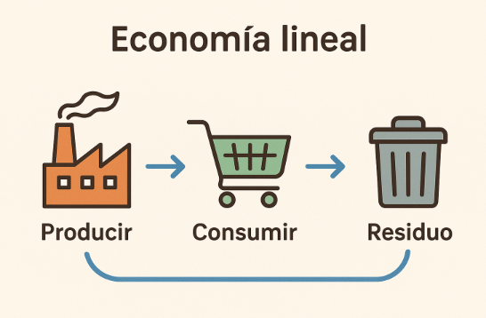
*Figura: el modelo lineal en tres pasos —producir ➜ consumir ➜ residuo—, con una flecha que
no vuelve. Es el esquema mental que hay que romper. Origen: `U4_Economia_Circular.pdf`.*

Para que este modelo funcione, el flujo de materiales tiene que ser **rápido**, y para eso es
necesario que **se consuma mucho**. De ahí sus rasgos característicos:

- **Alta dependencia de recursos naturales**: necesita grandes cantidades de minerales,
  energía fósil y agua, muchos de ellos limitados o no renovables.
- **Producción intensiva**: prioriza la cantidad, la rapidez y el bajo coste frente a la
  durabilidad o el impacto ambiental.
- **Obsolescencia programada y percibida**: muchos productos están diseñados para durar poco
  (**programada**) o para parecer anticuados enseguida (**percibida**), sobre todo en
  tecnología.
- **Consumo acelerado**: el sistema empuja a comprar constantemente (nuevas versiones de
  móviles, ordenadores, electrodomésticos), muchas veces sin necesidad real.
- **Generación masiva de residuos**, entre ellos gran cantidad de **residuos electrónicos
  (RAEE)** que no se reciclan bien.
- **Escasa reutilización y reciclaje**: los productos rara vez se diseñan para repararse, y
  muchos materiales valiosos se pierden.
- **Impacto ambiental elevado**: contribuye al cambio climático, la contaminación y la
  pérdida de biodiversidad.

La globalización es la que hace posible este ritmo. Dos ejemplos que aparecen en el temario:
poder comprar **alimentos vegetales fuera de temporada** en cualquier época del año gracias
al transporte eficiente, y la **deslocalización** de empresas a países con costes de
producción (salarios) más bajos, lo que permite vender productos baratos en los países
desarrollados y **estimular el consumo**. Ese proceso de deslocalización industrial ocurrió,
sobre todo, durante el **último tercio del siglo XX**.

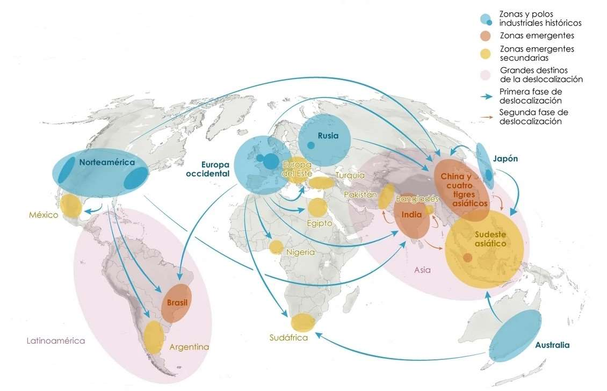
*Figura: zonas industriales históricas (azul) y grandes destinos de la deslocalización
(Asia, Latinoamérica…), con las dos fases del traslado de fábricas. Explica por qué el
producto que compras aquí se fabrica a miles de kilómetros. Origen: `UNIDAD_4.pdf` (fuente
citada en el PDF: elordenmundial.com).*

### Por qué el modelo lineal es insostenible

Por dos motivos que se refuerzan: el **agotamiento de las materias primas** (son finitas y
las consumimos cada vez más rápido) y la **contaminación** que provoca la enorme acumulación
de residuos. Entender bien la secuencia **producir ➜ consumir ➜ residuo** sirve para
detectar sus puntos débiles y plantear alternativas: la economía verde, la economía circular
y el ecodiseño.

> **Ejemplo actual — La ropa "ultrarrápida".** Plataformas como Shein o Temu han llevado el
> modelo lineal al extremo en la moda: catálogos con miles de referencias nuevas cada día,
> precios muy bajos y prendas pensadas para usarse pocas veces. Es "extraer-fabricar-
> consumir-tirar" a máxima velocidad: mucho consumo de agua y energía en la fabricación y
> montañas de textil que acaban en vertederos. Es el mismo patrón que en la electrónica de
> consumo, solo que con camisetas en vez de móviles.

> **En las noticias — El "derecho a reparar" en la Unión Europea.** En 2024 la UE aprobó una
> directiva sobre el derecho a reparar para que los fabricantes faciliten y abaraten el
> arreglo de productos como móviles o electrodomésticos, incluso después de la garantía.
> La idea, según se informó, es frenar la obsolescencia y alargar la vida útil de los
> aparatos, justo lo contrario de lo que premia el modelo lineal.

### Ideas clave de esta sección

- La economía trabaja con **recursos limitados**; el modelo lineal actúa como si fueran
  infinitos.
- Modelo lineal = **extraer → fabricar → consumir → tirar**, con cuatro etapas y un flujo
  que debe ser rápido (mucho consumo).
- Sus rasgos: globalización, producción intensiva, **obsolescencia programada y percibida**,
  consumo acelerado, muchos residuos (RAEE), poca reparación y reciclaje.
- Es insostenible porque **agota materias primas** y **acumula contaminación**.

---

## 2. Principios de la economía verde y circular

### La economía verde y los "colores" de la economía

En los últimos años, la clasificación por sectores (primario, secundario, terciario) se ha
complementado con una **sectorización por colores**. Como el medio ambiente se asocia al
verde, algunos economistas empezaron a hablar de **economía verde**.

La **economía verde** es un modelo de desarrollo económico que busca **mejorar el bienestar
humano y la equidad social** al tiempo que **reduce significativamente los riesgos
ambientales y la escasez ecológica**. Está enfocada en la **transición ecológica** de los
sectores productivos, incluido el sector TIC. Promueve la eficiencia en el uso de los
recursos, el reciclaje de residuos y la reducción de emisiones contaminantes (para
contrarrestar la llamada "economía roja"). De todos los "colores", la verde es la que con
más probabilidad podría lograr el **desarrollo sostenible**, porque **reconoce los límites
planetarios**; sus principales líneas de negocio son la **reducción de emisiones** y el
**procesado de residuos**.

**Principios clave de la economía verde:**

- **Eficiencia en el uso de los recursos**: usar materias primas y energía de forma
  optimizada, minimizando el desperdicio.
- **Reducción de emisiones y residuos**: procesos más limpios y mejor gestión de los
  desechos.
- **Fomento de las energías renovables**: sustituir las fósiles por solar, eólica o biomasa.
- **Inversión en tecnologías limpias**: soluciones que reducen el impacto durante todo el
  ciclo de vida.
- **Generación de empleo verde**: puestos ligados a la eficiencia energética, el reciclaje o
  las renovables.

Otros "colores" que menciona el temario: **economía azul** (actividades marinas: pesca
sostenible, acuicultura, turismo costero, biotecnología marina), **economía amarilla**
(ciencia y tecnología), **economía blanca** (reconstrucción de zonas destruidas por la
guerra) y **economía naranja** (propiedad intelectual, arte y cultura). El **gris** se asocia
a la economía sumergida y el **negro** a actividades ilícitas como el narcotráfico. Esta
clasificación por colores **no sustituye** a la de sectores primario/secundario/terciario.

### La economía circular: cerrar los ciclos

La **economía circular** es un modelo que busca **cerrar los ciclos de vida** de los
productos, materiales y recursos para evitar que se conviertan en residuos. Puede verse como
una **contextualización de la economía verde** aplicada a los flujos de materiales: la
entrada de materias primas y la salida de residuos se reducen al mínimo. Se apoya en el
principio de las **3R: Reducir, Reutilizar, Reciclar**.

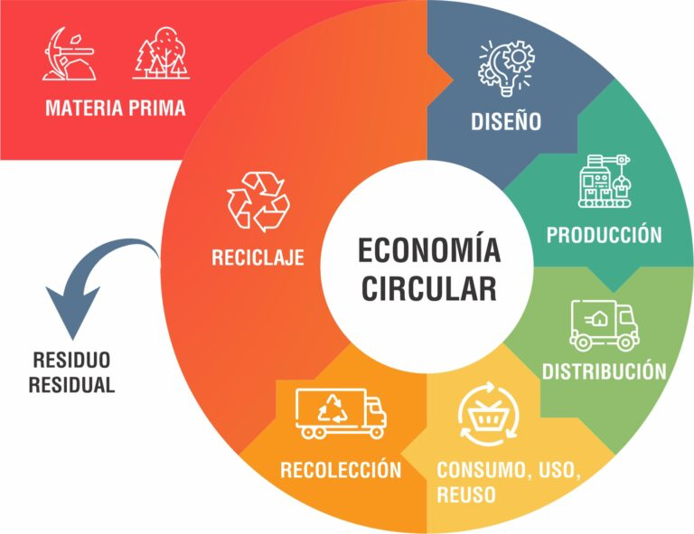
*Figura: el ciclo se representa como un círculo —materia prima, diseño, producción,
distribución, consumo/uso/reutilización, recolección, reciclaje— del que solo se escapa un
pequeño "residuo residual". Origen: `U4_Economia_Circular.pdf`.*

**Principios clave de la economía circular:**

- **Diseño para la durabilidad, la reparabilidad y la reciclabilidad**: productos que duran
  más, se reparan fácil y permiten separar los materiales.
- **Mantenimiento y reparación de equipos** para prolongar su vida útil.
- **Reutilización** de componentes o de dispositivos completos.
- **Reciclaje de materiales valiosos** para darles una segunda vida.
- **Economía de servicios**: sustituir la venta de productos físicos por servicios que
  cubren la misma necesidad (por ejemplo, software en la nube o alquiler de equipos con
  mantenimiento incluido).

El temario añade también los **5 principios rectores de la economía circular**:

1. **Proteger el capital natural** y usar energías renovables.
2. **Reducir los residuos** y aprovecharlos.
3. **Potenciar la durabilidad** de los productos.
4. **Diseñar productos ecoeficientes.**
5. **Regenerar la naturaleza** (aquí se justifica el interés de la economía circular por la
   agricultura ecológica).

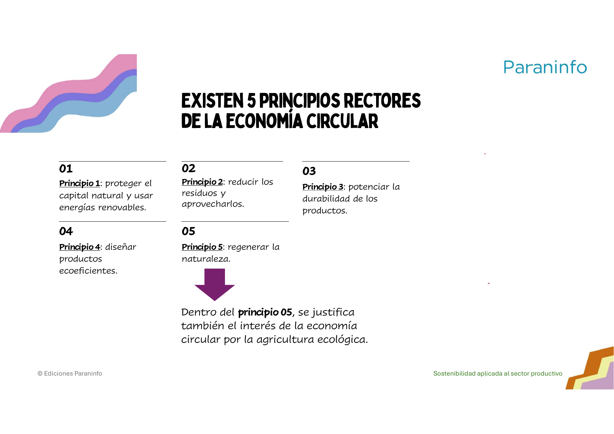
*Figura: los 5 principios rectores tal como los presenta el PDF. El principio 5 (regenerar
la naturaleza) es el que conecta la economía circular con la agricultura ecológica. Origen:
`UNIDAD_4.pdf`.*

### De las 3R a las 9R

Ante la complejidad de los sistemas de producción y consumo, las 3R se han ampliado a las
**9R**, una **jerarquía de estrategias** ordenadas de la más prioritaria (evitar el residuo)
a la menos deseable (aprovecharlo como energía):

| # | Estrategia | Qué significa | Ejemplo del sector TIC |
|---|---|---|---|
| 1 | **Rechazar** | Evitar el consumo de productos innecesarios o insostenibles | No comprar dispositivos de baja calidad o de un solo uso |
| 2 | **Reducir** | Minimizar el uso de materias primas y energía en todo el ciclo | Software ligero que necesita menos hardware |
| 3 | **Reutilizar** | Dar una segunda vida a productos o componentes | Reutilizar monitores o teclados en otros puestos |
| 4 | **Reparar** | Arreglar productos estropeados para que duren más | Cambiar la batería del portátil en vez del equipo entero |
| 5 | **Restaurar** | Dejar un producto como nuevo | Equipos reacondicionados certificados para reventa |
| 6 | **Rediseñar** | Concebir el producto sostenible desde el inicio | Portátiles modulares con piezas fáciles de sustituir |
| 7 | **Reciclar** | Convertir materiales residuales en nuevas materias primas | Recuperar oro, cobre o aluminio de móviles antiguos |
| 8 | **Recuperar** | Obtener energía de residuos que no se pueden reutilizar ni reciclar | Valorización energética de RAEE no reciclables |
| 9 | **Reintegrar** | Aprovechar residuos para nuevos usos en otras industrias | Plástico reciclado de carcasas para fabricar mobiliario |

Importante: **las 9R no sustituyen a las 3R, las amplían**. Son una evolución del modelo para
actuar de forma más profunda, especialmente en sectores como el tecnológico.

> **Nota sobre las fuentes.** Los dos PDF coinciden en el paso de 3R a 9R, pero nombran de
> forma ligeramente distinta las últimas estrategias: `U4_Economia_Circular.pdf` usa
> *Rediseñar* y *Reintegrar*, mientras que `UNIDAD_4.pdf` habla de *Repensar* y *Refabricar*.
> El concepto (rediseñar/repensar el producto y volver a fabricar/reintegrar materiales) es
> el mismo. Aquí se usa la lista de `U4_Economia_Circular.pdf` porque define y ejemplifica
> cada una de las 9R.

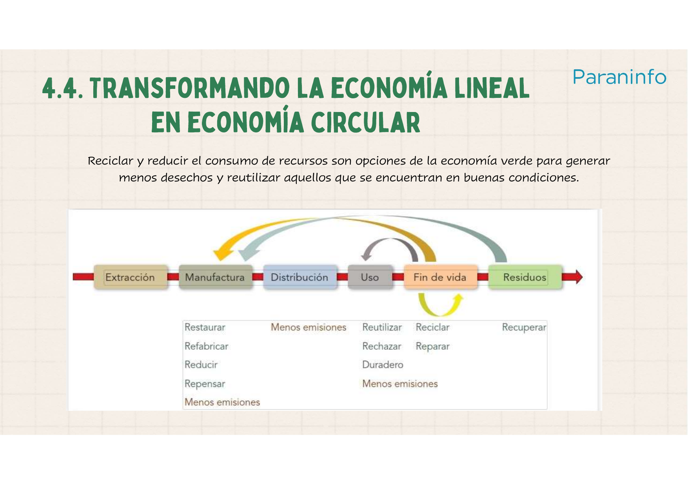
*Figura: sobre la cadena lineal (extracción → manufactura → distribución → uso → fin de vida
→ residuos) se dibujan bucles de retorno (reutilizar, reparar, reciclar, restaurar,
refabricar…) que "doblan" la línea hasta convertirla en círculo. Origen: `UNIDAD_4.pdf`.*

### Lineal frente a circular: la comparación

La economía lineal ha generado bienestar, pero de forma **desigual** y a costa de depender
de materias finitas. La economía circular ofrece **mayor seguridad de suministro de materias
primas**, **menos problemas de gestión de residuos**, **innovación** y **más competitividad**
en los mercados.

| Aspecto | Modelo lineal | Economía circular |
|---|---|---|
| Uso de recursos | Intensivo y extractivo | Eficiente y regenerativo |
| Generación de residuos | Alta, sin valorización | Mínima, con recuperación y reciclaje |
| Impacto ambiental | Elevado (contaminación, cambio climático) | Reducido (cierre de ciclos, menor huella) |
| Sostenibilidad económica | Dependencia de materias finitas | Resiliencia mediante modelos innovadores |
| Impacto social | Desigual, con empleo precario | Inclusivo, con generación de empleo verde |

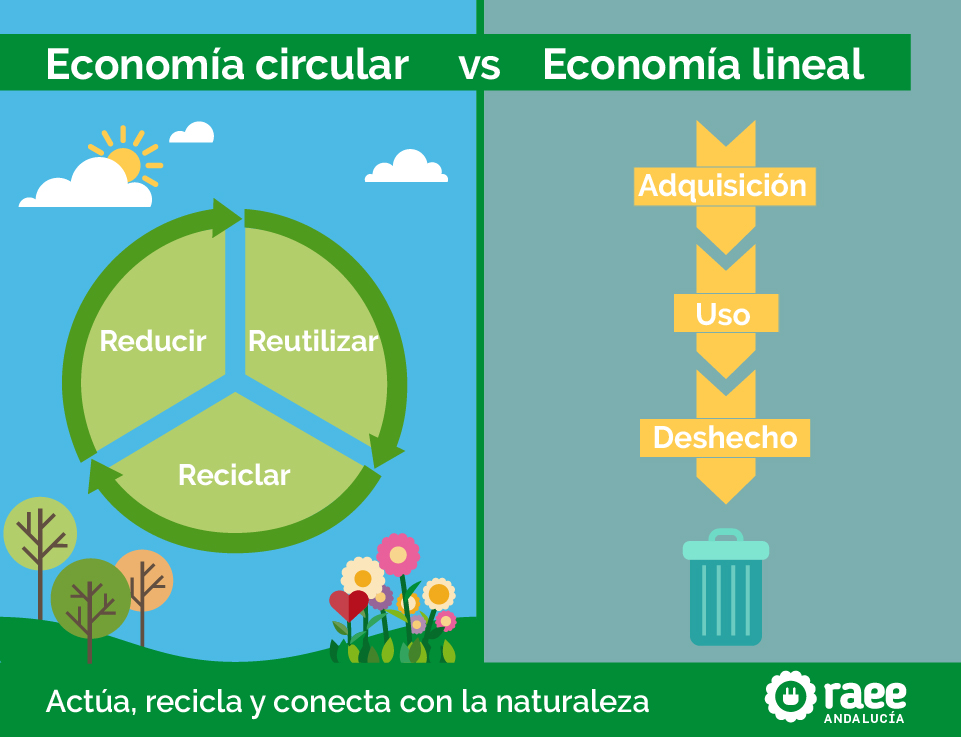
*Figura: a la izquierda, un ciclo cerrado (reducir-reutilizar-reciclar) en un entorno sano;
a la derecha, una flecha recta adquisición → uso → desecho que termina en el cubo de basura.
Origen: `U4_Economia_Circular.pdf`.*

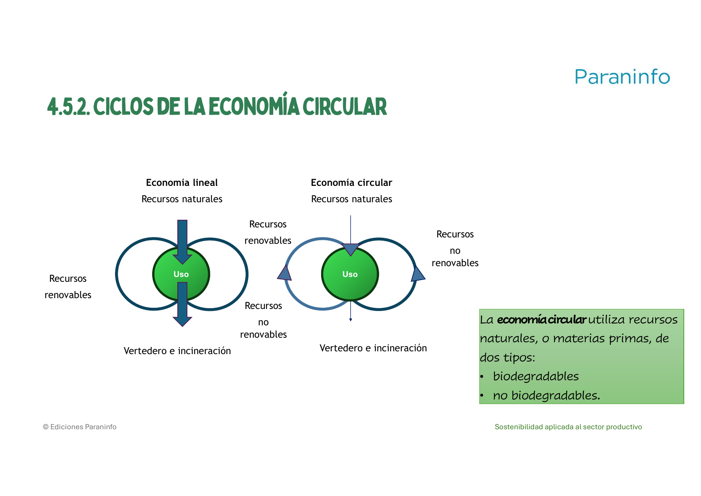
*Figura: en el modelo lineal los recursos entran, se usan una vez y caen al vertedero o la
incineradora; en el circular vuelven a entrar en el uso. La economía circular trabaja con
recursos naturales de dos tipos: **biodegradables** y **no biodegradables**. Origen:
`UNIDAD_4.pdf`.*

### Qué hace falta para la transición (y qué frena)

- **A nivel tecnológico**: se necesitan mayores inversiones en investigación y desarrollo.
- **A nivel cultural**: el hábito de "usar y tirar" está muy implantado.
- **A nivel político y de regulación**: falta apoyo de los gobiernos para implantarla.

**Marco normativo que aparece en el temario:**

- La **Estrategia Española de Economía Circular (EEEC)** emana de la Unión Europea. Sienta
  las bases para alcanzar objetivos de economía circular **antes de 2030** y se concreta
  mediante **planes sucesivos trienales**.
- **Ley 7/2022, de 8 de abril, de residuos y suelos contaminados para una economía
  circular** (legislación estatal).

**Objetivos de la EEEC para 2030:**

- Reducir el consumo de materiales un **30 %** respecto a 2010.
- Generar un **15 %** menos de residuos respecto a 2010.
- Reducir los **desperdicios de alimentos** en toda la cadena alimentaria.
- **Reutilizar el 10 %** de los residuos municipales.
- Reducir la emisión de **gases de efecto invernadero** del sector residuos.
- Mejorar la **eficiencia en el uso del agua un 10 %**.

### Economía circular y desarrollo sostenible

El desarrollo sostenible tiene tres dimensiones: **económica, social y ambiental**. Para ser
verdaderamente sostenible, la economía circular debería **producir rentabilidad económica,
proteger el medio ambiente y ser socialmente inclusiva**. Pero, por sí misma, **no
resolverá** retos sociales como la desigualdad o la pobreza: es una herramienta potente, no
una solución mágica.

> **Ejemplo actual — Móviles reacondicionados.** Plataformas como Back Market o los
> programas "renovados" de grandes tiendas venden teléfonos y portátiles revisados y
> reparados con garantía. Es economía circular pura: aplican **Restaurar** y **Reutilizar**,
> alargan la vida del aparato y evitan fabricar uno nuevo. El mercado de reacondicionados
> lleva años creciendo porque además sale más barato para quien compra.

> **En las noticias — Pasaporte digital de producto en la UE.** El nuevo Reglamento de
> Ecodiseño para Productos Sostenibles (ESPR), aprobado en 2024, introducirá de forma
> progresiva un "pasaporte digital" con información sobre materiales, reparabilidad y
> reciclaje de cada producto, empezando por sectores como el textil o las baterías. Según se
> informó, el objetivo es que fabricantes y consumidores puedan tomar decisiones circulares
> con datos fiables.

### Ideas clave de esta sección

- **Economía verde**: modelo de desarrollo que mejora el bienestar reduciendo los riesgos
  ambientales; reconoce los límites planetarios.
- **Economía circular**: cierra los ciclos de materiales para que no haya residuos; se basa
  en las **3R**, ampliadas a **9R**, más **5 principios rectores**.
- Las **9R** son una **jerarquía**: primero evitar el residuo (rechazar, reducir), luego
  alargar la vida (reutilizar, reparar, restaurar, rediseñar) y solo al final reciclar,
  recuperar energía o reintegrar.
- El circular gana al lineal en recursos, residuos, impacto, resiliencia económica y empleo.
- Referencias clave: **EEEC (objetivos a 2030)** y **Ley 7/2022** de residuos.

---

## 3. Beneficios del ecodiseño

### Qué es el ecodiseño

El **ecodiseño** consiste en crear productos y servicios **teniendo en cuenta su impacto
ambiental desde la fase de diseño**, con el objetivo de minimizar ese impacto a lo largo de
**todo su ciclo de vida** (fabricación, uso y fin de vida). Dicho de otra forma: su función
es **identificar los potenciales daños ambientales que un producto nuevo podría generar
*antes* de empezar a fabricarlo**, cuando todavía se está a tiempo de cambiarlos sin coste.

**Principios clave del ecodiseño:**

- **Mínimos materiales**: solo los necesarios, evitando componentes superfluos o
  contaminantes (por ejemplo, menos plástico y estructuras de aluminio reciclado).
- **Residuos limitados**: reducir los residuos tanto en la producción como en el embalaje
  (embalajes biodegradables, sin plásticos de un solo uso).
- **Optimización del consumo energético**: equipos que gastan menos energía en reposo y en
  uso.
- **Prolongación de la vida útil**: facilitar la actualización, el mantenimiento y la
  reparación (tapas desmontables sin herramientas especiales).
- **Reciclaje sencillo**: que el producto se desmonte fácil para separar materiales al final
  de su vida (baterías sin adhesivos, tornillos estándar, materiales identificados).

`UNIDAD_4.pdf` resume los principios del ecodiseño en cinco: **considerar las 9R**,
**fomentar los materiales biodegradables**, **optimizar la cantidad de materiales y
energía**, **facilitar el reciclaje** y **reducir las emisiones**.

### Los beneficios del ecodiseño

Este es el corazón del Contenido. El ecodiseño:

- **Reduce el impacto ambiental y el uso de recursos**: al usar menos materiales y energía,
  baja la presión sobre los recursos naturales y la contaminación.
- **Mejora la eficiencia energética del producto**: los dispositivos consumen menos
  electricidad durante su funcionamiento.
- **Reduce costes de producción y de gestión de residuos**: menos materiales y menos
  residuos significan ahorro en fabricación y en tratamiento posterior.
- **Refuerza la imagen de marca sostenible**: la empresa puede comunicar su compromiso
  ambiental y ganar reputación frente a clientes y socios.
- **Cumple con las normativas ambientales actuales y futuras**: diseñar con criterios
  ecológicos facilita adaptarse a las leyes europeas sobre residuos electrónicos o
  eficiencia energética.

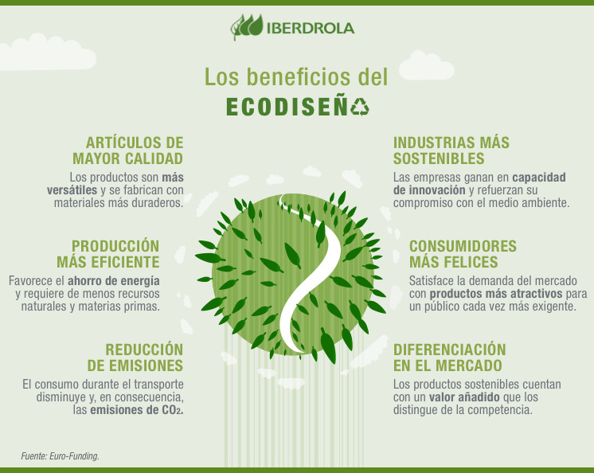
*Figura: infografía que agrupa los beneficios en artículos de mayor calidad, producción más
eficiente (ahorro de energía), reducción de emisiones, industrias más sostenibles,
consumidores más satisfechos y diferenciación en el mercado. Origen: `U4_Economia_Circular.pdf`.*

Además, `UNIDAD_4.pdf` recuerda que el ecodiseño **impulsa la I+D+i** (investigación,
desarrollo e innovación): sin investigación no serían posibles los materiales alternativos ni
los procesos más limpios. El PDF incluye además un esquema de la secuencia de realización de
un proyecto de I+D+i.

### El ecodiseño a lo largo del ciclo de vida

El ecodiseño no actúa en un solo punto, sino en **cada etapa** de la vida del producto. La
tabla siguiente contrasta lo que ocurre **sin** ecodiseño (problemas) y **con** ecodiseño
(soluciones):

| Etapa | Sin ecodiseño (problemas) | Con ecodiseño (soluciones) |
|---|---|---|
| Obtención de recursos | Recursos no renovables, residuos en la extracción | Proveedores sostenibles, materiales certificados, alternativas a materiales tóxicos |
| Manufactura | Gran gasto energético, emisiones nocivas, despilfarro de materiales | *Lean manufacturing*, tecnología eficiente, reaprovechar pérdidas |
| Distribución | Embalaje excesivo, peso excesivo, transporte ineficiente | Logística optimizada, envases retornables |
| Consumo | Exceso de ruido, emisiones de calor, alto gasto de energía, reparación difícil | Recomendaciones de buenas prácticas de uso |
| Gestión de residuos | Coste elevado, reciclado difícil, mucho volumen de residuos | Diseño para reciclar, reparar, refabricar y reducir; se generan pocos residuos |

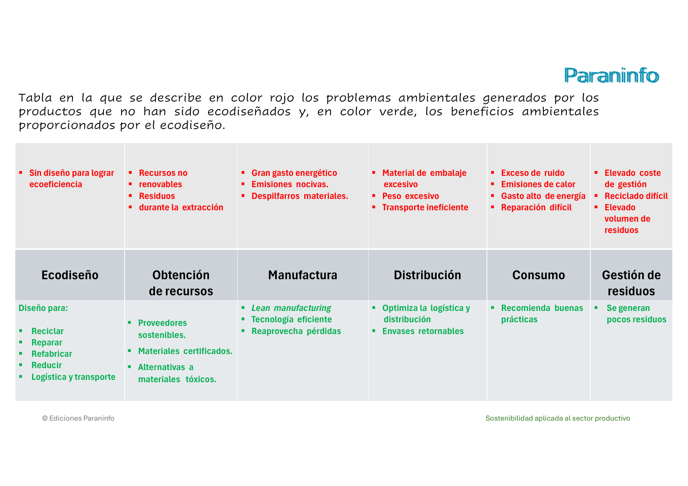
*Figura: en rojo, los problemas ambientales de un producto que no se ha ecodiseñado; en
verde, los beneficios del ecodiseño, fase por fase (obtención de recursos, manufactura,
distribución, consumo y gestión de residuos). Es la mejor "chuleta" para aplicar ecodiseño.
Origen: `UNIDAD_4.pdf`.*

### Materiales biodegradables y bioplásticos

Fomentar los **materiales biodegradables** casi elimina el problema de los vertederos,
aunque sus residuos deben tratarse en **plantas especializadas**. Los materiales
biodegradables se descomponen por la acción del medio ambiente produciendo **CO₂, agua y
sustancias minerales**. Los **compostables** son también biodegradables, pero se degradan
más rápido y producen **abono** bajo condiciones ambientales específicas.

Los **bioplásticos** son plásticos biodegradables y/o derivados de productos vegetales (caña
de azúcar, almidón de patata o maíz, subproductos agrícolas). Los más interesantes para la
economía circular son los biodegradables derivados de vegetales, como el **PLA, el PHA y el
PBS**.

### Ecoetiquetas y normas: los "criterios de sostenibilidad" que se pueden certificar

Las **ecoetiquetas** identifican productos que cumplen ciertos criterios ambientales
(eficiencia energética, durabilidad, facilidad de reciclaje, menos sustancias peligrosas):

- **EPEAT** (*Electronic Product Environmental Assessment Tool*): etiqueta internacional que
  evalúa el impacto ambiental de productos electrónicos (diseño sostenible, reciclabilidad,
  uso de materiales reciclados).
- **Energy Star**: etiqueta reconocida en la UE que certifica productos con **alta
  eficiencia energética**.
- **TCO Certified**: etiqueta sueca con gran aceptación en Europa; garantiza que el producto
  es seguro, eficiente, ergonómico y fabricado con criterios sociales y ambientales.
- **Etiquetado energético de la UE**: **obligatorio** en muchos dispositivos; informa del
  consumo energético clasificado de la **A** (más eficiente) a la **G** (menos eficiente).

Y una norma dedicada: **ISO 14006**, para la identificación, el control y la mejora de los
aspectos ambientales de los productos y servicios comercializados; es el estándar de
referencia para implantar el ecodiseño en una organización.

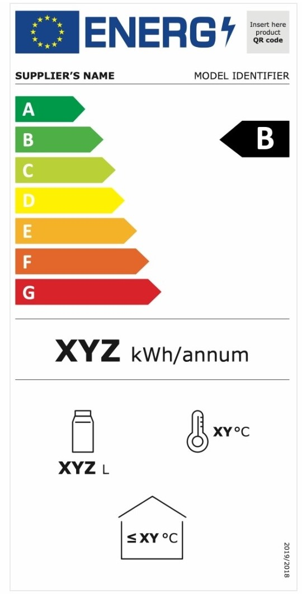
*Figura: la etiqueta energética europea, con la escala de la A (más eficiente) a la G (menos
eficiente). Es obligatoria y ayuda a comparar productos antes de comprar. Origen:
`U4_Economia_Circular.pdf`.*

También encaja aquí la **alargascencia**: un movimiento social nacido para **alargar la
durabilidad de los productos** y reducir el consumo de recursos naturales; es la respuesta
ciudadana a la obsolescencia programada.

> **Ejemplo actual — Fairphone y Framework.** Fairphone diseña smartphones **modulares**:
> puedes cambiar tú mismo la batería, la pantalla o la cámara con un destornillador normal, y
> la marca ofrece actualizaciones de software durante muchos años. Framework hace lo mismo
> con portátiles: puertos, memoria, teclado y placa se sustituyen y se actualizan. Ambos son
> ecodiseño de manual: mínimos materiales, larga vida útil y desmontaje sencillo.

> **En las noticias — Cargador único USB-C.** Desde finales de 2024, la normativa europea
> obliga a que móviles, tabletas, cámaras, auriculares y otros dispositivos pequeños que se
> vendan en la UE lleven puerto **USB-C**. Según se informó, la medida busca reducir la
> "basura de cargadores" y permitir vender el aparato sin cargador. Es una decisión de
> ecodiseño impuesta por ley: menos materiales y menos residuos.

### Ideas clave de esta sección

- Ecodiseño = pensar el impacto ambiental **desde el diseño** y para **todo el ciclo de
  vida**.
- Sus beneficios: **menos impacto y recursos**, **más eficiencia energética**, **menos
  costes**, **mejor imagen de marca** y **cumplimiento normativo**. Además impulsa la I+D+i.
- Actúa en **todas las fases**: proveedores sostenibles, manufactura eficiente, logística
  optimizada, buen uso y diseño para reciclar.
- Se puede certificar con **ecoetiquetas** (EPEAT, Energy Star, TCO Certified, etiquetado
  energético UE) y con la norma **ISO 14006**.

---

## 4. Ciclo de vida del producto y del servicio

### El ciclo de vida: definición

El **ciclo de vida de un producto** es el conjunto de etapas que atraviesa **desde que se
extraen las materias primas** necesarias para fabricarlo **hasta su eliminación o reciclaje**
al final de su uso. Analizarlo permite **detectar los puntos más críticos ambientalmente** y
aplicar mejoras sostenibles (ecodiseño, reutilización de materiales).

Hay dos formas complementarias de mirarlo:

**a) Las etapas comerciales del producto** (cómo se comporta en el mercado):

- **Introducción**: lanzamiento. Ventas bajas, costes de producción y marketing altos,
  pruebas con usuarios, riesgo de fallos técnicos, todavía sin beneficios.
- **Crecimiento**: gana popularidad, crece la demanda, se optimiza la producción; suben las
  ventas y se introducen mejoras de hardware o software.
- **Madurez**: punto más estable. Ventas sostenidas pero mercado saturado; la innovación
  baja y se apuesta por mejoras incrementales y mantenimiento.
- **Declive**: la demanda cae por la aparición de nuevas tecnologías. El producto queda
  obsoleto, se retira o se mantiene como opción barata; **aumentan los residuos
  electrónicos** y termina el soporte técnico.

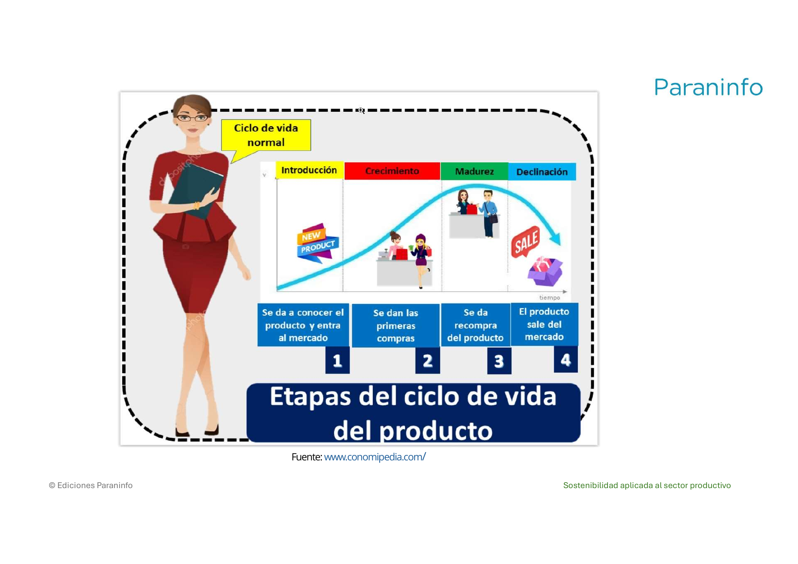
*Figura: la curva de ventas frente al tiempo dibuja las cuatro etapas —introducción,
crecimiento, madurez y declive—. Saber en qué fase está un producto ayuda a decidir si
conviene actualizarlo o sustituirlo. Origen: `UNIDAD_4.pdf` (fuente citada: economipedia).*

**Relación con la sostenibilidad**: si se diseña pensando en **alargar la fase de madurez**,
se reduce la necesidad de fabricar equipos nuevos constantemente. En la fase de **declive**
es preferible **actualizar o reutilizar** los dispositivos antes que desecharlos
prematuramente. Y conviene **evitar lanzamientos innecesarios**, que fomentan el consumo
impulsivo y aceleran la generación de residuos electrónicos.

**b) El Análisis del Ciclo de Vida (ACV)** (cómo medir su impacto ambiental):

El **ACV** es una técnica para **evaluar los aspectos ambientales y los posibles impactos
negativos** ligados al ciclo de vida de un producto. Los **aspectos ambientales** que se
consideran son, por ejemplo, el consumo de agua, de materiales y de energía, y las emisiones
de gases de efecto invernadero. Los **posibles impactos** son el agotamiento de recursos
naturales, el cambio climático, la reducción de la capa de ozono, la contaminación de la
atmósfera, los cursos de agua, el mar o el suelo, y los efectos sobre la salud humana.

Según la norma **ISO 14040**, el ACV consta de **cuatro etapas**:

1. **Definición de objetivos y alcance**: se fija para qué se hace el análisis y hasta dónde
   llega.
2. **Inventario de las entradas y salidas**: se identifican y cuantifican todas las entradas
   de materias primas y de energía durante el ciclo de vida.
3. **Evaluación de los posibles impactos ambientales**: se relacionan esas entradas y
   salidas con los impactos que provocan.
4. **Interpretación de los resultados**: ya se sabe qué impactos genera cada fase, así que se
   decide **dónde hacer cambios o mejoras**.

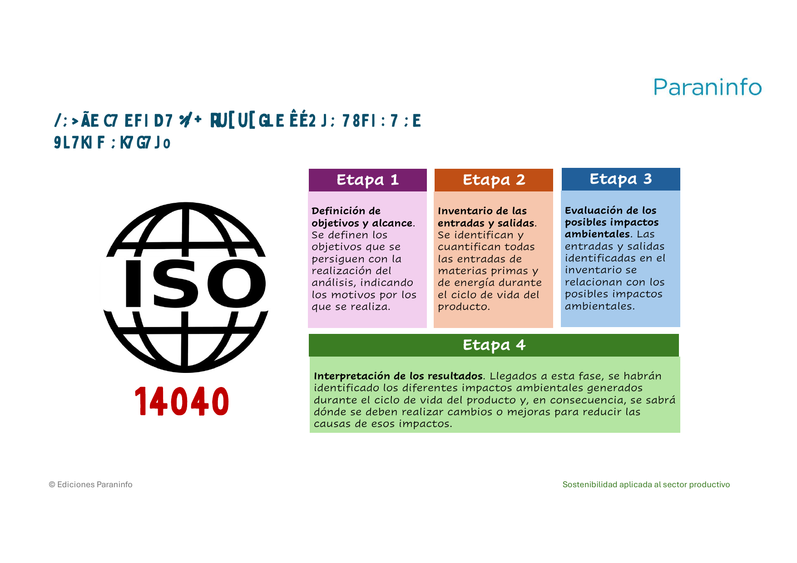
*Figura: las cuatro etapas del análisis del ciclo de vida (objetivos y alcance → inventario
de entradas y salidas → evaluación de impactos → interpretación de resultados). Origen:
`UNIDAD_4.pdf`.*

### Procesos de producción y criterios de sostenibilidad aplicados

Un ACV o un ejercicio de ecodiseño acaban señalando **procesos de producción** más
sostenibles: **proveedores sostenibles** y **materiales certificados** en la obtención de
recursos; **lean manufacturing** y **tecnología eficiente** en la fabricación; **logística
optimizada** y **envases retornables** en la distribución. Los **criterios de
sostenibilidad** se acreditan con las herramientas ya vistas: **ecoetiquetas** (EPEAT,
Energy Star, TCO Certified, etiquetado energético de la UE) y **normas** (ISO 14006 para
ecodiseño, ISO 14040 para el ACV).

### Y el ciclo de vida del servicio

El Contenido habla de "producto **y del servicio**", pero los PDF se centran sobre todo en el
producto físico. La idea que sí aparece es la **economía de servicios**: cuando en lugar de
vender un producto se ofrece un servicio que cubre la misma necesidad (**software en la nube
/ SaaS**, alquiler de impresoras con mantenimiento incluido), el proveedor tiene incentivo
para que los equipos **duren y se reparen**, porque el aparato sigue siendo suyo. Aun así,
un servicio digital también tiene su ciclo de vida y su impacto (servidores, electricidad,
red), que se trata en el siguiente apartado. *Los PDF de la carpeta no desarrollan un método
específico de "ciclo de vida del servicio"; queda como pregunta abierta.*

**Ejemplos de aprovechamiento de residuos por sectores** (del temario, para ver el ciclo de
vida "cerrado" en la práctica):

- **Construcción**: ladrillos fabricados con hasta un **90 % de residuos de demolición**, lo
  que reduce en una proporción parecida las emisiones de CO₂.
- **Mobiliario urbano** fabricado con **plásticos de rechazo** (no reciclables) que, si no,
  irían al vertedero.
- **Agroalimentario**: organizaciones que recogen del campo las frutas y verduras que quedan
  fuera de los circuitos comerciales por su forma, tamaño o color (en España, la empresa
  Talkual).

> **Ejemplo actual — De disco duro a SSD en lugar de tirar el equipo.** Un ordenador que va
> lento no siempre está al final de su vida: muchas veces basta con **ampliar la memoria RAM
> y cambiar el disco duro mecánico (HDD) por uno SSD**. Con una intervención barata, el
> equipo vuelve a la fase de "madurez" y se retrasa años su paso a residuo. Es análisis de
> ciclo de vida aplicado con sentido común.

> **En las noticias — El fin de soporte de un sistema operativo de escritorio.** El fin del
> soporte de Windows 10, previsto para octubre de 2025, llevó a advertir de una posible
> oleada de residuos electrónicos: millones de equipos que funcionan bien pero no cumplen
> los requisitos para actualizar a la última versión. Según se informó, asociaciones de
> consumidores y ecologistas pidieron alargar el soporte o facilitar alternativas para
> evitar tirar ordenadores útiles. Es la fase de **declive** provocada por software, no por
> hardware.

### Ideas clave de esta sección

- **Ciclo de vida** = de la extracción de materias primas a la eliminación o reciclaje.
- Etapas comerciales: **introducción, crecimiento, madurez, declive**; alargar la madurez y
  reutilizar en el declive es lo sostenible.
- **ACV (ISO 14040)**: técnica en **4 etapas** —objetivos y alcance, inventario de entradas
  y salidas, evaluación de impactos, interpretación— para saber qué fase mejorar.
- Los **criterios de sostenibilidad** se certifican con ecoetiquetas y normas (**ISO 14006**,
  **ISO 14040**).

---

## 5. Sostenibilidad en el desarrollo de productos digitales

El sector TIC recorre esta unidad de principio a fin, porque es un caso extremo del modelo
lineal **y** un terreno lleno de oportunidades circulares.

### El problema: obsolescencia y residuos electrónicos (RAEE)

En tecnología, la **obsolescencia programada y percibida** es especialmente intensa: nuevas
versiones de móviles, ordenadores y electrodomésticos empujan a un **consumo acelerado**,
muchas veces innecesario. El resultado son toneladas de **residuos de aparatos eléctricos y
electrónicos (RAEE)** que a menudo no se reciclan bien. Un ejemplo del temario: un portátil
usado por una empresa **solo dos años** puede acabar como residuo electrónico; en cambio, si
se **recondiciona y se revende**, se alarga su ciclo de vida y se reduce su huella
ecológica.

### La economía verde aplicada a la informática

- **Eficiencia**: algoritmos de bajo consumo energético y **hardware eficiente** que
  prolonga la vida útil de los equipos.
- **Gestión responsable de los RAEE**: reciclaje o reacondicionamiento en lugar de vertedero.
- **Energías renovables**: los **centros de datos**, que consumen muchísima electricidad para
  funcionar y refrigerarse, pueden alimentarse con energía **solar o eólica** para reducir su
  huella de carbono.
- **Tecnologías limpias**: equipos con **ecoetiquetas** (Energy Star) o **diseño modular**
  para reparar y actualizar.
- **Empleo verde**: técnicos dedicados al **reacondicionamiento de equipos** o al desarrollo
  de **software de gestión energética**.

### La economía circular aplicada a la informática

- **Diseño para durar y repararse**: ordenadores con **carcasa desmontable**, piezas
  intercambiables y manuales de reparación disponibles.
- **Reparación**: talleres que arreglan portátiles, móviles o impresoras en vez de
  desecharlos.
- **Reutilización de componentes**: recuperar discos duros, fuentes de alimentación o
  memorias RAM para otros equipos.
- **Reciclaje de materiales valiosos**: recuperación de **oro, plata, cobre y tierras raras**
  de placas base y móviles.
- **Economía de servicios**: **software en la nube (SaaS)** o alquiler de impresoras con
  mantenimiento incluido, en lugar de comprar y poseer el equipo.

Las **9R aplicadas a la tecnología** (ver tabla de la sección 2) dan ideas muy concretas:
**software ligero** que pide menos hardware (Reducir), **reutilizar** monitores y teclados,
**cambiar la batería** en vez del portátil (Reparar), **equipos reacondicionados
certificados** (Restaurar), **portátiles modulares** (Rediseñar), **recuperar metales** de
móviles (Reciclar), **valorización energética** de RAEE no reciclables (Recuperar) y
**plástico reciclado** de carcasas para fabricar mobiliario u otros dispositivos
(Reintegrar).

### El ecodiseño de un producto digital

Aplicar los principios del ecodiseño a un dispositivo se traduce en: **menos plástico** y
estructuras de **aluminio reciclado**; **embalajes biodegradables** sin plásticos de un solo
uso; certificación **Energy Star** por bajo consumo; **tapas desmontables sin herramientas
especiales** para acceder a memoria y almacenamiento; y **baterías sin adhesivos**, con
**tornillos estándar** y materiales claramente identificados para el reciclaje.

### Proyectos inspiradores del sector TIC (del temario)

- **Closing the Loop**: recupera móviles usados en África para extraer metales valiosos y
  reintroducirlos en el mercado.
- **Fairphone**: diseña smartphones **modulares**, fácilmente reparables y con materiales
  sostenibles.
- **CEWASTE**: impulsa la recuperación de **metales críticos** en residuos electrónicos.

> **Ejemplo actual — El consumo eléctrico de la inteligencia artificial y los centros de
> datos.** El auge de la IA generativa ha disparado la construcción de centros de datos.
> Informes del sector energético publicados en 2024 advirtieron de que el consumo eléctrico
> mundial de centros de datos, IA y criptomonedas podría aproximadamente **duplicarse** en
> pocos años; las cifras concretas varían según la fuente. Conecta directamente con la
> economía verde: eficiencia de los algoritmos, refrigeración eficiente y alimentación con
> renovables.

> **En las noticias — Índice de reparabilidad y de durabilidad.** Francia obliga desde hace
> unos años a mostrar un **índice de reparabilidad** (una nota de 0 a 10) en móviles,
> portátiles y otros aparatos, y lo está ampliando a un **índice de durabilidad**. Según se
> informó, la medida ha empujado a algunos fabricantes a publicar despieces y a vender
> repuestos. Es ecodiseño incentivado desde la etiqueta, en la línea del etiquetado
> energético de la UE.

### Ideas clave de esta sección

- La informática es un **caso extremo del modelo lineal** (obsolescencia, RAEE, consumo
  eléctrico) y un **campo de pruebas de la economía circular**.
- Economía **verde** en TIC: eficiencia, gestión de RAEE, renovables en centros de datos,
  empleo verde.
- Economía **circular** en TIC: diseño reparable, reparación, reutilización de componentes,
  recuperación de metales, **economía de servicios (SaaS)**.
- **Ecodiseño digital**: menos materiales, aluminio reciclado, embalaje biodegradable,
  desmontaje sin herramientas, materiales identificados.
- Referencias: **Closing the Loop, Fairphone, CEWASTE**.

---

## Glosario rápido

| Término | En una frase |
| --- | --- |
| Modelo / economía lineal | Producir, consumir y tirar sin reutilizar ni reciclar ("extraer-fabricar-consumir-tirar"). |
| Obsolescencia programada | Diseñar un producto para que tenga una vida útil limitada. |
| Obsolescencia percibida | Hacer que un producto *parezca* anticuado aunque siga funcionando. |
| Deslocalización | Trasladar la producción a países con costes (salarios) más bajos; se aceleró en el último tercio del siglo XX. |
| Economía verde | Modelo de desarrollo que mejora el bienestar humano reduciendo los riesgos ambientales y la escasez ecológica. |
| Economía circular | Modelo que cierra los ciclos de productos y materiales para evitar residuos; se basa en las 3R. |
| 3R | Reducir, Reutilizar, Reciclar. |
| 9R | Jerarquía de estrategias circulares: Rechazar, Reducir, Reutilizar, Reparar, Restaurar, Rediseñar, Reciclar, Recuperar, Reintegrar. |
| 5 principios rectores | Proteger el capital natural, reducir y aprovechar residuos, potenciar la durabilidad, diseñar ecoeficiente, regenerar la naturaleza. |
| Economía de servicios | Ofrecer un servicio (SaaS, alquiler con mantenimiento) en lugar de vender el producto físico. |
| EEEC | Estrategia Española de Economía Circular; emana de la UE, con objetivos a 2030 y planes trienales. |
| Ley 7/2022 | Ley de residuos y suelos contaminados para una economía circular. |
| Ecodiseño | Diseñar un producto teniendo en cuenta su impacto ambiental durante todo su ciclo de vida. |
| Alargascencia | Movimiento social para alargar la durabilidad de los productos; lo contrario de la obsolescencia. |
| Bioplásticos | Plásticos biodegradables y/o de origen vegetal; los más útiles para la economía circular son PLA, PHA y PBS. |
| Biodegradable / compostable | Se descompone por el ambiente (CO₂, agua, minerales); el compostable, además, se degrada rápido y produce abono. |
| Ecoetiqueta | Sello que acredita criterios ambientales: EPEAT, Energy Star, TCO Certified, etiquetado energético de la UE (A–G). |
| ISO 14006 | Norma para implantar y mejorar el ecodiseño en una organización. |
| Ciclo de vida del producto | Etapas desde la extracción de materias primas hasta la eliminación o el reciclaje. |
| ACV | Análisis del Ciclo de Vida; técnica en 4 etapas (ISO 14040) para medir impactos ambientales y decidir mejoras. |
| RAEE | Residuos de aparatos eléctricos y electrónicos. |

## Repaso: 10 preguntas para autoevaluarte

1. Define "economía" con las palabras del temario y explica por qué la parte de "recursos
   limitados" es tan importante en esta unidad.
2. Enumera las **cuatro etapas** del sistema productivo clásico y explica por qué el modelo
   lineal necesita que el flujo de materiales sea rápido.
3. ¿Qué diferencia hay entre **obsolescencia programada** y **obsolescencia percibida**? Pon
   un ejemplo tecnológico de cada una.
4. ¿Qué es la **economía verde** y cuáles son sus cinco principios clave?
5. Explica la **economía circular** en una frase y enumera las **3R** y las **9R** en orden
   de prioridad. ¿Por qué se dice que las 9R son una "jerarquía"?
6. Cita los **5 principios rectores** de la economía circular y los **objetivos de la EEEC
   para 2030**.
7. Construye una tabla comparando el modelo lineal y el circular en: uso de recursos,
   residuos, impacto ambiental, sostenibilidad económica e impacto social.
8. ¿Qué es el **ecodiseño**? Enumera al menos cuatro de sus **beneficios**.
9. Nombra cuatro **ecoetiquetas** y explica qué acredita el **etiquetado energético de la
   UE**. ¿Para qué sirve la norma **ISO 14006**?
10. Describe las **cuatro etapas del ACV** según la norma **ISO 14040** y explica cómo se
    aplicaría a alargar la vida de un ordenador lento.

Respuestas (resumidas y con la sección donde repasar)

1. Economía = estudio de los métodos más efectivos para satisfacer las necesidades
   materiales de las personas **usando recursos limitados**. Importa porque el modelo lineal
   trata esos recursos como si fueran infinitos y por eso es insostenible. (Sección 1)
2. Extraer materias primas → manufacturar en cadena → adquisición por los consumidores →
   desecho como residuo tras un uso breve. El modelo necesita rapidez porque solo funciona
   si se consume mucho. (Sección 1)
3. Programada: el producto se **diseña** para durar poco. Percibida: se induce la sensación
   de que está anticuado aunque funcione (moda, "modelo nuevo"). Ejemplos: batería no
   reemplazable pegada (programada); lanzamiento anual de móvil casi idéntico (percibida).
   (Sección 1)
4. Modelo de desarrollo que mejora el bienestar humano y la equidad social reduciendo los
   riesgos ambientales y la escasez ecológica. Principios: eficiencia en los recursos,
   reducción de emisiones y residuos, fomento de renovables, inversión en tecnologías
   limpias, generación de empleo verde. (Sección 2)
5. Modelo que cierra los ciclos de productos y materiales para que no haya residuos. 3R:
   Reducir, Reutilizar, Reciclar. 9R: Rechazar, Reducir, Reutilizar, Reparar, Restaurar,
   Rediseñar, Reciclar, Recuperar, Reintegrar. Es jerarquía porque primero hay que evitar el
   residuo y solo al final reciclarlo o valorizarlo energéticamente. (Sección 2)
6. Principios rectores: proteger el capital natural y usar renovables; reducir y aprovechar
   residuos; potenciar la durabilidad; diseñar ecoeficiente; regenerar la naturaleza.
   Objetivos EEEC 2030: −30 % consumo de materiales (vs 2010), −15 % residuos (vs 2010),
   reducir el desperdicio alimentario, reutilizar el 10 % de los residuos municipales,
   reducir los GEI del sector residuos, +10 % eficiencia del agua. (Sección 2)
7. Ver la tabla "Lineal frente a circular". Claves: intensivo/extractivo vs
   eficiente/regenerativo; residuos altos vs mínimos; impacto elevado vs reducido;
   dependencia de materias finitas vs resiliencia; empleo precario vs empleo verde.
   (Sección 2)
8. Diseñar el producto teniendo en cuenta su impacto ambiental durante todo el ciclo de
   vida. Beneficios: reduce impacto y uso de recursos; mejora la eficiencia energética;
   reduce costes de producción y de gestión de residuos; refuerza la imagen de marca;
   cumple la normativa; impulsa la I+D+i. (Sección 3)
9. EPEAT, Energy Star, TCO Certified y etiquetado energético de la UE. El etiquetado
   energético de la UE es obligatorio e informa del consumo energético del producto en una
   escala de A (más eficiente) a G (menos eficiente). ISO 14006 sirve para implantar,
   controlar y mejorar el ecodiseño en una organización. (Sección 3)
10. ACV (ISO 14040): 1) definición de objetivos y alcance; 2) inventario de entradas y
    salidas (materiales y energía); 3) evaluación de los posibles impactos; 4) interpretación
    de resultados para decidir mejoras. Aplicado al ordenador lento: se ve que fabricar uno
    nuevo tiene mucho más impacto que ampliar RAM y poner un SSD, así que la mejora es
    alargar la vida del equipo. (Sección 4)

---

## Bibliografía y fuentes citadas

### Material del módulo

- Colt Technology Services. (2024). *Impacto sostenible y alcance sin esfuerzo: el camino del CIO para lograr un futuro mejor. Informe sobre la infraestructura digital 2024 de Colt* [Informe]. Colt Group.
- Departamento de Informática, IES Telesforo Bravo. (2025-2026). *Apuntes del módulo Sostenibilidad aplicada al sistema productivo* (unidades 1 y 3 a 6) [Apuntes de clase]. Consejería de Educación, Formación Profesional, Actividad Física y Deportes del Gobierno de Canarias.
- *Informe integral de sostenibilidad: De la teoría a la gestión ASG* [Documento de trabajo]. (s. f.).
- Ocio de la Fuente, V. (2025). *Plan de sostenibilidad 2025-2027: plan de sostenibilidad alineado con la estrategia* [Presentación].
- Oramas González-Moro, I. (2024). *Temas 1 a 3 del curso: aspectos ambientales, sociales y de gobernanza (ASG); los ODS como guía para superar retos ambientales y sociales; grandes desafíos globales* [Material de formación]. Curso Sostenibilidad aplicada a los sectores productivos (PROF23, expediente F.064380/2024-01). IES Fernando Sagaseta.
- *Programación didáctica: Sostenibilidad aplicada al sistema productivo (2627). 2.º DAM* (versión provisional). (s. f.). Consejería de Educación, Formación Profesional, Actividad Física y Deportes del Gobierno de Canarias.
- Tíscar Oliver, P. A. (2024). *Sostenibilidad aplicada al sistema productivo*. Ediciones Paraninfo. ISBN 978-84-283-6345-7 (ed. impresa); 978-84-283-6991-6 (ed. digital). Incluye las presentaciones de aula de las unidades didácticas 1 a 6.
- *Apuntes del módulo Sostenibilidad aplicada al sistema productivo: UT 1 a UT 3* [Apuntes de clase]. (2025-2026).

### Fuentes citadas dentro de los materiales

- Boletín Oficial del Estado. (2007). *Real Decreto 1514/2007, por el que se aprueba el Plan General de Contabilidad*. <https://www.boe.es/buscar/act.php?id=BOE-A-2007-19884>
- Boletín Oficial del Estado. (2011). *Ley 2/2011, de 4 de marzo, de Economía Sostenible*. <https://www.boe.es/buscar/act.php?id=BOE-A-2011-4117>
- Boletín Oficial del Estado. (2018). *Ley 11/2018, de 28 de diciembre, en materia de información no financiera y diversidad*. <https://www.boe.es/buscar/doc.php?id=BOE-A-2018-17989>
- Boletín Oficial del Estado. (2021). *Ley 7/2021, de 20 de mayo, de cambio climático y transición energética*. <https://www.boe.es/buscar/act.php?id=BOE-A-2021-8447>
- Boletín Oficial del Estado. (2022). *Ley 7/2022, de 8 de abril, de residuos y suelos contaminados para una economía circular*. <https://www.boe.es/buscar/act.php?id=BOE-A-2022-5809>
- Club de Roma. (1972). *Los límites del crecimiento*.
- Comisión Mundial sobre el Medio Ambiente y el Desarrollo. (1987). *Nuestro futuro común* (Informe Brundtland). Organización de las Naciones Unidas.
- Conferencia de las Naciones Unidas sobre Comercio y Desarrollo. (2015). *Agenda de Acción de Addis Abeba*. <https://unctad.org/system/files/official-document/ares69d313_es.pdf>
- Convención Marco de las Naciones Unidas sobre el Cambio Climático. (2015). *Acuerdo de París*. <https://unfccc.int/es/acerca-de-las-ndc/el-acuerdo-de-paris>
- Diario Oficial de la Unión Europea. (2024). *Directiva (UE) 2024/1760 sobre diligencia debida de las empresas en materia de sostenibilidad (CSDDD)*. <https://www.boe.es/buscar/doc.php?id=DOUE-L-2024-81037>
- Fundación Vida Sostenible. (s. f.). *Calculadora de huella ecológica*. <https://www.vidasostenible.org/proyectos/calculadora-de-huella-ecologica/>
- Global Footprint Network. (s. f.). *Ecological footprint — recursos y datos*. <https://www.footprintnetwork.org/resources/footprint-calculator/>
- Global Footprint Network. (s. f.). *Footprint calculator*. <https://www.footprintcalculator.org/home/es>
- Ministerio de Derechos Sociales, Consumo y Agenda 2030. (s. f.). *Calcula tu huella*. <https://calculatuhuella.consumo.gob.es>
- Ministerio para la Transición Ecológica y el Reto Demográfico. (s. f.). *Portal oficial*. <https://www.miteco.gob.es>
- Organización de las Naciones Unidas. (1972). *Conferencia de las Naciones Unidas sobre el Medio Humano (Estocolmo)*. <https://www.un.org/es/conferences/environment/stockholm1972>
- Organización de las Naciones Unidas. (1992). *Conferencia de las Naciones Unidas sobre el Medio Ambiente y el Desarrollo (Río de Janeiro)*. <https://www.un.org/es/conferences/environment/rio1992>
- Organización de las Naciones Unidas. (2000). *Cumbre del Milenio (Nueva York)*. <https://www.un.org/es/conferences/environment/newyork2000>
- Organización de las Naciones Unidas. (2015). *Transformar nuestro mundo: la Agenda 2030 para el Desarrollo Sostenible* (A/RES/70/1). <https://unctad.org/system/files/official-document/ares70d1_es.pdf>
- Organización de las Naciones Unidas. (s. f.). *Objetivos de Desarrollo Sostenible*. <https://www.un.org/sustainabledevelopment/es/objetivos-de-desarrollo-sostenible/>
- Organización Internacional de Normalización. (s. f.). *ISO 14001. Sistemas de gestión ambiental*. <https://www.iso.org/es/norma/14001>
- Organización Internacional de Normalización. (s. f.). *ISO 26000. Responsabilidad social*. <https://www.iso.org/es/contents/data/standard/04/25/42546.html>
- Organización Internacional de Normalización. (s. f.). *ISO 50001. Sistemas de gestión de la energía*. <https://www.iso.org/es/contents/data/standard/06/94/69426.html>
- Pacto Mundial de las Naciones Unidas, GRI y WBCSD. (2016). *SDG Compass: la guía para la acción empresarial en los ODS*. <https://sdgcompass.org/>
- Red Española del Pacto Mundial. (2017). *El sector privado ante los ODS: guía práctica para la acción*. <https://www.pactomundial.org/wp-content/uploads/2017/04/Empresas_y_ODS_PM_20170405.pdf>
