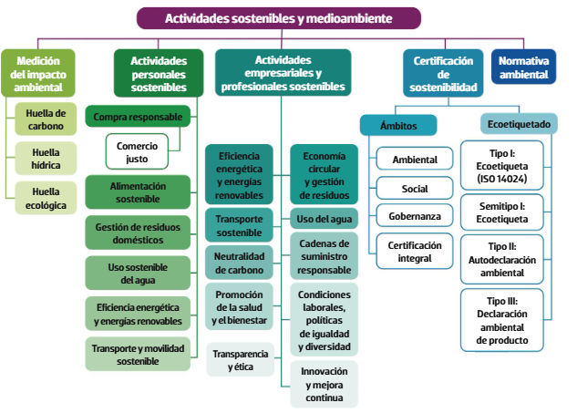
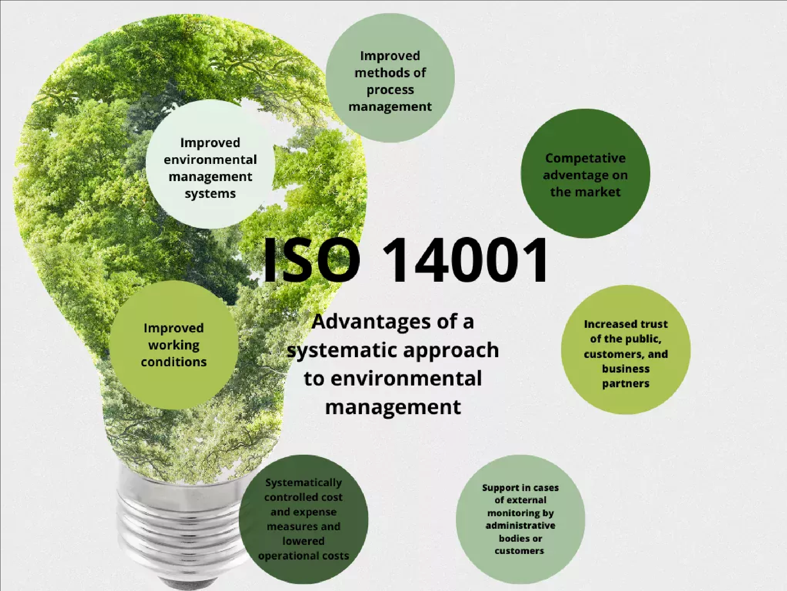
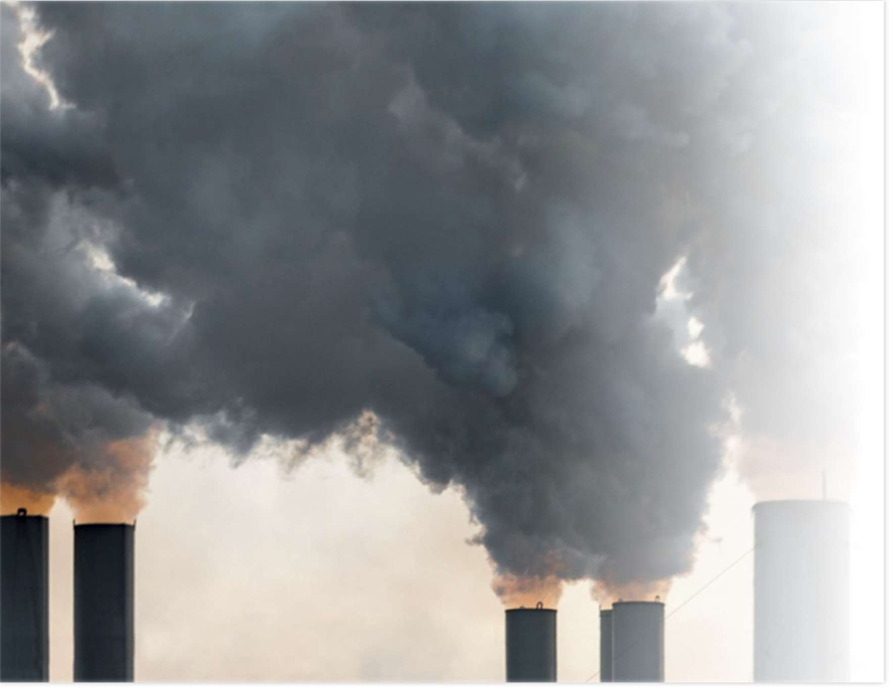
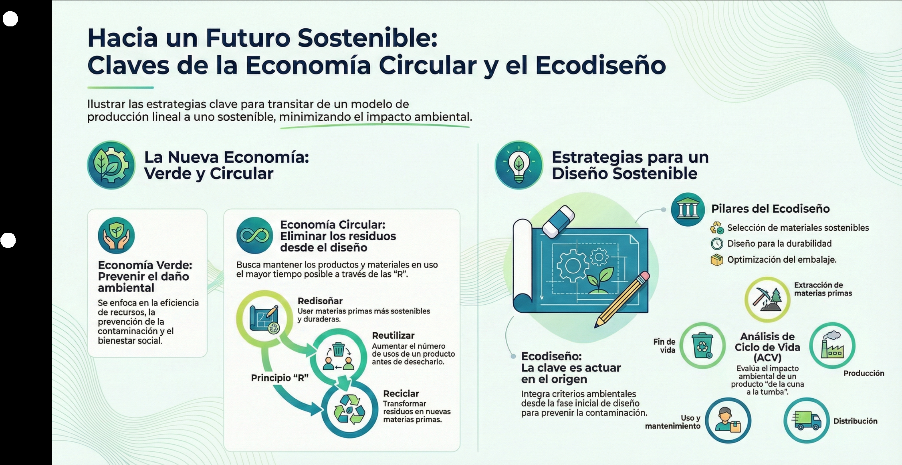
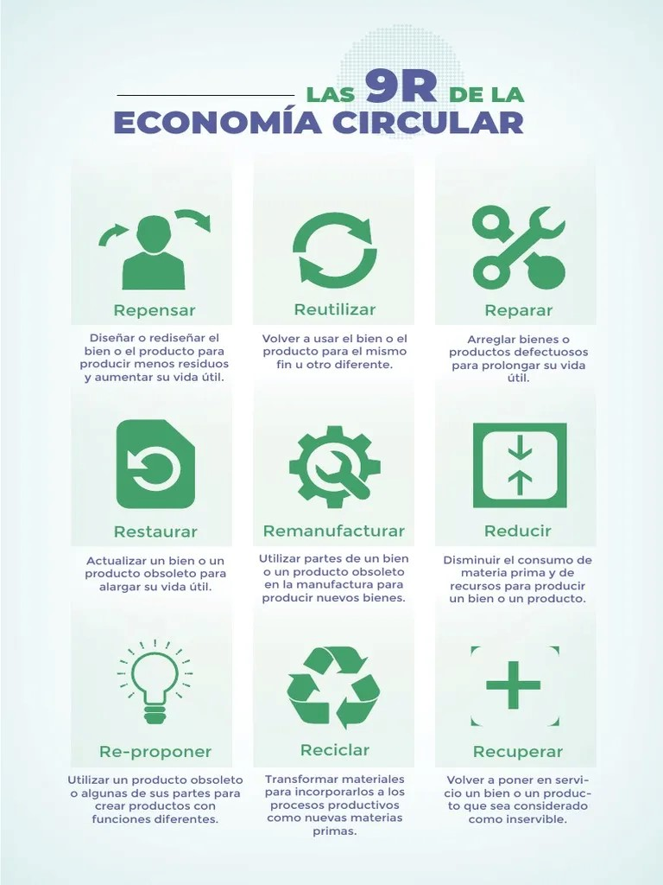
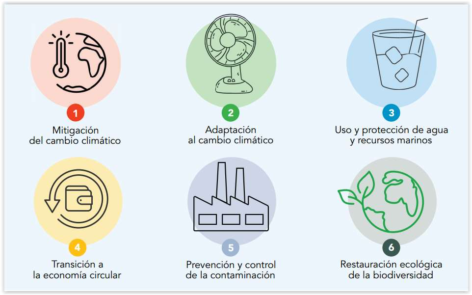
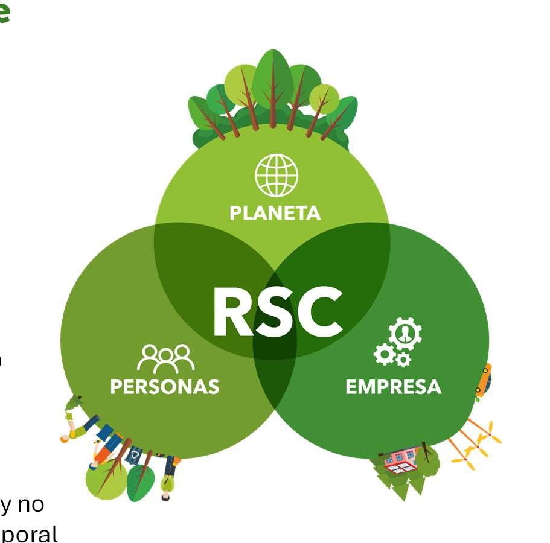
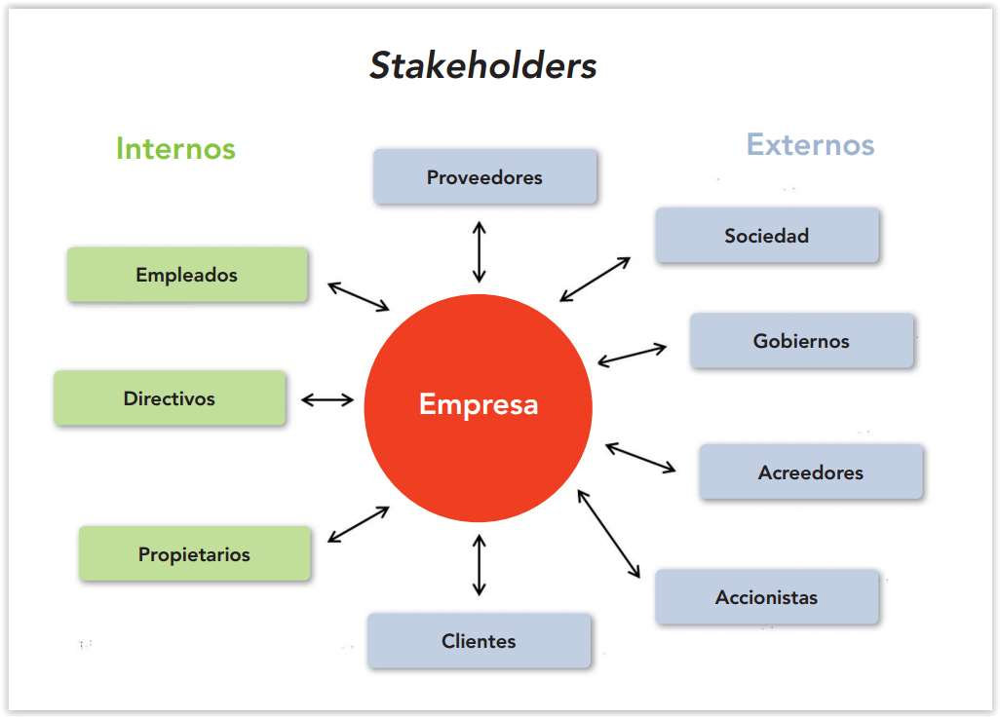

# Estrategias sostenibles aplicadas

## Índice

1. [Evaluación del impacto ambiental y social](#1-evaluacion-del-impacto-ambiental-y-social)
2. [Huella digital y consumo energético en TIC](#2-huella-digital-y-consumo-energetico-en-tic)
3. [Estrategias sostenibles en informática: eficiencia, digitalización responsable](#3-estrategias-sostenibles-en-informatica-eficiencia-digitalizacion-responsable)
4. [Normativa y políticas ambientales aplicables](#4-normativa-y-politicas-ambientales-aplicables)
5. [Integración de criterios de sostenibilidad en la práctica profesional](#5-integracion-de-criterios-de-sostenibilidad-en-la-practica-profesional)
6. [Glosario rápido](#glosario-rapido)
7. [Repaso: 10 preguntas para autoevaluarte](#repaso-10-preguntas-para-autoevaluarte)
8. [De dónde sale esto (fuentes de la carpeta)](#de-donde-sale-esto-fuentes-de-la-carpeta)

## De qué va esta unidad

Hasta ahora has visto la sostenibilidad "desde arriba": qué son los ODS, qué retos ambientales y sociales tenemos, qué es la economía verde y circular. En esta unidad **bajamos al suelo**. La pregunta que responde la UT5 es muy práctica: *cuando yo hago algo —fabricar un producto, prestar un servicio, montar un sistema, incluso vivir mi día a día—, ¿qué daño le estoy haciendo al medio ambiente y a la sociedad, y cómo lo reduzco?*

La unidad integra conocimientos previos (economía circular, principios de ecodiseño, identificación de riesgos y efectos medioambientales) y los pone a trabajar para **realizar actividades sostenibles**. El objetivo de esas actividades es siempre el mismo: **minimizar el impacto ambiental** y contribuir al logro de los Objetivos de Desarrollo Sostenible (ODS). Para lograrlo trabajaremos cuatro herramientas mentales: (1) saber **medir y evaluar** el impacto de lo que hacemos, (2) conocer nuestra **huella** (de carbono, hídrica, ecológica y digital), (3) aplicar **estrategias sostenibles y ecodiseño** para eliminar el impacto en origen, y (4) cumplir la **normativa y las políticas ambientales** que nos obligan y nos guían.

El hilo conductor es la idea de **"eliminación de impactos en origen"**: es mucho más barato y eficaz no generar un problema que arreglarlo después. Diseñar bien un producto o un servicio, elegir buenos materiales, consumir menos energía y planificar el fin de vida evita toneladas de residuos y emisiones que, de otro modo, habría que limpiar.

*Figura: esquema general de la UT5. A la izquierda, la **medición del impacto** (huella de carbono, hídrica y ecológica); en el centro, las **actividades sostenibles** personales y profesionales; a la derecha, la **certificación** (ámbitos ambiental, social y de gobernanza; ecoetiquetado de tipos I, II y III) y la **normativa ambiental**. Origen: `U5_apuntes_SOJ.pdf`.*

## Qué deberías saber hacer al terminar (resultados de aprendizaje)

El resultado de aprendizaje de la unidad (RA5) dice, en lenguaje de programación oficial: *"Realiza actividades sostenibles minimizando el impacto de las mismas en el medio ambiente."* Traducido a lo que tú debes ser capaz de hacer:

- **Describir el modelo de producción y consumo actual** y explicar por qué genera tanta presión sobre el planeta.
- **Identificar los principios de la economía verde y circular** y **contrastar sus beneficios** frente al modelo clásico de "producir, usar y tirar".
- **Evaluar el impacto** de mis actividades, tanto personales como profesionales (saber qué mido, con qué herramienta y qué significan los resultados).
- **Aplicar principios de ecodiseño**: pensar el impacto ambiental desde la fase de diseño, no al final.
- **Aplicar estrategias sostenibles** concretas en la economía, el medio ambiente, lo social, la gobernanza y la innovación.
- **Analizar el ciclo de vida** de un producto o servicio, "de la cuna a la tumba".
- **Identificar los procesos de producción** y los criterios de sostenibilidad que se aplican en cada fase.
- **Aplicar la normativa ambiental**: saber qué leyes, reglamentos y normas técnicas afectan a una actividad y qué obligan a hacer.

---

## 1. Evaluación del impacto ambiental y social

### El punto de partida: el modelo de producción y consumo actual

El **modelo de producción sostenible** analiza los principios de sostenibilidad que se aplican a las actividades económicas para lograr **una sociedad compatible con el equilibrio medioambiental y social**. Dicho de otra forma: producir y consumir de manera que el planeta y las personas puedan seguir funcionando a largo plazo.

El modelo dominante hoy sigue siendo mayoritariamente **lineal**: se extraen materias primas, se fabrica, se usa y se tira. Frente a él, las **actividades sostenibles** que propone la unidad se relacionan con estos frentes de trabajo:

- Lucha contra el cambio climático.
- Eliminación de residuos.
- Contaminación (reducción y control).
- Transición energética y energías renovables.
- Conservación de la biodiversidad.
- Protección de los recursos hídricos.
- Modelo alimentario sostenible.
- Desarrollo urbano sostenible.
- No discriminación.
- Lucha contra la corrupción y transparencia.

Fíjate en que la lista no es solo ambiental: incluye **discriminación**, **corrupción** y **transparencia**. Eso es la parte **social** y de **gobernanza** del impacto. Evaluar el impacto de una actividad no es solo contar toneladas de CO₂: también es preguntarse a quién afecta, en qué condiciones trabaja la gente y si el proceso es transparente y honesto.

### Qué es evaluar los aspectos ambientales

La **evaluación de aspectos ambientales** es un **proceso sistemático para identificar, medir y analizar los factores ambientales** relacionados con las actividades, productos o servicios de una organización. Es crucial porque permite comprender los **riesgos y oportunidades ambientales**: dónde puedo tener un problema (una multa, un vertido, una mala imagen) y dónde puedo mejorar (ahorrar energía, reducir residuos, diferenciarme).

Un par de definiciones útiles:

- **Aspecto ambiental:** el elemento de una actividad que **puede interactuar** con el medio ambiente (por ejemplo, el consumo de electricidad de una sala de servidores).
- **Impacto ambiental:** el **cambio** que ese aspecto provoca en el medio (por ejemplo, las emisiones asociadas a esa electricidad).

El proceso, especialmente en el marco de la norma **ISO 14001**, tiene **tres fases**:

1. **Identificación de aspectos ambientales.** Se hace un **inventario** de las operaciones que pueden interactuar con el medio, usando métodos como la observación directa, la consulta a personas expertas o las **auditorías ambientales**. Se distingue entre:
   - **Aspectos directos:** operaciones propias, consumo de energía, residuos, emisiones.
   - **Aspectos indirectos:** actividades de terceros, proveedores o clientes.
2. **Evaluación de impactos ambientales.** Se determina cómo cada aspecto afecta a los **componentes ambientales**: aire, agua, suelo, flora y fauna. La evaluación puede ser **cualitativa** (experiencia y criterio de personas expertas) o **cuantitativa** (datos numéricos).
3. **Planificación de acciones de mejora.** Se definen **objetivos** para mitigar, controlar o mejorar los impactos ambientales significativos.

*Figura: la norma **ISO 14001** se utiliza para la evaluación ambiental porque aporta un proceso ordenado dentro de un **sistema de gestión ambiental (SGA)** para identificar y valorar los impactos que la organización genera en el medio. La imagen resume sus ventajas: mejora de la gestión ambiental, de los métodos de trabajo, de las condiciones laborales, control sistemático de costes, ventaja competitiva y mayor confianza de clientes y administración. Origen: `U5_apuntes_SOJ.pdf`.*

### Herramientas para evaluar impactos

- **Matrices de impacto ambiental.** Tablas que permiten **identificar, analizar y valorar** los efectos potenciales de un proyecto o actividad sobre el medio ambiente (se cruzan acciones del proyecto con factores del entorno y se puntúa cada casilla).
- **Análisis de ciclo de vida (ACV).** Metodología que examina el impacto medioambiental **en todas las etapas de vida del producto**, desde la adquisición de materias primas hasta la disposición final. Es lo que se conoce como enfoque **"de la cuna a la tumba"**. El ACV analiza estas etapas principales:
  1. Extracción de materias primas.
  2. Producción y manufactura.
  3. Distribución y transporte.
  4. Uso y mantenimiento.
  5. Fin de vida y disposición.

El ACV es la herramienta clave para el criterio *"analizar el ciclo de vida del producto"*: sin mirar todas las etapas es fácil engañarse. Un producto puede parecer "verde" en la fábrica y ser un desastre en la fase de uso o cuando se convierte en residuo.

### El impacto social

La evaluación no se queda en lo ambiental. La dimensión **social** examina la relación de la organización con la sociedad y con las personas: **inclusividad laboral, derechos de las personas trabajadoras y prevención de accidentes en el trabajo**, entre otras cuestiones. Y la dimensión de **gobernanza** vigila que la administración de la organización no vulnere las leyes y actúe con transparencia. Estas tres patas —ambiental, social y de gobernanza— son las que en el mundo de la inversión se llaman **criterios ASG** (lo veremos en la sección 5).

*Figura: los impactos ambientales de una actividad pueden ser **directos** (lo que emite mi propia instalación) o **indirectos** (lo que emiten mis proveedores o mis clientes al usar lo que les vendo). Evaluar bien obliga a mirar toda la cadena, no solo la puerta de mi fábrica. Origen: `UNIDAD_5 (1).pdf`.*

> **Ejemplo actual — Los informes de emisiones de las grandes tecnológicas.** En 2024, varias compañías del sector TIC reconocieron en sus informes anuales de sostenibilidad que sus emisiones habían **subido** en los últimos años, en buena parte por la energía que consumen los nuevos centros de datos dedicados a inteligencia artificial. Es un caso de manual de **aspecto indirecto** que se vuelve directo: la demanda de servicios de IA "en la nube" dispara el consumo eléctrico y, con él, la huella de carbono de toda la empresa. Muestra por qué la evaluación de impactos debe repetirse cada año y no darse por hecha.

> **En las noticias — Nueva normativa europea de informes de sostenibilidad.** Según se informó, a partir del ejercicio 2024 (con publicación en 2025) las grandes empresas de la Unión Europea empezaron a reportar su desempeño ambiental y social con un formato común y más exigente, dentro de la llamada directiva de información de sostenibilidad corporativa. La idea de fondo es la misma que estudiamos aquí: **medir de forma sistemática y comparable** el impacto ambiental y social para que inversores, clientes y administración puedan tomar decisiones informadas.

### Ideas clave de esta sección

- Evaluar el impacto es un **proceso sistemático**: identificar aspectos → evaluar impactos → planificar mejoras.
- Distingue **aspecto** (lo que puede afectar) de **impacto** (el cambio real en aire, agua, suelo, flora y fauna).
- Hay impactos **directos** e **indirectos**; los indirectos (proveedores y clientes) suelen ser los más olvidados.
- **ISO 14001** ordena la evaluación dentro de un sistema de gestión ambiental.
- Herramientas: **matrices de impacto ambiental** y **análisis de ciclo de vida (ACV)**, "de la cuna a la tumba".
- El impacto también es **social** (personas, derechos laborales) y de **gobernanza** (legalidad, transparencia).

## 2. Huella digital y consumo energético en TIC

> *Aviso de cobertura:* los PDF de esta carpeta tratan la **medición del impacto** sobre todo a través de la **huella ecológica, la huella hídrica y la huella de carbono**, con calculadoras para uso personal. La expresión concreta "huella digital / consumo energético en TIC" apenas se desarrolla en el temario de la carpeta; en esta sección se explica lo que sí aparece y se completa con ejemplos y noticias claramente marcados como aportación externa.

### Las "huellas": cómo se traduce el impacto en un número

Una **huella** es un indicador que resume, en una sola cifra, la presión que una persona, un producto o una organización ejerce sobre un recurso natural. En la unidad aparecen tres:

- **Huella de carbono.** Cantidad de gases de efecto invernadero (medidos en CO₂ equivalente) que genera una actividad, un producto o una persona.
- **Huella hídrica.** Volumen de agua dulce utilizado para producir los bienes y servicios que consumimos. **Ojo:** *no* es el agua que "contiene" el producto, sino toda el agua empleada en su cadena de producción. La huella hídrica y la huella ecológica **no son lo mismo**.
- **Huella ecológica.** Superficie de territorio productivo (cultivos, bosques, mar, suelo) que haría falta para sostener nuestro estilo de vida y absorber nuestros residuos. Se suele expresar en "número de planetas Tierra" que necesitaríamos si todo el mundo viviera como nosotros.

Un poco de historia que recogen los apuntes:

- El concepto de **huella ecológica** lo crearon **Mathis Wackernagel y William Rees en 1996**. Hoy es uno de los indicadores más usados en educación ambiental.
- En **2003**, Wackernagel fundó junto a Susan Burns la **Global Footprint Network (GFN)**, organización internacional sin ánimo de lucro que trabaja con gobiernos, universidades e instituciones para medir el impacto humano sobre el planeta.
- El concepto de **huella hídrica** lo introdujo el profesor neerlandés **Arjen Hoekstra en 2002**, considerado el "padre" de la idea. En **2008** fundó la **Water Footprint Network**.

**Regla básica:** una huella ecológica **alta no es deseable**. Cuanto más alta, más recursos consume y más residuos genera esa persona o país. Por eso los habitantes de los países más desarrollados tienen una huella más alta: más consumo de energía, más transporte motorizado, más productos importados, más carne, más aparatos electrónicos y más residuos.

### Calculadoras de huella personal

Los apuntes proponen calcular tu propia huella con herramientas web oficiales y gratuitas:

| Herramienta | Para qué sirve |
| --- | --- |
| **Global Footprint Network** (`footprintcalculator.org/home/es`) | Calcula tu huella personal y cuántos "planetas" necesitarías. Multilingüe, incluye español. |
| **Sitio oficial de GFN** (`footprintnetwork.org`) | Datos nacionales y herramientas avanzadas. |
| **Fundación Vida Sostenible** (`vidasostenible.org`) | Encuesta interactiva premiada, con mapas por comunidades autónomas; muy adaptada a España y Canarias. |
| **Ministerio de Consumo** (`calculatuhuella.consumo.gob.es`) | Analiza 16 impactos en alimentación, movilidad, vivienda, etc., alineada con los ODS. |

### La huella digital

Por extensión de todo lo anterior, la **huella digital** (o huella ambiental de lo digital) es el impacto ambiental —sobre todo consumo de electricidad y emisiones asociadas, más agua para refrigeración y materiales para fabricar los equipos— que provoca nuestra actividad en el mundo digital: los dispositivos que usamos, las redes que transportan los datos y, muy especialmente, los **centros de datos** donde se almacena y se procesa todo. Cada búsqueda, cada vídeo, cada copia de seguridad y cada consulta a un asistente de inteligencia artificial tiene un coste energético que no vemos porque ocurre lejos, en una nave llena de servidores.

En el sector TIC, el consumo energético se concentra en tres puntos: **la fabricación de los equipos** (extracción de metales, energía de fábrica), **la fase de uso** (electricidad de dispositivos, redes y centros de datos, con su refrigeración) y el **fin de vida** (residuos electrónicos). Reducir la huella digital es, básicamente, aplicar a lo informático las mismas ideas de esta unidad: eficiencia energética, alargar la vida útil de los equipos y buena gestión del residuo.

> **Ejemplo actual — El coste energético de la inteligencia artificial generativa.** Entre 2023 y 2025, el uso masivo de chatbots y generadores de imágenes ha puesto el foco en el consumo de los centros de datos. Una consulta a un modelo de IA generativa requiere bastante más electricidad que una búsqueda web tradicional, y entrenar esos modelos consume energía equivalente a la de miles de hogares durante meses. Es el ejemplo perfecto de **huella digital**: un servicio que percibimos como "gratis e inmaterial" tiene detrás naves refrigeradas consumiendo megavatios.

> **En las noticias — Previsiones de consumo eléctrico de los centros de datos.** Según se informó a comienzos de 2025, la Agencia Internacional de la Energía estimó que los centros de datos representaban en torno a un pequeño porcentaje de la electricidad mundial y proyectó que ese consumo **crecería con fuerza hacia 2030**, impulsado por la inteligencia artificial. Varias eléctricas europeas y estadounidenses han anunciado inversiones en red y en generación para atender esa nueva demanda. Conecta directamente con el ODS 7 (energía) y el ODS 13 (clima) que ya conoces.

> **En las noticias — Residuos electrónicos (RAEE).** Según se informó en el *Global E-waste Monitor* de 2024, en 2022 se generaron en el mundo del orden de **62 millones de toneladas** de residuos de aparatos eléctricos y electrónicos, y solo se recicló de forma adecuada una fracción pequeña. Móviles, portátiles y servidores que se sustituyen antes de tiempo son la cara oculta de la huella digital: mucho metal valioso y algunas sustancias peligrosas que acaban mal gestionados.

### Ideas clave de esta sección

- Una **huella** convierte un impacto difuso en un **número** con el que se puede trabajar.
- **Huella de carbono** (gases de efecto invernadero), **huella hídrica** (agua dulce usada, no la que "contiene" el producto) y **huella ecológica** (territorio necesario, en "planetas").
- Huella ecológica creada por **Wackernagel y Rees (1996)**; **GFN** fundada en **2003**. Huella hídrica: **Hoekstra (2002)**; **Water Footprint Network** en **2008**.
- Una huella ecológica **alta es mala**; los países ricos la tienen más alta por su nivel de consumo.
- La **huella digital** es la huella ambiental de dispositivos, redes y **centros de datos**; la IA y el vídeo la están disparando.
- Reducir la huella digital = eficiencia energética + vida útil larga de los equipos + buena gestión de los **RAEE**.

## 3. Estrategias sostenibles en informática: eficiencia, digitalización responsable

> *Aviso de cobertura:* los PDF de la carpeta explican las **estrategias sostenibles y el ecodiseño en general**, con ejemplos de industria (juguetes, textil, biomasa). No hay un desarrollo específico "en informática". Aquí se explican las estrategias tal como aparecen y se traducen al terreno TIC mediante ejemplos marcados.

### Qué es una estrategia sostenible

Una **estrategia sostenible** es un **enfoque integral y planificado** que busca **satisfacer las necesidades actuales sin comprometer la capacidad de las futuras generaciones** (es la definición clásica de desarrollo sostenible, aplicada a la forma de trabajar de una organización). "Integral" quiere decir que toca varios frentes a la vez y "planificado" quiere decir que no es un gesto suelto, sino un plan con objetivos.

El temario agrupa las estrategias sostenibles en **cinco componentes interrelacionados**:

| Componente | Qué incluye |
| --- | --- |
| **Economía sostenible** | Producción y consumo responsable, economía circular, inversión en energías renovables. |
| **Medio ambiente** | Conservación de la biodiversidad, gestión sostenible de los recursos naturales, reducción de emisiones. |
| **Sociedad** | Equidad social, desarrollo comunitario, salud y bienestar. |
| **Gobernanza** | Transparencia, rendición de cuentas, participación ciudadana, políticas sostenibles. |
| **Innovación y tecnología** | Tecnologías limpias, inversión en I+D, educación y concienciación. |

El sector TIC aparece de forma natural en el componente de **innovación y tecnología** ("tecnologías limpias", I+D) y en el de **economía sostenible** (consumo responsable, economía circular aplicada a los equipos).

### Economía verde y economía circular como base de las actividades

Las **actividades de economía verde y circular** buscan **minimizar los impactos medioambientales** aplicando sus principios.

- **Economía verde:** se centra en **diseñar actuaciones que previenen un perjuicio significativo al medio ambiente**. Pone el acento en la eficiencia de los recursos, la prevención de la contaminación y el bienestar social.
- **Economía circular:** busca **mantener los productos y materiales en uso el mayor tiempo posible**, eliminando los residuos **desde el diseño**. Se articula a través de las llamadas **"R"**.

*Figura: la economía verde **previene el daño**, la economía circular **elimina los residuos desde el diseño** (rediseñar, reutilizar, reciclar…) y el **ecodiseño** actúa **en el origen**, integrando criterios ambientales desde la primera fase y apoyándose en el **análisis de ciclo de vida (ACV)**. Origen: `U5_apuntes_SOJ.pdf`.*

Los proyectos de economía circular ilustran la aplicación de las **9R**:

| R | En una frase |
| --- | --- |
| **Repensar / Rediseñar** | Diseñar o rediseñar el producto para generar menos residuos y alargar su vida útil. |
| **Reutilizar** | Volver a usar el producto para el mismo fin u otro distinto. |
| **Reparar** | Arreglar productos defectuosos para prolongar su vida útil. |
| **Restaurar** | Poner a punto un producto obsoleto para alargar su vida útil. |
| **Remanufacturar** | Usar partes de un producto obsoleto en la fabricación de productos nuevos. |
| **Reducir** | Consumir menos materia prima y menos recursos para producir. |
| **Re-proponer** | Usar un producto obsoleto (o partes) para crear productos con **funciones diferentes**. |
| **Reciclar** | Transformar materiales para reincorporarlos como nuevas materias primas. |
| **Recuperar** | Volver a poner en servicio un producto que se consideraba inservible. |

*Figura: las **9R** ordenadas de la más deseable (repensar, reducir: evitar el residuo) a la menos deseable (reciclar, recuperar: gestionar el residuo cuando ya existe). Aplicadas a lo informático: repensar si de verdad hace falta renovar el equipo, reparar y ampliar memoria en vez de sustituir, reutilizar máquinas dando una segunda vida con software más ligero, y reciclar correctamente como RAEE. Origen: `U5_apuntes_SOJ.pdf`.*

### Ecodiseño: eliminar el impacto en origen

El **ecodiseño** es una metodología que busca **integrar criterios ambientales desde la fase inicial de diseño**, con el objetivo de **reducir los impactos a lo largo de todo el ciclo de vida**. Se enmarca en la filosofía de **"eliminación de impactos en origen"**: prevenir y minimizar los efectos negativos antes de que existan.

**Principios del ecodiseño:**

- **Selección de materiales.** Materiales reciclados o certificados; incorporación de bioplásticos y materiales biodegradables.
- **Optimización del proceso de producción.** Maquinaria que consuma menos energía; iluminación y climatización eficientes.
- **Diseño para la durabilidad y la reparabilidad.** Productos robustos que resistan el uso prolongado y fáciles de reparar.
- **Diseño para el desmontaje.** Piezas que puedan separarse con facilidad al final de la vida útil, para facilitar el reciclaje.
- **Optimización del transporte y el embalaje.** Embalajes compactos, con materiales reciclables o reutilizables.

Aunque el ejemplo del temario es industrial (juguetes robustos y reparables, embalaje compacto), los principios se trasladan casi literalmente al **diseño de productos y servicios digitales**: elegir bien la infraestructura, optimizar para que consuma menos, diseñar pensando en actualizaciones y mantenimiento en lugar de en la sustitución, y no "sobredimensionar".

### Digitalización responsable

La **digitalización responsable** es aplicar todo lo anterior al uso y al desarrollo de tecnología: digitalizar procesos **para reducir impactos** (menos papel, menos desplazamientos) pero **sin trasladar el problema** a un consumo energético desbocado de servidores. En términos de la unidad, es la intersección entre el componente de **innovación y tecnología** (tecnologías limpias, concienciación) y el de **economía sostenible** (consumo responsable, circularidad de los equipos), con el **ecodiseño** como método.

> **Ejemplo actual — Eficiencia en la nube y "apagar lo que no se usa".** Desde 2023 se ha popularizado entre equipos técnicos la práctica de revisar los recursos contratados en la nube y **apagar o reducir** los que están inactivos (entornos de prueba encendidos de noche, máquinas sobredimensionadas, copias que nadie consulta). Es economía circular aplicada a lo digital: **reducir** el consumo y **repensar** si de verdad hace falta toda esa capacidad. Suele bajar a la vez la factura y las emisiones.

> **Ejemplo actual — Segunda vida de equipos informáticos.** Cada vez más organizaciones y entidades sociales **reacondicionan** ordenadores dados de baja (limpieza, cambio de disco por SSD, sistema operativo ligero) y los destinan a formación o a colectivos con dificultades. Es un caso claro de **reutilizar** y **restaurar** de las 9R, que alarga años la vida útil de un aparato y evita fabricar uno nuevo.

> **En las noticias — Derecho a reparar y ecodiseño de productos en la UE.** Según se informó, en 2024 la Unión Europea aprobó normas para reforzar el **derecho a reparar** y un reglamento de **ecodiseño de productos sostenibles** que amplía los requisitos de durabilidad, reparabilidad y contenido reciclado, e introduce un "pasaporte digital de producto" con información ambiental. Para el sector TIC significa, entre otras cosas, disponibilidad de piezas y actualizaciones durante más años. Es exactamente el principio de **"diseño para la durabilidad y el desmontaje"** convertido en ley.

### Ideas clave de esta sección

- Una **estrategia sostenible** es integral y planificada; el temario la divide en **economía, medio ambiente, sociedad, gobernanza e innovación/tecnología**.
- **Economía verde** = prevenir el daño; **economía circular** = mantener productos y materiales en uso y **eliminar residuos desde el diseño**.
- Las **9R** van de "evitar el residuo" (repensar, reducir) a "gestionarlo" (reciclar, recuperar).
- El **ecodiseño** actúa **en origen**: materiales, proceso, durabilidad/reparabilidad, desmontaje y embalaje/transporte.
- **Digitalización responsable** = digitalizar para reducir impactos sin disparar el consumo de servidores; reutilizar y reparar equipos; eficiencia por diseño.

## 4. Normativa y políticas ambientales aplicables

La normativa ambiental es **muy amplia y está en cambio continuo**. No se trata de memorizarla entera, sino de saber **qué tipos de normas existen**, **qué regulan** y **dónde buscarlas** cuando una actividad concreta lo exija (criterio *"aplicar la normativa ambiental"*).

### La base: la Constitución

La **Constitución Española de 1978**, en su **artículo 45**, establece que:

- Todas las personas tienen **derecho a disfrutar de un medio ambiente adecuado** para el desarrollo de la persona, y el **deber de conservarlo**.
- Los poderes públicos velarán por la **utilización racional de los recursos naturales**, para proteger y mejorar la calidad de vida y defender y restaurar el medio ambiente.
- Para quienes incumplan, se establecerán **sanciones** y la **obligación de reparar el daño** causado.

De ese artículo cuelga toda la legislación ambiental española.

### Normas técnicas: la familia ISO 14000

- **ISO 14001.** Norma internacional para implantar un **sistema de gestión ambiental (SGA)**. No es una ley, sino un estándar voluntario y certificable que ordena cómo identificar aspectos, evaluar impactos y mejorar.
- **Ecoetiquetado** (según el mapa conceptual de la unidad):
  - **Tipo I:** ecoetiqueta con base en la norma **ISO 14024**.
  - **Tipo II:** **autodeclaración** ambiental.
  - **Tipo III:** **declaración ambiental de producto**.

### Normativa de la Unión Europea (reglamentos)

- **Etiqueta Ecológica Europea (EEE):** **Reglamento (UE) n.º 234/2013**, que establece el etiquetado ecológico de la Unión Europea.
- **Gases de efecto invernadero (GEI) y cambio climático:** **Reglamento (UE) n.º 525/2013** (mecanismo de seguimiento y notificación de emisiones).

### Normativa estatal (leyes y reales decretos)

| Ámbito | Norma |
| --- | --- |
| Cambio climático | **Ley 7/2021, de 20 de mayo**, de cambio climático y transición energética |
| Evaluación ambiental | **Ley 21/2013, de 9 de diciembre**, de Evaluación Ambiental |
| Residuos y economía circular | **Ley 7/2022, de 8 de abril**, de residuos y suelos contaminados para una economía circular |
| Envases y residuos de envases | **Real Decreto 1055/2022, de 27 de diciembre** |
| Biodiversidad | **Ley 42/2007, de 13 de diciembre**, del Patrimonio Natural y de la Biodiversidad |
| Parques Nacionales | **Ley 30/2014, de 3 de diciembre** |
| Responsabilidad medioambiental | **Ley 26/2007, de 23 de octubre** |
| Calidad del aire | **Ley 34/2007, de 15 de noviembre**, de calidad del aire y protección de la atmósfera |
| Ruido | **Ley 37/2003, de 17 de noviembre**, del ruido |
| Aguas | **Real Decreto Legislativo 1/2001, de 20 de julio** (Texto Refundido de la Ley de Aguas) |
| Medio marino y litoral | **Ley 41/2010** (protección del medio marino); **Ley 22/1988** (Costas); **Ley 2/2013** (uso sostenible del litoral) |
| Montes | **Ley 43/2003, de 21 de noviembre**, de Montes |
| Economía sostenible | **Ley 2/2011, de 4 de marzo**, de Economía Sostenible |
| Cooperación y desarrollo sostenible | **Ley 1/2023, de 20 de febrero**, de cooperación para el desarrollo sostenible y la solidaridad global |

> *Contradicción interna del temario:* en el cuerpo de los apuntes el real decreto de envases se cita como **RD 1055/2022** y en el anexo final como **RD 1015/2022**, ambos "de 27 de diciembre, de envases y residuos de envases". Se toma como buena la referencia del cuerpo (**RD 1055/2022**), que es además la habitual.

### Las políticas: el marco que orienta las leyes

Por encima de cada ley hay **estrategias políticas** que marcan la dirección:

- **Agenda 2030 y los 17 ODS.** Referencia mundial. Los planes y objetivos ambientales deben ser **coherentes con los ODS**.
- **Pacto Verde Europeo** (*European Green Deal*), presentado por la Comisión Europea. Recoge un conjunto de medidas y acciones que, en sí mismas, constituyen **seis objetivos ambientales** para conseguir la **neutralidad climática de la Unión Europea antes de 2050**.

*Figura: los **seis objetivos ambientales** vinculados al Pacto Verde Europeo. (1) Mitigación del cambio climático, (2) adaptación al cambio climático, (3) uso y protección del agua y los recursos marinos, (4) transición a la economía circular, (5) prevención y control de la contaminación y (6) restauración ecológica de la biodiversidad. Un plan de sostenibilidad de una organización debería poder "colgar" cada objetivo de uno de estos seis. Origen: `UNIDAD_5 (1).pdf`.*

> **Ejemplo actual — La transición energética española en cifras cotidianas.** Al amparo de la Ley 7/2021 de cambio climático, en 2023-2024 la generación eléctrica renovable ha batido récords en España y en algunos días la demanda peninsular se ha cubierto casi por completo con eólica, solar e hidráulica. Para una organización, esto cambia el cálculo de su huella de carbono: la misma actividad emite menos si el mix eléctrico es más limpio.

> **En las noticias — Adaptación al cambio climático tras fenómenos extremos.** Según se informó, los episodios de sequía prolongada y las lluvias torrenciales de gran intensidad de los últimos años en España han acelerado planes públicos de **adaptación** (objetivo ambiental n.º 2): gestión del agua, drenajes urbanos, sistemas de alerta. Ilustra que la política ambiental no va solo de "reducir emisiones" (mitigación), sino también de **prepararse** para impactos que ya son inevitables.

### Ideas clave de esta sección

- Todo parte del **artículo 45 de la Constitución**: derecho a un medio ambiente adecuado, deber de conservarlo, sanción y reparación del daño.
- Hay **normas técnicas voluntarias** (ISO 14001, ecoetiquetas tipos I/II/III con base ISO 14024) y **normas obligatorias** (reglamentos UE y leyes/reales decretos estatales).
- Reglamentos UE citados: **EEE 234/2013**, **GEI 525/2013**. Leyes estatales clave: **7/2021** (clima), **21/2013** (evaluación ambiental), **7/2022** (residuos), **26/2007** (responsabilidad medioambiental), **42/2007** (biodiversidad).
- Por encima de las leyes están las **políticas**: **Agenda 2030 / 17 ODS** y **Pacto Verde Europeo** con **seis objetivos ambientales** y meta de **neutralidad climática en 2050**.

## 5. Integración de criterios de sostenibilidad en la práctica profesional

Este último contenido responde a la pregunta: *¿cómo llevo todo esto a mi trabajo del día a día?* La respuesta tiene tres niveles: los **procesos** (fase a fase), los **criterios ASG** y los **planes** que comprometen a toda la organización.

### Criterios de sostenibilidad fase a fase del proceso de producción

Un proceso de producción o de prestación de servicios, en términos generales, tiene estas fases, y en **cada una** se pueden aplicar criterios de sostenibilidad:

| Fase | Qué ocurre | Criterio de sostenibilidad (ejemplos del temario) |
| --- | --- | --- |
| **Planificación** | Investigación y desarrollo (I+D), diseño detallado | Aplicar **ecodiseño** desde aquí |
| **Aprovisionamiento** | Compra de materias primas, inventarios, preparación de materiales | Selección de **materias primas sostenibles** (p. ej. algodón orgánico en textil), proveedores responsables |
| **Producción** | Fabricación, control de calidad, ensamblaje, montaje, pruebas y ajustes | **Reducción de agua y energía**, procesos limpios (p. ej. tintes respetuosos con el medio ambiente) |
| **Empaquetado y etiquetado** | Embalaje y etiquetado con la información necesaria | Embalajes **compactos y reciclables**; ecoetiquetado |
| **Almacenamiento y distribución** | Logística y transporte a clientes | **Optimización del transporte** (menos viajes, carga eficiente) |
| **Servicio postventa y atención al cliente** | Soporte, mantenimiento y reparación | Facilitar la **reparación** para alargar la vida útil |

El temario usa la **industria textil** como ejemplo (algodón orgánico, menos agua y energía, tintes respetuosos), pero la lógica es universal: **mirar cada fase y preguntarse qué se puede hacer mejor**.

### Actividades sostenibles, personales y profesionales

La sostenibilidad "en la práctica" también incluye las decisiones cotidianas. El mapa conceptual de la unidad distingue:

- **Actividades personales sostenibles:** compra responsable, comercio justo, alimentación sostenible, gestión de residuos domésticos, uso sostenible del agua, eficiencia energética y energías renovables, transporte y movilidad sostenible.
- **Actividades empresariales y profesionales sostenibles:** eficiencia energética y energías renovables, transporte sostenible, neutralidad de carbono, promoción de la salud y el bienestar, transparencia y ética, economía circular y gestión de residuos, uso responsable del agua, **cadenas de suministro responsables**, condiciones laborales y políticas de igualdad y diversidad, e **innovación y mejora continua**.

### De la RSC a los criterios ASG y los planes de sostenibilidad

La **responsabilidad social corporativa (RSC)** es el **compromiso** que adquiere una organización de contribuir al **desarrollo económico sostenible** colaborando con su plantilla, las familias de esta, la comunidad local y la sociedad en general.

*Figura: la RSC se representa como el punto donde se cruzan **planeta**, **personas** y **empresa**. Origen: `UNIDAD_5 (1).pdf`.*

Las estrategias de RSC (voluntarias, pensadas sobre todo para la reputación) están siendo **sustituidas por planes de sostenibilidad** basados en los **17 ODS** de la Agenda 2030. El motivo es económico: hoy los analistas financieros incluyen los ODS en sus estudios de inversión, de modo que disponer de una **estrategia de sostenibilidad basada en los ODS** es casi imprescindible para acceder a las mejores fuentes de financiación.

En ese contexto aparecen los **criterios ASG**, que analizan quienes invierten su dinero en empresas comprometidas con el desarrollo:

- **A – Ambiente.** Posibilidad de que la actividad genere impactos negativos, directos o indirectos, sobre el medio ambiente. Se relaciona principalmente con los **ODS 6, 9, 11, 13, 14 y 15**.
- **S – Social.** Relación de la organización con la sociedad y las personas: inclusividad laboral, derechos de las personas trabajadoras, prevención de accidentes.
- **G – Gobernanza.** Administración de la organización y controles para no vulnerar las leyes. Se relaciona principalmente con los **ODS 12, 16 y 17**.

La **inversión socialmente responsable (ISR)** es la que tiene en cuenta los criterios ASG **además** de los puramente financieros (riesgo, rentabilidad, plazo de reembolso). Para poder invertir así, quienes gestionan los fondos necesitan información: la piden a la propia empresa o recurren a **agencias de calificación ASG**, que puntúan los riesgos ambientales, sociales y de gobernanza y comparan cada empresa con sus competidoras del mismo sector.

### El plan de sostenibilidad y sus grupos de interés

Un **plan de sostenibilidad** es un **documento estratégico** que **compromete a todos los grupos de interés** de la organización en la mejora de su sostenibilidad. Los **grupos de interés** (*stakeholders*) son todas las personas y entidades interesadas en la actividad de la organización.

*Figura: grupos de interés **internos** (plantilla, dirección, propiedad) y **externos** (proveedores, clientes, sociedad, gobiernos, acreedores, accionistas). Un plan de sostenibilidad moderno implica a todos ellos, no solo a un departamento. Origen: `UNIDAD_5 (1).pdf`.*

Elementos de un plan de sostenibilidad, según el temario:

- **Análisis de materialidad.** Diagnóstico inicial de la situación de la organización y de las expectativas de sus grupos de interés (imaginar que hay que redactar un informe de sostenibilidad y ver qué temas son realmente relevantes). El informe obligatorio de sostenibilidad se conoce como **estado de la información no financiera (EINF)**, y el estándar más utilizado por las empresas europeas es el **GRI** (*Global Reporting Initiative*).
- **Objetivos.** Concretos, bien definidos, realistas y **coherentes con los ODS** y con los compromisos del país (a nivel europeo, con el Pacto Verde Europeo y sus seis objetivos ambientales).
- **Planes de acción.** Para cada objetivo, un listado de actuaciones. Para ser operativos deben incluir, al menos: **personas responsables**, **recursos necesarios**, **plazos**, **indicadores de seguimiento** y **frecuencia del seguimiento**.
- **Indicadores de desempeño.** Miden la mejora alcanzada en cada objetivo. Se definen con un **valor de partida** y un **valor objetivo**, y se basan en **datos medibles**.
- **Implementación y seguimiento periódico.** Compete a **todos los grupos de interés**, no a un único departamento (esa es la gran diferencia con la vieja RSC).

> **Ejemplo actual — Criterios de sostenibilidad en compras de tecnología.** Desde 2023, cada vez más pliegos de contratación pública y de grandes empresas exigen a los proveedores de equipos y servicios informáticos requisitos ambientales: eficiencia energética certificada, porcentaje de material reciclado, disponibilidad de repuestos, planes de recogida de RAEE. Es la **cadena de suministro responsable** del mapa conceptual llevada a la práctica: mi sostenibilidad depende también de a quién compro.

> **Ejemplo actual — Objetivos "de neutralidad" con indicadores públicos.** Muchas organizaciones publican hoy un objetivo de **neutralidad de carbono** para una fecha concreta, con un valor de partida (toneladas de CO₂ de un año base) y un valor objetivo, y lo revisan cada año. Cuando ese objetivo está bien montado, es un ejemplo perfecto de **indicador de desempeño**: dato medible, valor inicial y meta.

> **En las noticias — Vigilancia del *greenwashing*.** Según se informó, entre 2023 y 2024 autoridades europeas de consumo y competencia intensificaron la revisión de mensajes ambientales de las empresas ("100% sostenible", "eco", "climáticamente neutro") por considerar que muchos no estaban respaldados con datos. La conexión con la unidad es directa: los criterios de sostenibilidad solo valen si se **miden con indicadores** y se **comunican con transparencia** (criterio de gobernanza).

### Ideas clave de esta sección

- Integrar sostenibilidad en el trabajo = aplicar criterios **fase a fase** del proceso (planificación → aprovisionamiento → producción → empaquetado → distribución → posventa).
- Distingue **actividades personales sostenibles** y **actividades empresariales y profesionales sostenibles**.
- La **RSC** (voluntaria, reputacional) está siendo sustituida por **planes de sostenibilidad basados en los ODS**, entre otras cosas porque condicionan el acceso a financiación.
- **Criterios ASG:** Ambiente (ODS 6, 9, 11, 13, 14, 15), Social, Gobernanza (ODS 12, 16, 17). La **ISR** los tiene en cuenta; las **agencias de calificación ASG** los puntúan.
- Un **plan de sostenibilidad** compromete a **todos los grupos de interés** e incluye: análisis de **materialidad** (EINF, estándar **GRI**), **objetivos** coherentes con los ODS, **planes de acción** (responsables, recursos, plazos, indicadores, frecuencia) e **indicadores de desempeño** (valor de partida y valor objetivo).

---

## Glosario rápido

| Término | En una frase |
| --- | --- |
| **Actividad sostenible** | Acción cuyo objetivo es minimizar el impacto ambiental y contribuir a los ODS. |
| **Aspecto ambiental** | Elemento de una actividad que **puede** interactuar con el medio ambiente. |
| **Impacto ambiental** | El cambio real que ese aspecto provoca en aire, agua, suelo, flora o fauna. |
| **Evaluación de aspectos ambientales** | Proceso sistemático de identificar, medir y analizar los factores ambientales de una organización. |
| **ISO 14001** | Norma internacional para implantar un sistema de gestión ambiental (SGA). |
| **Matriz de impacto ambiental** | Tabla para identificar, analizar y valorar los efectos de un proyecto sobre el medio. |
| **Análisis de ciclo de vida (ACV)** | Metodología que evalúa el impacto en todas las etapas del producto, "de la cuna a la tumba". |
| **Huella de carbono** | Gases de efecto invernadero (CO₂ equivalente) que genera una actividad, producto o persona. |
| **Huella hídrica** | Volumen de agua dulce usado para producir lo que consumimos (no el agua que "contiene"). |
| **Huella ecológica** | Superficie productiva necesaria para sostener nuestro estilo de vida; se mide en "planetas". |
| **Huella digital (ambiental)** | Impacto ambiental de dispositivos, redes y centros de datos por nuestra actividad digital. |
| **RAEE** | Residuos de aparatos eléctricos y electrónicos. |
| **Economía verde** | Diseñar actuaciones que previenen un perjuicio significativo al medio ambiente. |
| **Economía circular** | Mantener productos y materiales en uso; eliminar los residuos desde el diseño. |
| **Las 9R** | Repensar, Reutilizar, Reparar, Restaurar, Remanufacturar, Reducir, Re-proponer, Reciclar, Recuperar. |
| **Ecodiseño** | Integrar criterios ambientales desde la fase inicial de diseño ("eliminar el impacto en origen"). |
| **Estrategia sostenible** | Enfoque integral y planificado para satisfacer necesidades actuales sin comprometer a las futuras generaciones. |
| **Ecoetiqueta** | Sello ambiental de un producto: Tipo I (con base en ISO 14024), Tipo II (autodeclaración ambiental), Tipo III (declaración ambiental de producto). |
| **Pacto Verde Europeo** | Estrategia de la Comisión Europea con seis objetivos ambientales y meta de neutralidad climática en 2050. |
| **RSC** | Compromiso de una organización de contribuir al desarrollo económico sostenible con su entorno. |
| **Criterios ASG** | Ambiente, Social y Gobernanza: criterios que analizan quienes invierten. |
| **Inversión socialmente responsable (ISR)** | Inversión que considera los criterios ASG además de los financieros. |
| **Agencia de calificación ASG** | Entidad que puntúa los riesgos ASG de una empresa y la compara con su sector. |
| **Grupos de interés (stakeholders)** | Todas las personas y entidades interesadas en la actividad de una organización. |
| **Plan de sostenibilidad** | Documento estratégico que compromete a todos los grupos de interés en mejorar la sostenibilidad. |
| **Análisis de materialidad** | Diagnóstico de la situación de la organización y de las expectativas de sus grupos de interés. |
| **EINF** | Estado de la información no financiera: el informe de sostenibilidad obligatorio. |
| **GRI** | Estándar de informes de sostenibilidad más usado por las empresas europeas. |
| **Indicador de desempeño** | Medida de la mejora de un objetivo, con valor de partida y valor objetivo. |

## Repaso: 10 preguntas para autoevaluarte

1. ¿Qué diferencia hay entre un **aspecto ambiental** y un **impacto ambiental**? Pon un ejemplo del sector TIC.
2. Enumera las **tres fases** de la evaluación de aspectos ambientales en el marco de ISO 14001.
3. ¿Qué analiza un **ACV** y qué significa "de la cuna a la tumba"? Nombra sus cinco etapas.
4. Explica la diferencia entre **huella hídrica** y **huella ecológica**. ¿Es buena una huella ecológica alta?
5. ¿Quiénes crearon el concepto de huella ecológica y en qué año? ¿Y el de huella hídrica?
6. Cita **cinco de las 9R** de la economía circular y explica dos de ellas.
7. ¿Qué es el **ecodiseño** y cuáles son sus principios? ¿Qué quiere decir "eliminar el impacto en origen"?
8. ¿Qué establece el **artículo 45 de la Constitución Española**? Cita además dos leyes ambientales estatales y para qué sirven.
9. ¿Cuáles son los **seis objetivos ambientales** vinculados al Pacto Verde Europeo y cuál es la meta de fecha?
10. ¿Qué es un **plan de sostenibilidad** y qué debe incluir un buen **plan de acción**? ¿Qué significan las siglas **ASG**, **ISR**, **EINF** y **GRI**?

Ver respuestas orientativas

1. El **aspecto** es lo que *puede* interactuar con el medio (el consumo eléctrico de una sala de servidores); el **impacto** es el cambio real que provoca (las emisiones asociadas a esa electricidad). Sección 1.
2. Identificación de aspectos ambientales → evaluación de impactos ambientales → planificación de acciones de mejora. Sección 1.
3. El ACV evalúa el impacto medioambiental en **todas las etapas de vida** del producto; "de la cuna a la tumba" = desde la extracción de materias primas hasta la disposición final. Etapas: extracción de materias primas; producción y manufactura; distribución y transporte; uso y mantenimiento; fin de vida y disposición. Sección 1.
4. La **huella hídrica** mide el agua dulce usada para producir un bien (no la que contiene); la **huella ecológica** mide la superficie productiva necesaria para sostener un estilo de vida, en "planetas". No son lo mismo. Una huella ecológica alta **no es deseable**. Sección 2.
5. Huella ecológica: **Mathis Wackernagel y William Rees, 1996**. Huella hídrica: **Arjen Hoekstra, 2002**. Sección 2.
6. Repensar/Rediseñar, Reutilizar, Reparar, Restaurar, Remanufacturar, Reducir, Re-proponer, Reciclar, Recuperar. Ejemplos: *Reducir* = consumir menos materia prima y recursos; *Re-proponer* = usar un producto obsoleto para una función diferente. Sección 3.
7. Metodología que **integra criterios ambientales desde la fase inicial de diseño** para reducir impactos en todo el ciclo de vida. Principios: selección de materiales, optimización del proceso de producción, diseño para la durabilidad y reparabilidad, diseño para el desmontaje, optimización del transporte y el embalaje. "En origen" = prevenir el impacto antes de que se produzca. Sección 3.
8. Derecho a un medio ambiente adecuado y deber de conservarlo; uso racional de los recursos naturales; sanciones y obligación de reparar el daño. Ejemplos: **Ley 21/2013** de Evaluación Ambiental; **Ley 7/2022** de residuos y suelos contaminados para una economía circular; **Ley 26/2007** de responsabilidad medioambiental; **Ley 7/2021** de cambio climático y transición energética. Sección 4.
9. (1) Mitigación del cambio climático, (2) adaptación al cambio climático, (3) uso y protección del agua y los recursos marinos, (4) transición a la economía circular, (5) prevención y control de la contaminación, (6) restauración ecológica de la biodiversidad. Meta: **neutralidad climática de la UE antes de 2050**. Sección 4.
10. Documento estratégico que compromete a **todos los grupos de interés** en mejorar la sostenibilidad. Un plan de acción debe incluir **responsables, recursos, plazos, indicadores de seguimiento y frecuencia del seguimiento**. **ASG** = Ambiente, Social, Gobernanza; **ISR** = inversión socialmente responsable; **EINF** = estado de la información no financiera; **GRI** = estándar de informes de sostenibilidad más usado en Europa. Sección 5.

## De dónde sale esto (fuentes de la carpeta)

- **`U5_apuntes_SOJ.pdf`** — "UD5. Las actividades sostenibles y medioambiente" (Departamento de Informática). Fuente principal del temario: modelo de producción sostenible, actividades de economía verde y circular, las 9R, evaluación de aspectos ambientales (tres fases, ISO 14001, matrices, ACV), estrategias sostenibles y sus cinco componentes, ecodiseño y sus principios, fases del proceso de producción, normativa ambiental estatal y europea, artículo 45 de la Constitución, huella de carbono/hídrica/ecológica, calculadoras de huella y el mapa conceptual de la unidad.
- **`UNIDAD_5 (1).pdf`** — Capítulo 5 del libro *Sostenibilidad aplicada al sector productivo* (Ediciones Paraninfo): de la RSC a los planes de sostenibilidad y la inversión socialmente responsable, criterios ASG (ambiental, social, gobernanza) y su relación con los ODS, reporte de compromisos ASG, agencias de calificación, planes de sostenibilidad para empresas (grupos de interés, análisis de materialidad, EINF, GRI, objetivos, planes de acción, indicadores de desempeño), Pacto Verde Europeo y sus seis objetivos ambientales. Aporta también la imagen de contaminación industrial, el diagrama de RSC, el de stakeholders y el de los seis objetivos ambientales.

*Aviso: los contenidos "Huella digital y consumo energético en TIC" y "Estrategias sostenibles en informática" están poco desarrollados de forma específica en los PDF de la carpeta; en este resumen se explican con el material general disponible y se completan con ejemplos y noticias claramente marcados como aportación externa.*
