# El plan de sostenibilidad y otros documentos

## Índice

1. [Identificación de grupos de interés (stakeholders)](#1-identificacion-de-grupos-de-interes-stakeholders)
2. [Aspectos ASG materiales y su priorización](#2-aspectos-asg-materiales-y-su-priorizacion)
3. [Acciones y métricas de sostenibilidad empresarial](#3-acciones-y-metricas-de-sostenibilidad-empresarial)
4. [Indicadores de desempeño (KPI)](#4-indicadores-de-desempeno-kpi)
5. [Elaboración de informes de sostenibilidad](#5-elaboracion-de-informes-de-sostenibilidad)
6. [Comunicación y transparencia corporativa](#6-comunicacion-y-transparencia-corporativa)
7. [Glosario rápido](#glosario-rapido)
8. [Repaso: 8-10 preguntas para autoevaluarte](#repaso-8-10-preguntas-para-autoevaluarte)
## De qué va esta unidad

Hasta ahora hemos hablado de sostenibilidad en general: los ODS, los retos ambientales y sociales, la economía circular, las estrategias que puede seguir una empresa. En esta unidad bajamos al terreno práctico y respondemos a una pregunta muy concreta: **cuando una empresa dice que "es sostenible", ¿en qué documento lo pone y cómo se comprueba que es verdad?**

La respuesta tiene dos piezas que conviene no confundir. El **plan de sostenibilidad** es la *hoja de ruta*: dice a dónde quiere llegar la organización, con qué metas y en qué plazos. El **informe de sostenibilidad** es la *rendición de cuentas*: cuenta, con datos, qué se ha conseguido durante el año. Alrededor de esos dos documentos aparecen otros elementos: los **grupos de interés** (a quién le importa lo que hace la empresa), el **análisis de materialidad** (qué temas son de verdad importantes), los **KPI** o indicadores (los números con los que se mide el avance), las **etiquetas ecológicas** y las **certificaciones** (ISO 14001, EMAS, FSC/PEFC) y, por debajo de todo, la **legislación ambiental** que marca el mínimo obligatorio.

El enfoque de la unidad es el de *analista*: no se trata solo de saber qué es un plan de sostenibilidad, sino de ser capaz de coger el plan de una empresa real, identificar sus grupos de interés, ver qué aspectos ambientales, sociales y de gobernanza (ASG) son relevantes, valorar si las acciones propuestas tienen sentido y si los indicadores elegidos sirven para medir de verdad el progreso.

Una imagen para fijar la idea, tomada del propio material: un plan de sostenibilidad es como **el cuadro de mandos de un barco transatlántico**. No solo indica velocidad y combustible (los datos económicos): también vigila el estado del motor (gobernanza), el bienestar de la tripulación y el pasaje (lo social) y que no estemos vertiendo residuos al océano que atravesamos (lo ambiental). Sirve para llegar a puerto hoy y para que otros barcos puedan navegar por la misma ruta en el futuro.

## Qué deberías saber hacer al terminar (resultados de aprendizaje)

El resultado de aprendizaje de la unidad (RA6) dice que serás capaz de **analizar un plan de sostenibilidad de una empresa del sector**, identificando sus grupos de interés, los aspectos ASG materiales y justificando acciones para su gestión y su medición. Traducido a cosas concretas:

- **Sabré identificar los principales grupos de interés** de una empresa y distinguir los internos de los externos, y explicar qué espera cada uno de ellos.
- **Sabré analizar los aspectos ASG materiales**: cuáles son ambientales, cuáles sociales y cuáles de gobernanza, qué esperan los grupos de interés respecto a ellos y por qué son importantes para los objetivos del negocio.
- **Seré capaz de proponer acciones** dirigidas a reducir los impactos negativos y a aprovechar las oportunidades que plantean esos aspectos ASG.
- **Sabré determinar las métricas** (indicadores, KPI) para evaluar el desempeño de la empresa, apoyándome en los estándares de sostenibilidad más utilizados.
- **Podré elaborar un informe de sostenibilidad** que recoja el plan y los indicadores propuestos, comunicándolo de forma clara y transparente.

La unidad tiene una carga lectiva reducida, así que el foco está en aplicar bien los conceptos, no en memorizar listas interminables.

---

## 1. Identificación de grupos de interés (stakeholders)

Los **grupos de interés** (en inglés, *stakeholders*) son **individuos u organizaciones que tienen un interés o una preocupación en la empresa**: pueden verse afectados por sus actividades o pueden influir en las decisiones de la organización. La palabra clave es "doble dirección": la empresa les afecta a ellos y ellos pueden afectar a la empresa.

Se clasifican en dos grandes categorías:

| Categoría | Quiénes son | Qué esperan de la empresa |
| --- | --- | --- |
| **Internos** | Accionistas, personas empleadas, personal directivo y consejo de administración | Rentabilidad, seguridad laboral, desarrollo profesional, visión estratégica |
| **Externos** | Clientela, proveedores, personas inversoras, comunidades, gobierno, medios de comunicación y ONG | Calidad, relaciones comerciales justas, transparencia, cumplimiento de la normativa e impacto positivo |

Identificar bien a los grupos de interés es el **primer paso real** de cualquier plan de sostenibilidad, porque determina a quién hay que escuchar y qué temas hay que poner sobre la mesa. Una empresa que ignora a un grupo de interés importante (por ejemplo, la comunidad local donde tiene una fábrica, o los proveedores de los que depende) se expone a conflictos, mala reputación y pérdida de negocio.

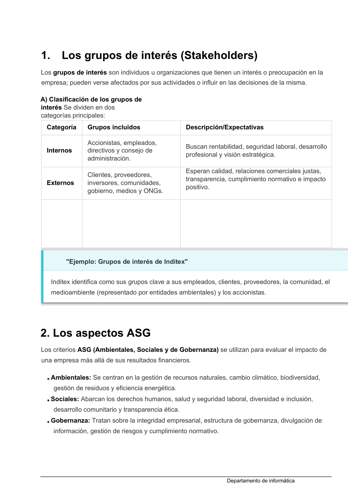
*Figura: clasificación de los grupos de interés (internos/externos) con sus expectativas, y los tres bloques de criterios ASG. Origen: `u6_SOJ.pdf`.*

El material pone como ejemplo el caso de **Inditex**, que identifica como grupos de interés clave a sus personas empleadas, su clientela, sus proveedores, la comunidad, el medioambiente (representado por entidades ambientales) y sus accionistas.

> **Ejemplo actual — Los despidos en tecnología y el grupo de interés "plantilla".** Entre 2023 y 2025, muchas grandes empresas del sector digital anunciaron reducciones de plantilla mientras a la vez presentaban resultados récord y aumentaban la inversión en inteligencia artificial. Esto ilustra muy bien la tensión entre grupos de interés: los accionistas (interno) pueden valorar positivamente el recorte de costes, mientras que la plantilla (interno) y las comunidades donde vive esa plantilla (externo) sufren el impacto. Un plan de sostenibilidad creíble tiene que decir cómo se gestiona ese conflicto, no esconderlo.

> **En las noticias — Comunidades locales y centros de datos.** En varias zonas de España y de otros países se han publicado, según se informó, quejas vecinales y de administraciones locales por el consumo de agua y de electricidad de nuevos centros de datos. Los residentes, los ayuntamientos y las asociaciones ecologistas son grupos de interés externos: aunque no compran nada a la empresa, pueden frenar un proyecto con alegaciones, movilizaciones o cambios en la normativa municipal. Escucharles a tiempo forma parte del análisis de grupos de interés.

### Ideas clave de esta sección
- Grupo de interés = quien afecta a la empresa o se ve afectado por ella.
- Internos: accionistas, plantilla, dirección, consejo. Externos: clientela, proveedores, inversores, comunidades, gobierno, medios, ONG.
- Cada grupo tiene expectativas distintas; identificarlas es el punto de partida del plan.

---

## 2. Aspectos ASG materiales y su priorización

Los **criterios ASG** (**A**mbientales, **S**ociales y de **G**obernanza; en inglés *ESG*) sirven para **evaluar el impacto de una empresa más allá de sus resultados financieros**. Son las tres "lentes" con las que se mira si una organización es sostenible:

- **Ambientales (A):** gestión de recursos naturales, cambio climático, biodiversidad, gestión de residuos y eficiencia energética.
- **Sociales (S):** derechos humanos, salud y seguridad laboral, diversidad e inclusión, desarrollo comunitario y transparencia ética.
- **Gobernanza (G):** integridad empresarial, estructura de gobierno, divulgación de información, gestión de riesgos y cumplimiento normativo.

No todos los aspectos ASG pesan lo mismo en todas las empresas. Aquí entra el concepto de **materialidad**: la identificación de **los temas ASG más importantes para una empresa y para sus grupos de interés**. Un aspecto es "material" cuando es lo bastante relevante como para influir en las decisiones de la organización o de quienes la observan. Para una empresa de logística, el consumo de combustible y las emisiones son muy materiales; para una consultora, probablemente lo sean más la igualdad, la retención del talento o la ética en el uso de datos.

El **análisis de materialidad** es el proceso por el que se cruzan dos preguntas: *¿qué impactos genera la empresa en el entorno y en las personas?* y *¿qué esperan y exigen sus grupos de interés?* El resultado es una lista corta y priorizada de temas sobre los que el plan de sostenibilidad va a trabajar de verdad. Sin materialidad, un plan se convierte en una lista de buenas intenciones inabarcable.

Los aspectos ASG no viven aparte de la estrategia: las empresas los **integran en sus metas a largo plazo**. El material cita como ejemplo a **Iberdrola**, que se fija objetivos como alcanzar el *"Net Zero"* (cero emisiones netas) antes de 2040, que es un objetivo ambiental, o aumentar la presencia de mujeres en puestos directivos, que es un objetivo social.

> **Ejemplo actual — La "doble materialidad".** En los informes de sostenibilidad más recientes se habla de *doble materialidad*: la empresa analiza tanto cómo le afecta a ella el entorno (por ejemplo, el riesgo de que una sequía encarezca su materia prima) como cómo afecta ella al entorno (sus vertidos, sus emisiones). Para un servicio digital, un ejercicio de doble materialidad realista incluiría el consumo eléctrico de sus servidores, la huella de agua de la refrigeración, la accesibilidad de sus productos y la protección de los datos de la clientela.

> **En las noticias — Simplificación de las obligaciones de reporte en la UE.** Durante 2025 se debatió en la Unión Europea, según se informó, una revisión ("ómnibus") para aligerar y retrasar parte de las obligaciones de información sobre sostenibilidad de las empresas, por considerarlas demasiado pesadas para las medianas. El debate es interesante para esta unidad: enfrenta la transparencia (más datos para los grupos de interés) con la carga administrativa (coste para la empresa). La materialidad es justo la herramienta para no ahogarse: reportar mucho de lo importante y poco de lo accesorio.

### Ideas clave de esta sección
- ASG = Ambiental, Social y Gobernanza: la evaluación de la empresa más allá del dinero.
- Materialidad = quedarse con los temas ASG realmente relevantes para la empresa y sus grupos de interés.
- El análisis de materialidad cruza "impactos que genero" con "lo que esperan de mí" y produce una lista priorizada.
- Los aspectos ASG materiales se convierten en objetivos de negocio (ejemplo del material: Iberdrola y su meta Net Zero para 2040).

---

## 3. Acciones y métricas de sostenibilidad empresarial

Una vez que sabemos qué aspectos ASG son materiales, el plan tiene que concretar **acciones** para gestionarlos: reducir los impactos negativos y aprovechar las oportunidades. El material las llama **acciones de minimización** y las alinea con las **estrategias de la Unión Europea para 2030 y 2050**:

- **Horizonte 2030:** reducir las emisiones netas de gases de efecto invernadero en un **55 % respecto a los niveles de 1990**.
- **Horizonte 2050:** alcanzar la **neutralidad climática**, es decir, cero emisiones netas.

Como ejemplos de acciones ya implantadas por empresas, el material cita:

- **Inditex:** uso de 100 % de energía renovable en sus instalaciones propias y eliminación de los plásticos de un solo uso para la clientela.
- **Iberdrola:** alianzas para acelerar la descarbonización e inversión en movilidad sostenible.
- **Nestlé:** instalación de parques solares para autoconsumo y calderas de biomasa.

Fíjate en el patrón: cada acción ataca un aspecto ASG material concreto (energía, residuos, emisiones) y es **medible**. Una acción que no se puede medir no sirve para un plan de sostenibilidad, porque nunca sabremos si ha funcionado. Por eso las acciones van siempre emparejadas con **métricas**: cada objetivo lleva su indicador, su valor de partida, su meta y su fecha.

Las **métricas o indicadores** son herramientas **cuantitativas y cualitativas** para medir y hacer seguimiento del rendimiento de la organización en sostenibilidad. Las estudiamos en detalle en la sección siguiente, pero la idea que hay que retener aquí es que **acción y métrica son dos caras de la misma moneda**: "instalar paneles solares" (acción) se mide con "porcentaje de electricidad autoconsumida de origen renovable" (métrica).

> **Ejemplo actual — Compromisos de energía renovable en centros de datos.** Grandes proveedores de servicios en la nube han anunciado en los últimos años objetivos de operar con energía "libre de carbono" las 24 horas del día y de reponer más agua de la que consumen sus instalaciones para 2030. Son acciones típicas de un plan de sostenibilidad: atacan aspectos ambientales materiales (energía, agua), tienen fecha y se acompañan de indicadores públicos que se revisan cada año.

> **En las noticias — La demanda eléctrica de la inteligencia artificial.** Durante 2024 y 2025 se publicaron numerosos análisis, según se informó, sobre el fuerte aumento del consumo eléctrico asociado al entrenamiento y uso de modelos de IA, hasta el punto de que algunas empresas retrasaron el cierre de centrales o firmaron contratos de energía nuclear. Para un plan de sostenibilidad del sector tecnológico, esto convierte la eficiencia del software y la elección de infraestructura en una acción de minimización de primer nivel, con métricas como el consumo por operación o la eficiencia energética de la instalación.

### Ideas clave de esta sección
- Las acciones del plan sirven para minimizar impactos negativos y aprovechar oportunidades ASG.
- Referencias de la UE: -55 % de emisiones en 2030 (frente a 1990) y neutralidad climática en 2050.
- Ejemplos del material: energía renovable y fin de plásticos de un solo uso (Inditex), descarbonización y movilidad sostenible (Iberdrola), autoconsumo solar y biomasa (Nestlé).
- Toda acción debe llevar asociada una métrica; si no se puede medir, no vale.

---

## 4. Indicadores de desempeño (KPI)

Un **KPI** (*Key Performance Indicator*, indicador clave de desempeño) es una **medida, cuantitativa o cualitativa, que permite seguir y monitorizar el rendimiento** de una organización en un objetivo concreto. En sostenibilidad, los KPI son los que traducen las promesas del plan en números comparables año a año.

El material agrupa los indicadores en cuatro familias:

- **Ambientales:** emisiones de gases de efecto invernadero (t CO₂ equivalente), consumo de energía (kWh), consumo de agua (m³) y residuos generados (t).
- **Sociales:** diversidad de la plantilla (género, edad), tasa de rotación del personal y accidentes de trabajo.
- **Económicos:** inversiones socialmente responsables, EBITDA, beneficio neto y retorno sobre la inversión (ROI).
- **Gobernanza:** índice de transparencia, cumplimiento de estándares éticos y composición del consejo de administración.

Un ejemplo sencillo de KPI que aparece en el material: **"el consumo total de energía, medido en kWh"**. Es un buen indicador porque es objetivo, fácil de recoger y se puede comparar con años anteriores y con otras empresas.

Para que los KPI de distintas empresas se puedan comparar, existen **estándares** que definen cómo se calculan y se presentan. Los más usados por las empresas españolas, según el material, son:

- **Estándares GRI**, creados en **1997** por la **Global Reporting Initiative**, una organización internacional, independiente y sin ánimo de lucro. Ofrecen un **lenguaje común** para que las empresas identifiquen y comprendan sus impactos económicos, ambientales y sociales, y para transmitir esa información a los grupos de interés de forma eficaz.
- **Cuadro integrado de indicadores CII-FESG**, desarrollado por la **AECA** (Asociación Española de Contabilidad y Administración de Empresas). Combina **indicadores financieros** (o de eficiencia económica) con **indicadores no financieros**: ambientales, sociales y de gobierno corporativo, todos codificados (por ejemplo F1, F2… para los financieros; E1, E2… para los ambientales).

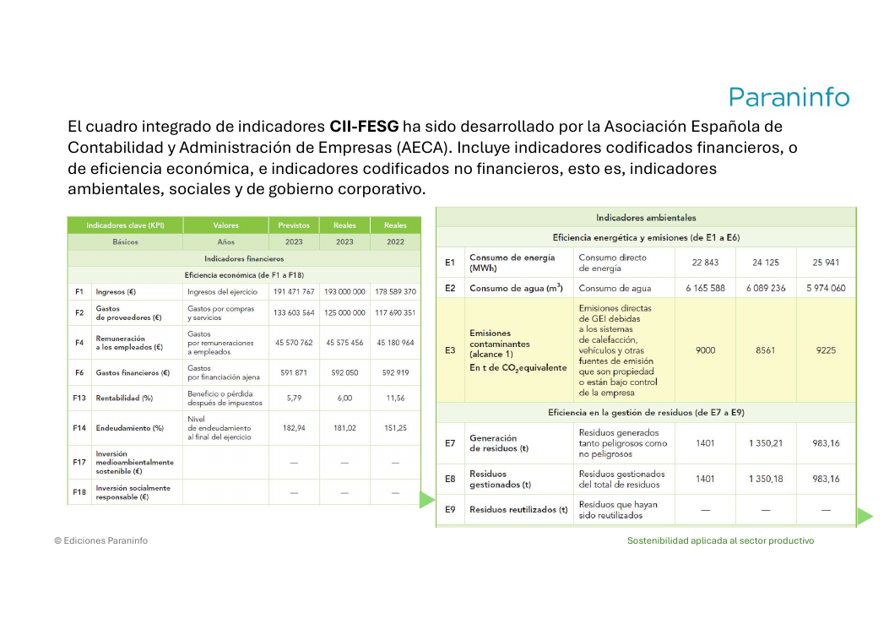
*Figura: extracto del cuadro CII-FESG de la AECA. A la izquierda, indicadores financieros (F1–F18); a la derecha, indicadores ambientales (E1–E9) con valores previstos y reales de varios años. Muestra por qué la comparabilidad interanual es clave. Origen: `UNIDAD_6.pdf`.*

Además de los estándares de cálculo, hay **índices de sostenibilidad** que "puntúan" a las empresas y arman rankings para inversores: el material cita el **Dow Jones Sustainability Index (DJSI)**, **MSCI Global Sustainability** y **FTSE4Good**. Entrar o salir de uno de estos índices tiene efecto directo sobre la imagen y sobre el acceso a financiación de la empresa.

> **Ejemplo actual — El PUE de los centros de datos.** En el sector tecnológico se ha popularizado como KPI ambiental el *PUE* (eficiencia en el uso de la energía): la relación entre la energía total que consume una instalación y la que llega realmente a los equipos informáticos. Un PUE de 1,1 es muy bueno; uno de 2,0 significa que por cada vatio útil se gasta otro en refrigeración y pérdidas. Es un indicador cuantitativo, comparable y con meta clara: acercarse a 1.

> **En las noticias — El alcance 3 y la cadena de suministro.** En los informes recientes se ha puesto el foco, según se informó, en las emisiones de "alcance 3": las que no genera directamente la empresa, sino sus proveedores y el uso de sus productos. Para una empresa de software, el alcance 3 incluye la fabricación de los dispositivos de la clientela y la energía que consumen sus servicios en casa de quien los usa. Medir bien ese KPI es difícil, pero es donde suele estar la mayor parte del impacto.

### Ideas clave de esta sección
- KPI = indicador clave de desempeño; convierte objetivos en números seguibles.
- Familias de indicadores: ambientales, sociales, económicos y de gobernanza.
- Ejemplo de KPI del material: consumo total de energía en kWh.
- Estándares para calcular y comparar: **GRI** (Global Reporting Initiative, 1997) y **CII-FESG** (AECA).
- Índices que puntúan a las empresas: DJSI, MSCI Global Sustainability, FTSE4Good.

---

## 5. Elaboración de informes de sostenibilidad

El **informe de sostenibilidad** es el documento con el que la organización **comunica su desempeño en términos económicos, ambientales y sociales** y guía la integración de prácticas sostenibles. En España también se le llama **estado de la información no financiera (EINF)**.

### 5.1. ¿Quién está obligado a publicarlo?

Según la **Ley 11/2018**, la obligación de publicar el EINF afecta a **empresas con una plantilla superior a 250 personas** que, además, cumplan una de estas condiciones:

- que tengan la consideración de **entidades de interés público**, o
- que, durante **dos años consecutivos**, hayan tenido **activos superiores a 20 millones de euros** o una **cifra anual de negocio superior a 40 millones de euros netos**.

En la práctica, por tanto, la obligación recae hoy **solo sobre las grandes empresas**. Las pymes pueden elaborar informes de sostenibilidad de forma voluntaria (y cada vez más lo hacen porque se lo piden sus clientes grandes o sus bancos).

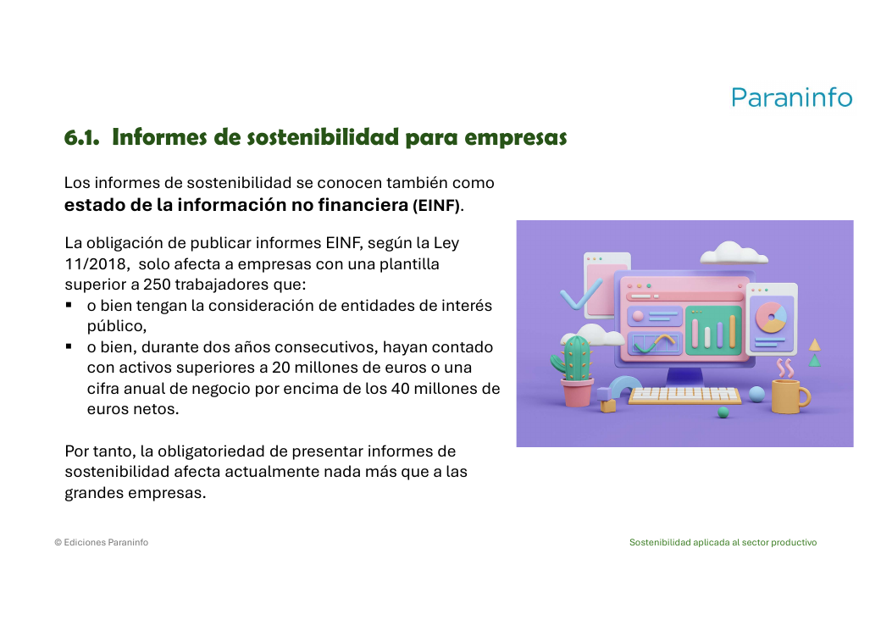
*Figura: condiciones de la Ley 11/2018 para estar obligado a publicar el estado de información no financiera. Origen: `UNIDAD_6.pdf`.*

### 5.2. ¿Sobre qué informa el EINF?

La Ley 11/2018 dice que el EINF debe informar sobre:

- **cuestiones ambientales**,
- **cuestiones sociales y relativas al personal**,
- **respeto de los derechos humanos**,
- **lucha contra la corrupción y el soborno**,
- **cuestiones de información general** relativas a la entidad.

### 5.3. Estructura del EINF (cinco puntos)

También según la Ley 11/2018, el EINF consta de cinco apartados:

1. **Breve descripción del modelo de negocio**, con sus objetivos y estrategias y los factores y tendencias que pueden afectar a su evolución futura.
2. **Descripción de las políticas aplicadas** respecto a las cuestiones anteriores.
3. **Resultados de esas políticas**, siendo obligatorio usar **indicadores clave** adecuados para seguir y evaluar los progresos.
4. **Principales riesgos** identificados como relevantes para la actividad de la empresa.
5. **Indicadores clave de resultados no financieros** pertinentes para la actividad.

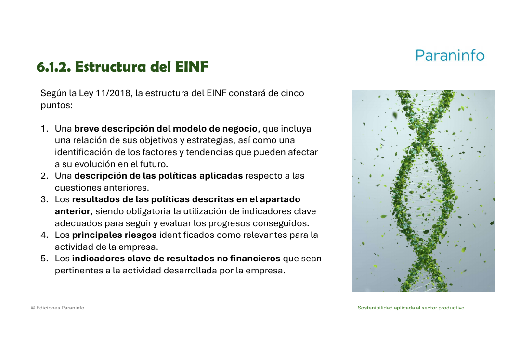
*Figura: los cinco apartados obligatorios del EINF (modelo de negocio, políticas, resultados, riesgos e indicadores). Origen: `UNIDAD_6.pdf`.*

### 5.4. Firma, presentación y verificación

- El EINF debe estar **firmado por todos los administradores** de la empresa.
- Se presenta en el **Registro Mercantil** correspondiente durante los **tres primeros meses del año**.
- Debe ponerse **gratuitamente a disposición del público en la web** de la entidad.
- **A partir de 2025**, la información no financiera debe ser **verificada obligatoriamente por un prestador de servicios de verificación independiente**, acreditado por **ENAC** (Entidad Nacional de Acreditación). En la verificación se comprueba que la información del EINF es **precisa y verdadera**.

### 5.5. Estructura típica y objetivos de un informe de sostenibilidad

Más allá de lo que exige la ley, un informe completo suele incluir: la **carta del director**, el **perfil de la organización**, el **desempeño en cada área ASG** y el **cumplimiento normativo**. Sus tres objetivos principales son:

1. **Transparencia:** presentar información clara y precisa.
2. **Materialidad:** enfocarse en los aspectos más relevantes para los grupos de interés.
3. **Comparabilidad:** incluir datos de años anteriores para mostrar el progreso.

### 5.6. El plan de sostenibilidad y sus pasos

El **plan de sostenibilidad** es la **hoja de ruta estratégica**. Incluye la declaración de la **misión**, el **análisis de la situación actual**, el establecimiento de **metas** y el **monitoreo mediante KPI**. No es lo mismo que el informe: el plan mira hacia delante (qué vamos a hacer), el informe mira hacia atrás (qué hemos hecho).

Para elaborarlo, las organizaciones pueden seguir una serie de **pasos** que no están cerrados, pero que sirven para empresas y profesionales de cualquier sector:

1. **Obtener el compromiso de la Dirección.**
2. Realizar un **análisis o diagnóstico inicial**.
3. **Analizar los grupos de interés** (stakeholders).
4. Realizar un **análisis de materialidad**.
5. **Definir objetivos y metas** de sostenibilidad.
6. **Asignar responsabilidades.**
7. **Establecer indicadores de desempeño.**
8. Fijar **mecanismos de seguimiento, evaluación y mejora**.
9. **Comunicar el plan** e integrarlo en la cultura de la empresa.

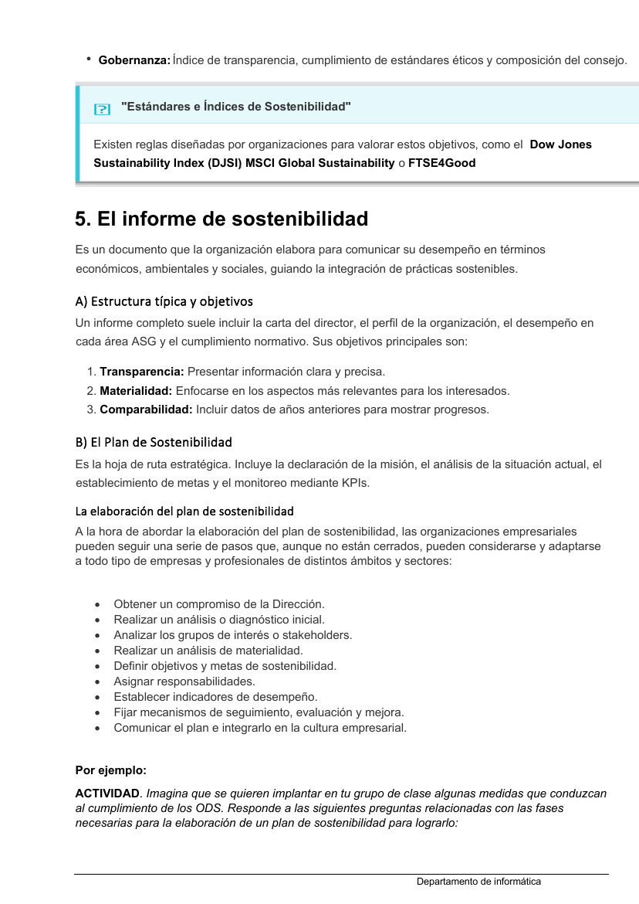
*Figura: secuencia de pasos para elaborar un plan de sostenibilidad. Reconoce el ciclo de mejora continua: diagnosticar, planificar, medir, revisar. Origen: `u6_SOJ.pdf`.*

El material propone un ejercicio muy útil para entender estos pasos: **aplicarlos a tu propio grupo de clase** para cumplir algunos ODS. La solución de ejemplo detecta problemas como el exceso de residuos plásticos de las meriendas, luces encendidas en aulas vacías y poca separación de basuras; propone contenedores de reciclaje, campañas de apagado de luces y botellas reutilizables; identifica los intereses de alumnado, profesorado, dirección y familias; fija un objetivo (reducir residuos un 30 % y consumo energético un 20 % en 6 meses, alineado con el ODS 12 y el ODS 7) con metas concretas (recoger 50 kg de reciclaje al mes, dos talleres mensuales sobre ODS); y reparte responsabilidades (una persona coordinadora, turnos de alumnado, todo el profesorado integrando los ODS, la dirección aprobando recursos). Es el mismo esquema que usaría una empresa, a menor escala.

Un apunte que conecta con la sección 6: si una empresa ya tiene implantada una **certificación como la ISO 14001**, tendrá **buena parte del EINF cumplimentada**, porque ese trabajo de diagnóstico, indicadores y seguimiento ya está hecho.

> **Ejemplo actual — Los primeros informes bajo las nuevas reglas europeas.** A lo largo de 2025, las grandes empresas europeas empezaron a publicar, según se informó, sus primeros informes de sostenibilidad con el formato reforzado de la nueva directiva comunitaria, que amplía el contenido del EINF y exige verificación externa. Muchas compañías reconocieron que la parte más costosa fue **recopilar datos fiables** de toda su cadena de suministro, justo el punto 3 de la estructura del EINF (resultados medidos con indicadores).

> **En las noticias — Multas por "maquillaje verde" en los informes.** En los últimos años, organismos de consumo y supervisores de varios países han sancionado o abierto expedientes, según se informó, a empresas por afirmaciones ambientales exageradas o sin respaldo en sus informes y su publicidad. La lección para esta unidad: un informe de sostenibilidad no es un folleto de marketing; si los datos no son precisos y verificables, expone a la empresa a sanciones y a perder la confianza de sus grupos de interés.

### Ideas clave de esta sección
- Informe de sostenibilidad = EINF (estado de información no financiera); rinde cuentas del año.
- Ley 11/2018: obligatorio para empresas de más de 250 personas que además sean de interés público o superen 20 M€ de activos o 40 M€ de cifra de negocio durante dos años.
- Contenido: ambiental, social/personal, derechos humanos, corrupción y soborno, información general.
- Estructura en 5 puntos: modelo de negocio, políticas, resultados con indicadores, riesgos, indicadores no financieros.
- Firma de todos los administradores, Registro Mercantil en el primer trimestre, publicación gratuita en web y verificación externa obligatoria desde 2025 (acreditada por ENAC).
- Objetivos del informe: transparencia, materialidad, comparabilidad.
- Plan de sostenibilidad = hoja de ruta (misión, situación actual, metas, KPI) que se elabora en 9 pasos empezando por el compromiso de la Dirección.

---

## 6. Comunicación y transparencia corporativa

La **transparencia** es a la vez un objetivo del informe de sostenibilidad y una obligación legal (recuerda: el EINF debe estar público y gratuito en la web). Comunicar bien la sostenibilidad significa dar información **clara, precisa, comparable y verificable**, y no solo mensajes bonitos. Alrededor de la comunicación corporativa hay tres grandes herramientas: las **etiquetas ecológicas**, las **certificaciones** y el marco que las sostiene, la **legislación ambiental**.

### 6.1. Etiquetas ecológicas (ecoetiquetas)

Una **etiqueta ecológica** es una etiqueta que **incorpora símbolos o distintivos medioambientales** y que sirve para **transmitir información desde el fabricante hacia la persona consumidora**, de modo que esta pueda decidir de forma fundada si compra el producto o no. Son **voluntarias**: la empresa no está obligada a etiquetar sus productos, aunque tenga derecho a usar el distintivo si cumple los requisitos.

Se distinguen dos tipos según necesiten o no verificación por una entidad independiente:

**Etiquetas que necesitan verificación externa:**

- **Etiqueta Ecológica de la UE** ("la flor de la Unión Europea"): promueve el consumo de productos que reducen los impactos ambientales negativos frente a otros de su misma categoría. Es **ecoetiqueta tipo I**.
- **Hoja Verde de la UE:** identifica alimentos procedentes de la **agricultura o ganadería ecológicas**.
- **Etiqueta RSPO** (Mesa Redonda sobre el Aceite de Palma Sostenible). Junto con la Hoja Verde, son **ecoetiquetas de semitipo I** (no proceden de las administraciones públicas).

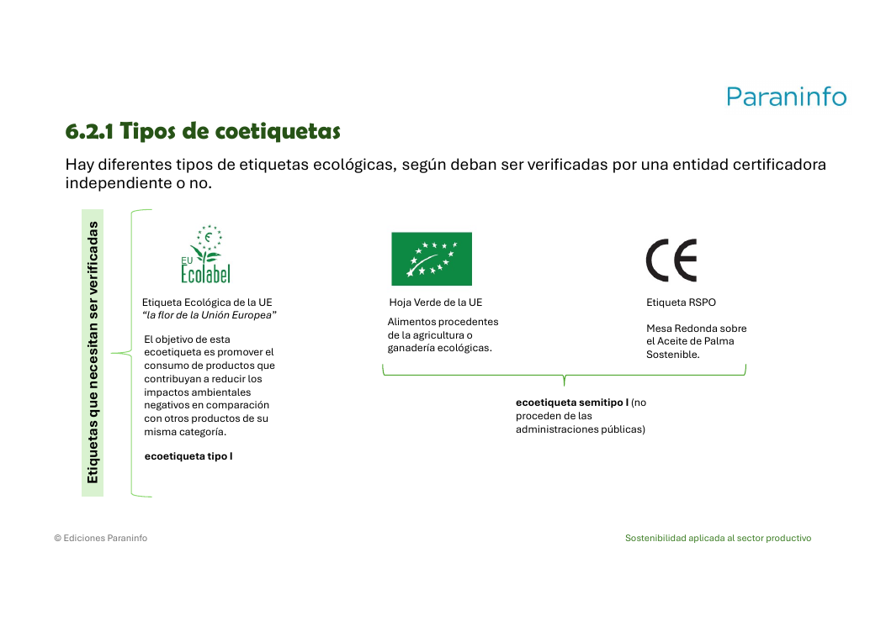
*Figura: ecoetiquetas que requieren verificación de una entidad certificadora independiente. La "flor" de la UE es tipo I; la Hoja Verde y la RSPO son de semitipo I. Origen: `UNIDAD_6.pdf`.*

**Etiquetas que no necesitan verificación (basta la autodeclaración del fabricante), llamadas ecoetiquetas tipo II o autodeclaraciones ambientales:**

- **Banda de Möbius** (el triángulo de flechas) para **productos reciclables**.
- **Banda de Möbius con porcentaje** para productos **reciclados al 100 %**.
- **Distintivo Punto Verde:** acredita que el fabricante pertenece al sistema gestionado por **Ecoembes** para el reciclado de los envases domésticos de plástico, briks, cartón y papel.

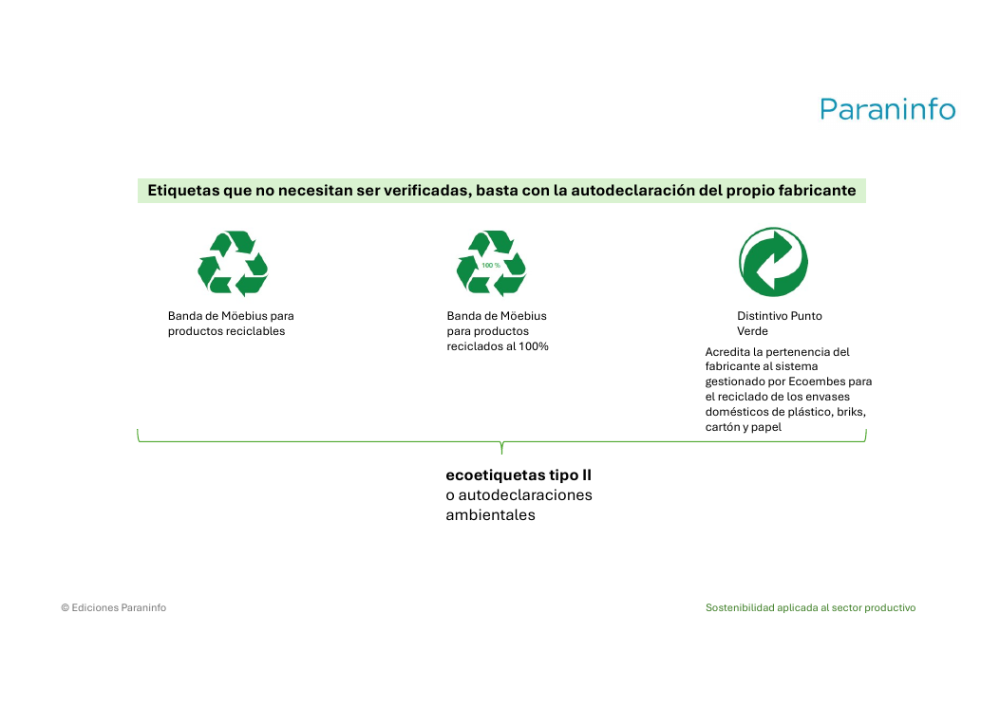
*Figura: ecoetiquetas tipo II o autodeclaraciones ambientales; no requieren verificación externa, las declara el propio fabricante. Origen: `UNIDAD_6.pdf`.*

### 6.2. Certificación de la sostenibilidad

Los **sistemas de certificación** evalúan la sostenibilidad de las empresas **sea cual sea su tamaño, tipo o actividad**. Los ejemplos del material son las **normas ISO**, el **reglamento EMAS** y los sistemas de gestión forestal sostenible **FSC** y **PEFC**.

Todo sistema de certificación tiene **tres partes**:

1. La **organización que elabora y publica el estándar** (ISO, EMAS, FSC o PEFC).
2. La **empresa interesada** en implantar ese estándar para mejorar su gestión.
3. La **entidad certificadora**, que entrega el certificado oficial que acredita que la empresa ha implantado bien el estándar (en España, acreditada por **ENAC**).

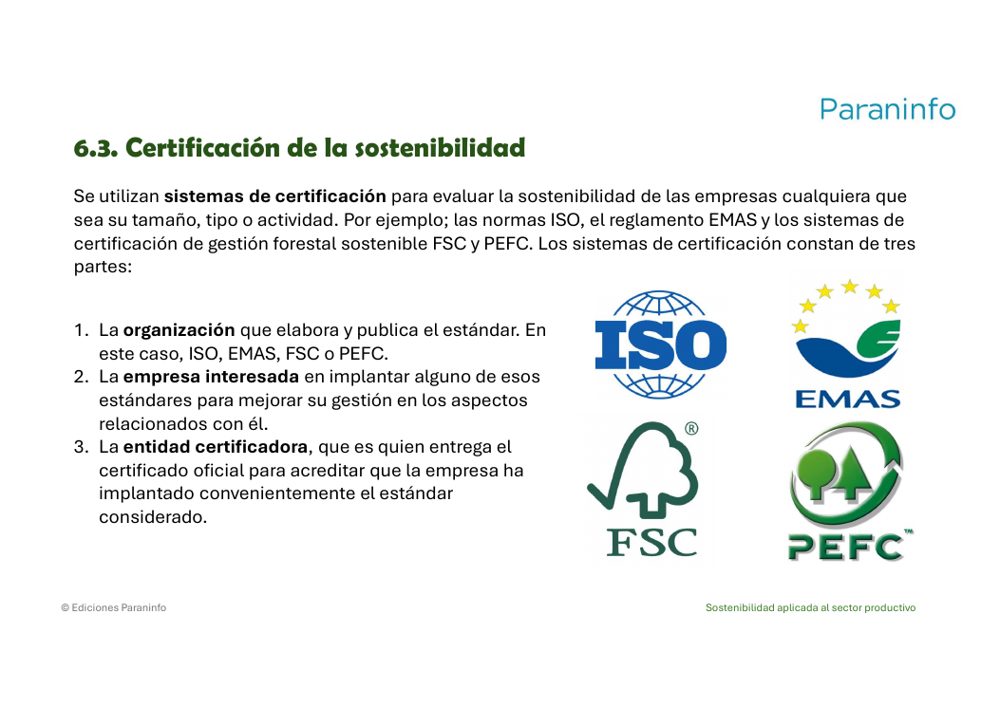
*Figura: las tres partes de cualquier sistema de certificación (quien publica el estándar, la empresa y la entidad certificadora) y los cuatro sistemas citados en el material. Origen: `UNIDAD_6.pdf`.*

**Fases de un proceso de certificación** (voluntario y parecido en todos los sistemas):

- a) Con el **impulso de la dirección**, obtener una copia de los contenidos vigentes del estándar.
- b) Hacer un **diagnóstico inicial** (análisis de materialidad) para conocer la realidad de la organización y su distancia respecto a los requisitos del estándar.
- c) **Elaborar el sistema de gestión** según los requisitos del estándar; aquí ayudan herramientas como las **matrices DAFO**.
- d) Realizar un **programa de formación y sensibilización** del personal.
- e) Una vez implantado, hacer **seguimiento** para ver cómo funciona y qué mejorar antes de solicitar la certificación.
- f) **Presentar la solicitud** de certificación a una entidad certificadora independiente (acreditada por ENAC).
- g) Si todo está conforme, la entidad certificadora **entrega la certificación** bajo su responsabilidad.

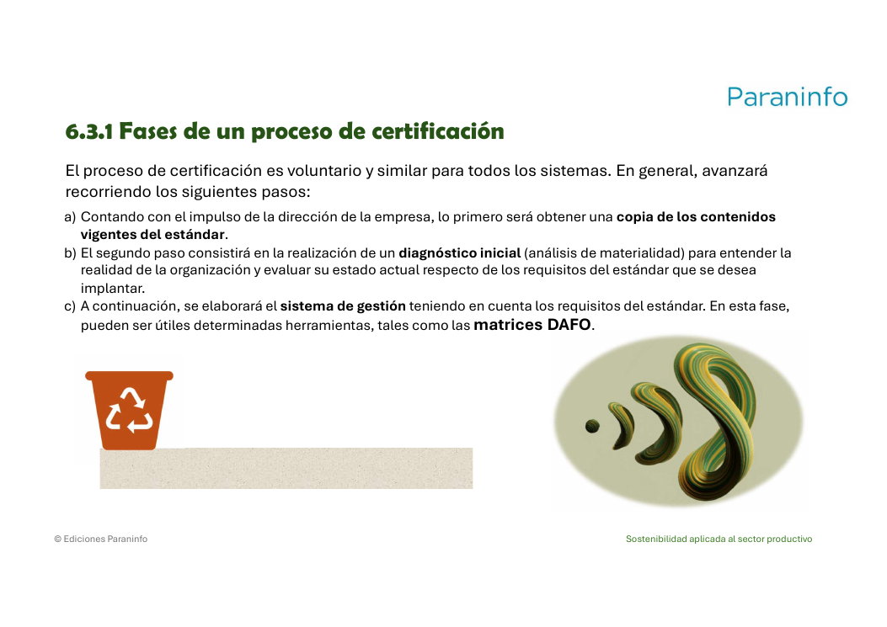
*Figura: primeras fases de un proceso de certificación. El paso 1 vuelve a ser el compromiso de la dirección, igual que en el plan de sostenibilidad. Origen: `UNIDAD_6.pdf`.*

**ISO 14001.** La elabora **ISO** (Organización Internacional de Estandarización), una organización **no gubernamental e independiente** en la que participan **170 países** y cuya labor es crear estándares reconocidos internacionalmente. La ISO 14001 permite **demostrar el cumplimiento de la legislación medioambiental** y el compromiso de la empresa con la protección del medioambiente y la gestión de los riesgos ambientales. Se puede aplicar a **cualquier empresa**, sea cual sea su tamaño, tipo o naturaleza. Se apoya en el ciclo **PHVA: planificar – hacer – verificar – actuar** (mejora continua). Entre sus beneficios: ventaja competitiva, reducción de costes de producción, procesos más eficaces, mayor satisfacción de la clientela y más visibilidad ante posibles inversores.

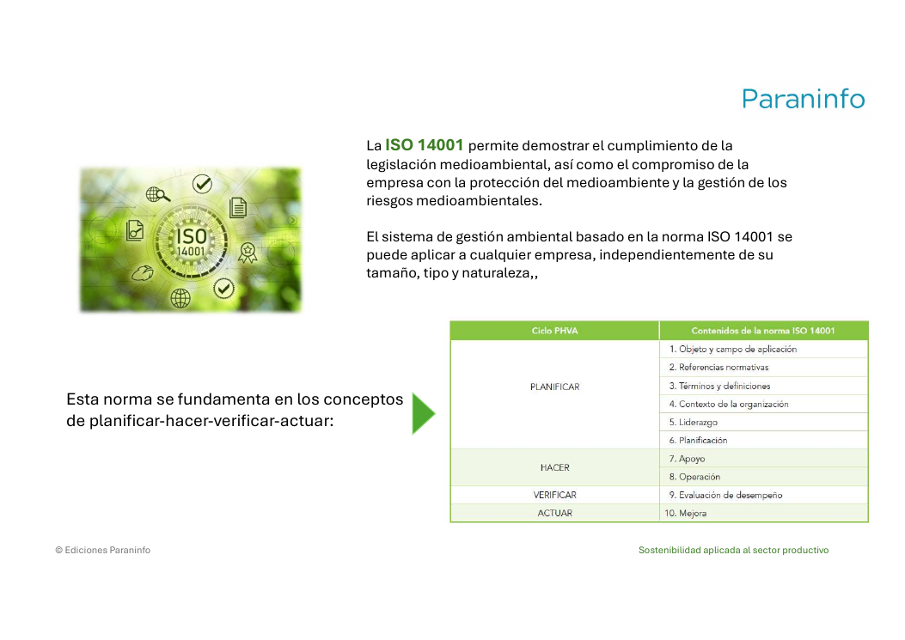
*Figura: la ISO 14001 y el ciclo Planificar-Hacer-Verificar-Actuar, con los diez apartados de la norma repartidos en esas cuatro fases. Origen: `UNIDAD_6.pdf`.*

**Reglamento EMAS** (*Eco-Management and Audit Scheme*). Está **basado en la norma ISO 14001** y es un sistema de certificación que **facilita la transición de las empresas hacia una economía circular**. Además: establece **indicadores para medir la eficiencia en el uso de los recursos**, obliga a **investigar vías para reducir los consumos o usar materiales menos contaminantes**, requiere la **implicación del personal** y se **anticipa a posibles nuevos requisitos legales** ambientales.

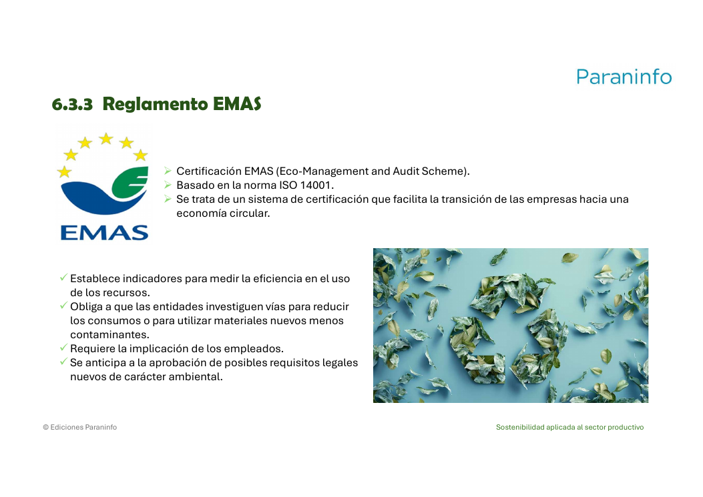
*Figura: características del reglamento EMAS. Va un paso más allá de la ISO 14001 al exigir indicadores de eficiencia de recursos e implicación del personal. Origen: `UNIDAD_6.pdf`.*

**Gestión forestal sostenible: FSC y PEFC.** Son las dos opciones para certificar la gestión forestal sostenible en Europa y son **ejemplos de ecoetiqueta de semitipo I**. Interesan sobre todo a propietarios de montes, gestores forestales y empresas que trabajan con madera u otros productos forestales, y también a quienes consumen preocupados por la conservación de los bosques.

- **PEFC:** *Programme for the Endorsement of Forest Certification* (Programa para el Reconocimiento de la Certificación Forestal); iniciativa promovida por los **propietarios privados de bosques**.
- **FSC:** *Forest Stewardship Council* (Consejo de Administración Forestal); surgió en **1993** para promover la gestión forestal sostenible de los **bosques tropicales**.

### 6.3. Legislación ambiental

La transparencia y las certificaciones se apoyan en un suelo común: la ley. **La UE, las Cortes Generales y los parlamentos autonómicos** pueden legislar sobre medioambiente.

**Estructura jerárquica de la legislación.** Una norma de rango inferior **no puede contradecir** a otra de rango superior. Ninguna norma, sea cual sea su nivel, puede contradecir la **Constitución española**, que es la norma suprema. Por debajo de la Constitución, el orden de prioridad es:

1. **Comunitaria** (UE): reglamentos y directivas.
2. **Estatal:** leyes, reales decretos y órdenes.
3. **Autonómica:** leyes, decretos y órdenes.
4. **Municipal:** ordenanzas municipales.

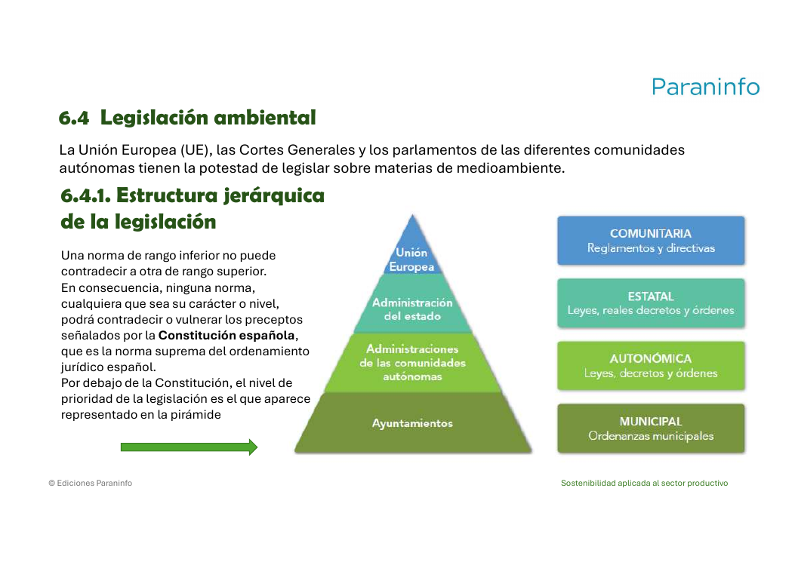
*Figura: pirámide de la legislación ambiental. Cada escalón inferior debe respetar los superiores, y todos, la Constitución. Origen: `UNIDAD_6.pdf`.*

**Normativa ambiental estatal relevante** (según el material; vigente en el momento de elaborarse el libro de texto). Algunos ejemplos por bloques:

- **Aguas:** Real Decreto Legislativo 1/2001 (texto refundido de la Ley de Aguas); Ley 22/1988 de Costas; Ley 41/2010 de protección del medio marino.
- **Atmósfera:** Ley 34/2007 de calidad del aire y protección de la atmósfera; Real Decreto 100/2011; Real Decreto 1042/2017.
- **Residuos:** **Ley 7/2022, de 8 de abril, de residuos y suelos contaminados para una economía circular**; Real Decreto 553/2020 (traslado de residuos); Real Decreto 110/2015 (residuos de aparatos eléctricos y electrónicos, RAEE).
- **Ruido:** Ley 37/2003, de 17 de noviembre, del Ruido.
- **Responsabilidad medioambiental:** Ley 11/2014, que modifica la Ley 26/2007 de Responsabilidad Medioambiental.
- **Cambio climático y energía:** Ley 7/2021 de cambio climático y transición energética; Ley 1/2005 (comercio de derechos de emisión de gases de efecto invernadero); Real Decreto 56/2016 (eficiencia energética).
- **Biodiversidad:** Ley 42/2007 del Patrimonio Natural y de la Biodiversidad.

**Normativa sobre evaluación ambiental.** Cualquier actividad que consuma recursos (incluida la energía) y genere residuos puede provocar impactos negativos sobre el medioambiente. El objetivo de esta legislación es **prevenir, mitigar o compensar** esos impactos evaluándolos ya en la **fase de proyecto**. A nivel estatal se rige por:

1. **Ley 21/2013, de 9 de diciembre, de evaluación ambiental.**
2. **Ley 9/2018, de 5 de diciembre**, que modifica la Ley 21/2013 (y otras).
3. **Real Decreto 445/2023, de 13 de junio**, que modifica los anexos I, II y III de la Ley 21/2013.

La evaluación ambiental es un **proceso administrativo** en el que se analizan los impactos que un proyecto, obra o actividad podría generar. El camino depende del anexo de la Ley 21/2013 en el que encaje la actividad:

- **Anexo I → procedimiento ordinario → DIA** (declaración de impacto ambiental).
- **Anexo II → procedimiento simplificado → IIA** (informe de impacto ambiental); si afecta a un espacio de la Red Natura 2000, puede pasar al procedimiento ordinario.
- **Sin anexo → no hay evaluación ambiental.**

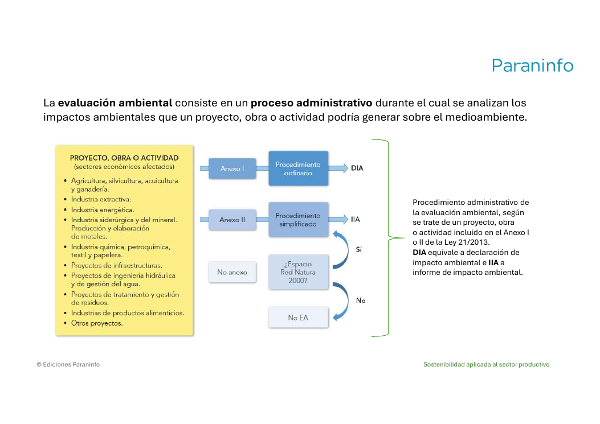
*Figura: circuito administrativo de la evaluación ambiental según la Ley 21/2013. DIA = declaración de impacto ambiental; IIA = informe de impacto ambiental. Origen: `UNIDAD_6.pdf`.*

> **Ejemplo actual — La Directiva europea sobre alegaciones ecológicas.** La UE ha impulsado en los últimos años normas contra el *greenwashing* que exigen respaldar con pruebas cualquier afirmación como "eco", "verde" o "climáticamente neutro" en el etiquetado y la publicidad. Encaja de lleno con la sección: la función de una etiqueta ecológica es informar con veracidad, y las autodeclaraciones tipo II (banda de Möbius, mensajes "respetuoso con el medioambiente") son las más vigiladas porque nadie las verifica antes de usarlas.

> **En las noticias — Sanciones por publicidad ambiental engañosa.** Durante 2023-2025, autoridades de consumo y tribunales de varios países europeos han fallado, según se informó, contra campañas de aerolíneas y de empresas de energía y alimentación por presentar como "neutras en carbono" productos o servicios sin base sólida. El mensaje para los perfiles técnicos e informáticos: los datos de sostenibilidad que una empresa publica (por ejemplo, en su web o su aplicación) tienen consecuencias legales; no son solo texto de relleno.

### Ideas clave de esta sección
- Comunicar sostenibilidad = información clara, comparable y **verificable**; el EINF va público y gratuito en la web.
- Ecoetiquetas: voluntarias, informan del fabricante a quien consume. Con verificación (flor de la UE tipo I; Hoja Verde y RSPO semitipo I) o autodeclaración (banda de Möbius y Punto Verde, tipo II).
- Certificación: 3 partes (quien publica el estándar, la empresa, la entidad certificadora acreditada por ENAC). Fases de la a) a la g), empezando por el impulso de la dirección.
- ISO 14001: estándar internacional de gestión ambiental, ciclo PHVA, aplicable a cualquier empresa. EMAS: basado en ISO 14001, orientado a la economía circular. FSC (1993, bosques tropicales) y PEFC (propietarios privados): gestión forestal sostenible.
- Jerarquía normativa: Constitución > UE > estatal > autonómica > municipal; ninguna norma contradice a otra superior.
- Evaluación ambiental (Ley 21/2013, Ley 9/2018, RD 445/2023): Anexo I → DIA; Anexo II → IIA.

---

## Glosario rápido

| Término | En una frase |
| --- | --- |
| **Grupo de interés / stakeholder** | Persona u organización que afecta a la empresa o se ve afectada por ella. |
| **ASG (ESG)** | Ambiental, Social y de Gobernanza: la evaluación de una empresa más allá de lo financiero. |
| **Materialidad** | Identificación de los temas ASG que de verdad importan a la empresa y a sus grupos de interés. |
| **Análisis de materialidad** | Proceso que cruza los impactos de la empresa con las expectativas de sus grupos de interés para priorizar temas. |
| **Net Zero / neutralidad climática** | Situación en la que las emisiones netas de gases de efecto invernadero son cero. |
| **KPI** | Indicador clave de desempeño; medida que permite seguir el avance de un objetivo. |
| **GRI** | Global Reporting Initiative; estándares de reporte de sostenibilidad creados en 1997. |
| **CII-FESG** | Cuadro integrado de indicadores financieros y no financieros de la AECA. |
| **Plan de sostenibilidad** | Hoja de ruta estratégica: misión, situación actual, metas y seguimiento con KPI. |
| **Informe de sostenibilidad / EINF** | Documento que rinde cuentas del desempeño económico, ambiental y social del año. |
| **Ley 11/2018** | Norma que obliga a las grandes empresas a publicar el estado de información no financiera. |
| **ENAC** | Entidad Nacional de Acreditación; acredita a los verificadores y a las entidades certificadoras. |
| **Ecoetiqueta** | Distintivo voluntario que informa del comportamiento ambiental de un producto. |
| **Tipo I / semitipo I / tipo II** | Ecoetiqueta verificada por tercero / verificada pero no pública / autodeclarada por el fabricante. |
| **ISO 14001** | Estándar internacional de sistemas de gestión ambiental basado en el ciclo PHVA. |
| **EMAS** | Reglamento europeo de gestión y auditoría ambiental, basado en ISO 14001 y orientado a la economía circular. |
| **FSC / PEFC** | Sistemas de certificación de gestión forestal sostenible. |
| **DIA / IIA** | Declaración / informe de impacto ambiental, resultados de la evaluación ambiental (Ley 21/2013). |
| **PHVA** | Planificar-Hacer-Verificar-Actuar: ciclo de mejora continua. |

## Repaso: 8-10 preguntas para autoevaluarte

1. ¿Qué diferencia hay entre un grupo de interés interno y uno externo? Pon dos ejemplos de cada uno.
2. Define "materialidad" y explica para qué sirve el análisis de materialidad dentro de un plan de sostenibilidad.
3. ¿Cuáles son los tres bloques de criterios ASG y qué tipo de cuestiones cubre cada uno?
4. ¿Qué objetivos de emisiones marca la UE para 2030 y para 2050?
5. Enumera las cuatro familias de indicadores (KPI) que recoge el material y pon un ejemplo de KPI ambiental.
6. ¿Qué son los estándares GRI y quién los creó? ¿Y el cuadro CII-FESG?
7. ¿Qué empresas están obligadas a publicar el EINF según la Ley 11/2018? Indica el umbral de plantilla y las condiciones económicas.
8. Enumera los cinco apartados de la estructura del EINF y explica qué cambió en su verificación a partir de 2025.
9. Ordena los nueve pasos para elaborar un plan de sostenibilidad. ¿Por cuál se empieza siempre?
10. Diferencia una ecoetiqueta de tipo I de una de tipo II. ¿En qué anexo de la Ley 21/2013 encaja un proyecto que acaba con una DIA?

Respuestas (dónde repasar)

1. Sección 1: internos = accionistas, plantilla, dirección, consejo; externos = clientela, proveedores, inversores, comunidades, gobierno, medios, ONG.
2. Sección 2: materialidad = temas ASG relevantes para empresa y grupos de interés; el análisis prioriza sobre qué trabaja el plan.
3. Sección 2: Ambiental (recursos, clima, biodiversidad, residuos, energía), Social (derechos humanos, seguridad laboral, diversidad, comunidad, ética), Gobernanza (integridad, estructura de gobierno, divulgación, riesgos, cumplimiento).
4. Sección 3: 2030 → -55 % de emisiones netas respecto a 1990; 2050 → neutralidad climática (cero emisiones netas).
5. Sección 4: ambientales, sociales, económicos, gobernanza; KPI ambiental, p. ej. consumo de energía en kWh o emisiones en t CO₂e.
6. Sección 4: GRI = estándares de la Global Reporting Initiative, creados en 1997; CII-FESG = cuadro integrado de indicadores de la AECA.
7. Sección 5.1: más de 250 personas de plantilla y, además, ser entidad de interés público o superar 20 M€ de activos o 40 M€ de cifra de negocio neta durante dos años consecutivos.
8. Sección 5.3 y 5.4: modelo de negocio, políticas, resultados con indicadores, riesgos, indicadores no financieros; desde 2025 la verificación por un tercero independiente acreditado por ENAC es obligatoria.
9. Sección 5.6: compromiso de la Dirección, diagnóstico inicial, análisis de grupos de interés, análisis de materialidad, objetivos y metas, asignar responsabilidades, indicadores, seguimiento y mejora, comunicación e integración. Se empieza por el compromiso de la Dirección.
10. Sección 6.1 y 6.3: tipo I = verificada por tercero (flor de la UE); tipo II = autodeclaración del fabricante (banda de Möbius, Punto Verde). Un proyecto del Anexo I sigue el procedimiento ordinario y termina en DIA.

